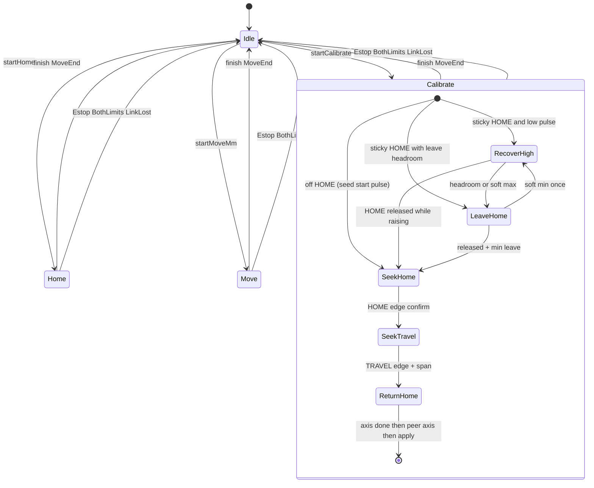

# Production FSM — as implemented

Engineering report of the live production motion finite state machine on the Double Actuator Centring Slave.

There is no C++ type named `ProductionFSM`. The production FSM is the file-local `Mode` / `CalPhase` machine in [`src/actuators.cpp`](../../src/actuators.cpp), with public outcomes in [`include/actuators.hpp`](../../include/actuators.hpp).

Related docs (not duplicated here):

- [TERMINAL_COMMANDS.md](TERMINAL_COMMANDS.md) — STATUS fields, commands, terminal testing
- [HEIGHT_MODEL.md](../../HEIGHT_MODEL.md) — height kinematics and cal parameter meanings

---

## 1. Purpose and ownership

| Role | Module | Responsibility |
|------|--------|----------------|
| **Production FSM** | `actuators` | Modes, motion ticks, safety latches, start rejects, move ends |
| **Orchestrator** | `app` | Loop order: WDT → switches → `pollSafety` → link → protocol → `actuators::tick` → completion STATUS |
| **Command surface** | `protocol` | Maps ASCII lines to `start*` / `clearEstopIfSafe`; emits STATUS and `CAL_RESULT` |
| **Sensors** | `switches` | Debounced home / travel / E-stop / both-limits |
| **Kinematics** | `kinematics` | Cal validity, pulse targets for MOVE, apply measured cal |

`Mode` and `CalPhase` are **private** to `actuators.cpp`. Externally, busy/idle is exposed via `busy()`, outcomes via `lastMoveEnd()` / `StartReject`.

### Loop ownership (`app::tick`)

```text
wdt_reset
switches::tick
actuators::pollSafety          # E-stop / both-limits latch
net_link::tick
[connect / disconnect]         # onDisconnect on link loss
[keepalive]                    # onDisconnect + forceDisconnect if RX idle ≥ 10 s
protocol::tick                 # when linked
actuators::tick                # Home / Move / Calibrate step
consumeCompletionEvent → protocol::onMotionComplete
```

---

## 2. State diagram



Cross-cutting flags (not members of `Mode`):

| Flag | Meaning |
|------|---------|
| `gBusy` | Motion in progress; `busy()` true |
| `gEstop` | Software E-stop latched; blocks new motion until `CLEARESTOP` |
| `cal` (`calValid`) | Production gate: set by CALIBRATE / SETCAL only (no homed flag) |
| `active[U/L]` | Axis still stepping in the current mode |
| `completionPending` | One-shot for Master STATUS after busy → idle (or safety latch) |

---

## 2b. PWM polarity and limit-switch policy

Canonical implementation: [`include/limit_policy.hpp`](../../include/limit_policy.hpp).

| Direction | PWM | Typical end |
|-----------|-----|-------------|
| Toward HOME (open) | **+µs** | `u_HOME` (high), UH/LH assert |
| Toward TRAVEL (close) | **−µs** | `u_TRAVEL` (low), UT/LT assert |

Rules enforced by `limit_policy::allow` / `tryStep` / MOVE start gate:

1. Single active HOME or TRAVEL is **valid** (not a fault).
2. Motion toward the **opposite** limit is allowed.
3. Motion **further into** the currently pressed limit is blocked until that switch releases.
4. Both switches on one axis → hard fault (`both_limits`).

Cal validation requires `u_HOME > u_TRAVEL` on each axis. Crawl signs in HOME/CALIBRATE come from `limit_policy::stepUs` so polarity cannot drift from the gate.

---

## 3. Modes

| Mode | Tick | Step style | Timeout | Success `MoveEnd` |
|------|------|------------|---------|-------------------|
| **Idle** | none | — | — | — |
| **Home** | `tickHome` | RecoverHigh (+µs) if low sticky; Leave (−µs); Seek (+µs) + edge confirm | `kHomeCalTimeoutMs` (60 s) | `Ok` |
| **Move** | `tickMove` | Speed-limited pulse slew toward height target | `kMotionTimeoutMs` (60 s) | `Ok` or `Limit` |
| **Calibrate** | `tickCalibrate` | Sequential U then L: RecoverHigh → Leave → SeekHome → SeekTravel → ReturnHome | `kHomeCalTimeoutMs` (60 s); clock reset per phase/axis | `Ok` if `applyCal` succeeds |

Timing constants ([`include/board_config.h`](../../include/board_config.h)):

| Constant | Value | Use |
|----------|-------|-----|
| `kCrawlStepUs` | 4 µs | Home step size |
| `kCalCrawlStepUs` | 12 µs | Calibrate crawl step |
| `kCrawlIntervalMs` | 20 ms | Home / cal step period |
| `kHomeLeaveMinUs` | 80 µs | Min leave distance off sticky HOME |
| `kLeaveHeadroomUs` | 80 µs | Soft headroom needed before Leave when on HOME |
| `kHomeEdgeConfirmTicks` | 3 | Consecutive HOME/TRAVEL asserts before settle |
| `kStallWindowMs` | 3 s | No pulse progress → stall |
| `kDefaultSpeedDegS` | 45 °/s | Home / cal / default MOVE |
| `kMinSpeedDegS` / `kMaxSpeedDegS` | 0.01 / 120 | MOVE speed clamp |
| `kEstopReleaseHoldMs` | 200 ms | Hold after button release before clear allowed |
| `kKeepaliveTimeoutMs` | 10 s | App link kill → `onDisconnect` |

Stall detection: `noteProgress()` updates when either axis pulse changes; `stalled()` if no progress for `kStallWindowMs`.

---

## 4. Entry and reject paths

### Shared precheck

`precheckMotion()` (before `beginBusy`):

| Condition | `StartReject` |
|-----------|---------------|
| `gEstop` | `Estop` |
| `anyBothPressed()` | `BothLimits` |
| `gBusy` | `Busy` |

`beginBusy(m)` also fails (returns false → `Busy`) if busy, E-stop, or both-limits pressed.

### Protocol → start

| Command | API | Extra rejects |
|---------|-----|---------------|
| `HOME` | `startHome(true, true)` | `BadArgs` if neither axis |
| `HOMEUPPER` | `startHome(true, false)` | same |
| `HOMELOWER` | `startHome(false, true)` | same |
| `MOVE` / `MOVEUPPER` / `MOVELOWER` | `startMoveMm(...)` | `NoCal`, `Range`, `Limit`, `BadArgs` |
| `CALIBRATE` / `CALIBRATION` | `startCalibrate()` | (precheck only) |
| `CLEARESTOP` | `clearEstopIfSafe()` | not a start; reason `estop` if unsafe |

While E-stop latched, protocol accepts only `CLEARESTOP`, `PING`, `STATUS` (other known cmds → reason `estop`).

### `StartReject` (STATUS `reason` via `startRejectStr`)

| Enum | Wire string |
|------|-------------|
| `Ok` | `ok` |
| `Busy` | `busy` |
| `NoCal` | `nocal` |
| `Limit` | `limit` |
| `Range` | `range` |
| `Estop` | `estop` |
| `BothLimits` | `both_limits` |
| `BadArgs` | `parse` |

Immediate accept can still call `finish(...)` in the same `start*` (already at home, already at target, both-limits at entry). Protocol then clears `completionPending` if not busy and emits STATUS so the Master sees the instantaneous completion.

---

## 5. Exit and completion

`finish(end)`:

1. Sets `gMoveEnd = end`
2. Clears `gBusy`
3. Sets `gLastWasCalibrate` if finishing from `Mode::Calibrate`
4. Sets `mode = Idle`, `completionPending = true`

When linked, `app::tick` calls `consumeCompletionEvent()` → `protocol::onMotionComplete()`:

- If `lastWasCalibrate()` → emit `CAL_RESULT` then STATUS
- Fault overlay on STATUS `reason`: `estop`, `both_limits`, or `link` as applicable
- Otherwise reason `ok` with `moveEnd=...`

### `MoveEnd` (STATUS `moveEnd`)

| Enum | Wire | Typical cause |
|------|------|---------------|
| `None` | `none` | Idle / after clear |
| `Ok` | `ok` | Mode completed normally |
| `Limit` | `limit` | MOVE hard-stopped by limit policy |
| `Stall` | `stall` | No progress (MOVE) |
| `Timeout` | `timeout` | MOVE timeout |
| `HomeFail` | `home_fail` | HOME timeout / stall / step fail |
| `CalFail` | `cal_fail` | CAL timeout / stall / step fail / `applyCal` reject |
| `LinkLost` | `link_lost` | TCP disconnect or keepalive kill |
| `Estop` | `estop` | E-stop latch |
| `BothLimits` | `both_limits` | Home+travel both true on an axis |
| `Range` | `range` | Present in enum/string table; MOVE rejects as start, not finish |

---

## 6. Safety overlay

Runs every loop via `pollSafety()` (and link path), **independent of Mode tick**.

### E-stop (`latchEstop`)

- Trigger: debounced E-stop button pressed while not already latched
- Effects: force Idle if busy; `gEstop = true`; `MoveEnd::Estop`; `completionPending`; clear `active`; **detach servos** (pins driven LOW)
- Clear: `CLEARESTOP` → `clearEstopIfSafe()` after button released **and** release held ≥ `kEstopReleaseHoldMs`; re-attaches servos; clears `gMoveEnd` to `None`

### Both-limits (`latchBothLimits`)

- Trigger: `anyBothPressed()` while busy, or while idle and last end was not already `BothLimits`
- Effects: force Idle if busy; `MoveEnd::BothLimits`; clear `active`; park to start pulses; **detach servos**
- Also produced mid-motion in Home/Calibrate tick paths when both switches read true

### Link lost (`onDisconnect`)

- Trigger: TCP drop or keepalive timeout in `app::tick`
- Effects: if busy → Idle + `MoveEnd::LinkLost`; clear `active`; **resync soft PWM from HOME/TRAVEL switches when `cal=1`** (do **not** rewrite boot start seeds); detach without driving a fake park; **`completionPending = false`** (no completion STATUS over a dead link)
- Rationale: parking to `kPulseStart*` (≈mid/TRAVEL) while jaws remain on HOME made STATUS report TRAVEL soft ° with `uh/lh=1`, so the next `MOVE*MM` was rejected (`reason=limit`) with no real motion.

---

## 7. Per-mode transitions

### Home (`tickHome` / `startHome`)

| Event | Result |
|-------|--------|
| Soft PWM agrees with cal HOME while switch pressed | Settle (snap to `u_HOME` if `cal=1`); deactivate |
| Sticky / disagreeing HOME at start | `HomePhase::Leave` (−µs) until release + `kHomeLeaveMinUs` |
| Not on HOME | `HomePhase::Seek` (+µs) until edge confirm ticks |
| Both home+travel on active axis | `finish(BothLimits)` |
| All active done | `finish(Ok)` |
| Timeout / stall / gated step fail | `finish(HomeFail)` |
| Crawl | Leave (−µs) if sticky/disagree; Seek (+µs) with edge confirm; snap to cal HOME when valid |

### Move (`tickMove` / `startMoveMm`)

| Event | Result |
|-------|--------|
| No cal / out of range / gate rejects | Reject start (`NoCal` / `Range` / `Limit`) |
| Already at pulse target(s) | Immediate `finish(Ok)` |
| Axis reaches target | Deactivate; when all done → `Ok` (or `Limit` if any axis was limit-stopped) |
| `tryStep` blocked by limit policy | Mark limited; freeze that axis target to current |
| Timeout | `Timeout` |
| Stall | `Stall` |

Speed: `usStepForDt` from `speedDegS`, capped at 50 µs per tick step.

### Calibrate (`tickCalibrate` / `startCalibrate`)

**Sequential per axis** (upper full cycle, then lower, then `applyCal`):

Phases per axis:

1. **RecoverHigh** (if sticky HOME at low soft µs) — crawl **+µs** until leave headroom or HOME releases; one recover attempt also after LeaveHome soft-min.
2. **LeaveHome** (if sticky) — crawl **−µs** from **live** pulse (no teleoport); until HOME releases + `kHomeLeaveMinUs`. Soft-min → RecoverHigh once, else `cal_fail reason=soft_min`.
3. **SeekHome** — crawl `+kCalCrawlStepUs` from **live** soft PWM (no `1206`/`1641` seed) until HOME edge confirm; store `calHomeCapUs[]`; then SeekTravel.
4. **SeekTravel** — crawl **−µs** until TRAVEL edge confirm (`kHomeEdgeConfirmTicks`); require `home − travel ≥ kCalMinSpanUs`; save `calTravelUs[]`.
5. **ReturnHome** — crawl **+µs** to a fresh HOME edge; store `calHomeCapUs[]`. Then peer axis, or `finishCalSuccessAtHome()`:
   - Applies measured `hu/hl` / `tu/tl` only (`calId=meas-v1`); sets `pu`/`pl` to those HOME edges
   - Prior SETCAL ends are suspended (`hu=0…`, `cal=0`, `calId=measuring`) during the run and restored only if measure fails

| Event | Result |
|-------|--------|
| Both switches mid-tick | `BothLimits` |
| Soft min after recover / TRAVEL while leaving | `CalFail` (`soft_min` / `leave_travel`) |
| TRAVEL never / span too small | `CalFail` (`travel` / `span`) |
| Timeout / stall | `CalFail` (`timeout` / `stall`) |

On `cal_fail`, `CAL_RESULT` adds `phase=` `ax=` `reason=` tags.

Cal math detail: [HEIGHT_MODEL.md](../../HEIGHT_MODEL.md).

---

## 8. Related machines (not part of Mode)

| Machine | Location | States | Relation to Production FSM |
|---------|----------|--------|------------------------------|
| Status LED | `status_led::Mode` | Off / Idle / Busy / Reject | Driven by app/protocol from busy, E-stop, rejects, completions |
| Link | `net_link` + keepalive in `app` | connected / disconnected | Drop or keepalive → `onDisconnect` |
| Watchdog | AVR WDT 2 s | — | Reset each `app::tick`; not a motion state |

---

## 9. Source of truth

| Artifact | Path / symbol |
|----------|---------------|
| Mode / CalPhase enums | `src/actuators.cpp` (anonymous namespace) |
| Dispatch | `actuators::tick` → `tickHome` / `tickMove` / `tickCalibrate` |
| Starts | `startHome`, `startMoveMm`, `startCalibrate` |
| Safety | `pollSafety`, `latchEstop`, `latchBothLimits`, `clearEstopIfSafe`, `onDisconnect` |
| Public enums | `actuators::MoveEnd`, `actuators::StartReject` in `include/actuators.hpp` |
| Timing / speeds | `include/board_config.h` |
| Loop + completion | `src/app.cpp` (`app::tick`) |
| Commands / STATUS | `src/protocol.cpp` (`handleLine`, `onMotionComplete`) |

This report matches the firmware as of the sources above. If Mode transitions change in code, update this document in the same change.
