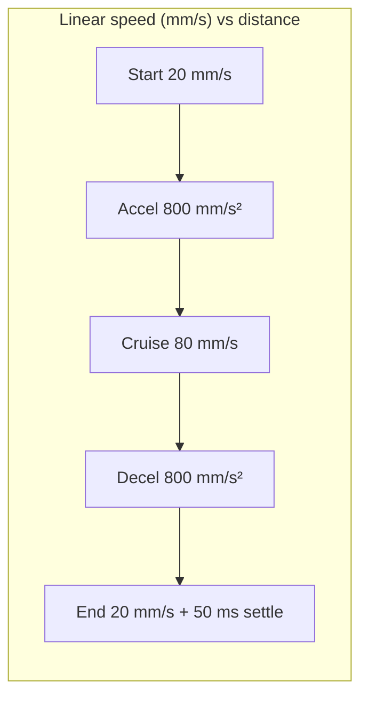

# Movement speed analysis for Pick & Place
_Exported on 6/19/2026 at 02:15:04 GMT+1 from Cursor (3.3.27)_

---

**User**

base on @USW_Machine-main/backend/lib/productionSequence.mjs conducat a deep analyse aboit the speed of  movment for Pick & Place during  MOVEAMMT2 need the linear speed 

---

**Cursor**

I'll analyze `productionSequence.mjs` and trace how MOVEAMMT2 sets Pick & Place linear movement speed.


# Deep analysis: Pick & Place linear speed during `MOVEAMMT2` (production)

This analysis traces the full chain from `productionSequence.mjs` → TCP master → Nano firmware, and derives the **actual linear speed profile** (not just the commanded setpoint).

---

## 1. Where `MOVEAMMT2` is used in production

In `productionSequence.mjs`, after pneumatics, two axis-A moves run:

| Phase | Function | Target (default) | Speed source |
|-------|----------|------------------|--------------|
| `move_to_pick` | `moveAmmT2(320, speed)` | 320 mm | `PRODUCTION_MOVE_SPEED_MM_S` or config |
| `return_to_backoff` | `moveAmmT2(0.5, speed)` | `backoffMmA` = 0.5 mm | same speed |

```35:50:c:\Users\YOUNES\Downloads\USW_Machine-main\USW_Machine-main\backend\lib\productionSequence.mjs
function getProductionTiming() {
  const cfg = getPickPlaceConfig()
  return {
    // ...
    movePositionMm: envMs('PRODUCTION_MOVE_POSITION_MM', 320),
    moveSpeedMmS: envMs('PRODUCTION_MOVE_SPEED_MM_S', cfg.movementSpeedMmS),
    returnPositionMm: cfg.backoffMmA,
  }
}
```

```156:176:c:\Users\YOUNES\Downloads\USW_Machine-main\USW_Machine-main\backend\lib\productionSequence.mjs
    if (!skipPickPlace) {
      _currentPhase = 'move_to_pick'
      moveToPick = await moveAmmT2(timing.movePositionMm, timing.moveSpeedMmS)
      // ...
      _currentPhase = 'return_to_backoff'
      moveToBackoff = await moveAmmT2(timing.returnPositionMm, timing.moveSpeedMmS)
```

---

## 2. Commanded linear speed (setpoint)

### Default: **80 mm/s**

From `backend/data/pick_place_config.json`:

```json
"movementSpeedMmS": 80
```

### Override priority

1. `PRODUCTION_MOVE_SPEED_MM_S` (env) — production-only
2. `movementSpeedMmS` in `pick_place_config.json`
3. Hard default in master: **80 mm/s**

### Validation range (master)

```381:387:c:\Users\YOUNES\Downloads\USW_Machine-main\USW_Machine-main\New_version_pick&place\master\pick_place_master.js
function validateSpeedMmS(mmps, label = 'speed') {
  const n = Number(mmps)
  const max = STEP_MAX_HZ / DEFAULT_SPMM
  if (!Number.isFinite(n) || n <= 0 || n > max) {
    throw clientError(`${label} must be 0.01–${max} mm/s`)
  }
  return n
}
```

With `STEP_MAX_HZ = 40000` and `FIRMWARE_STEPS_PER_MM = 10/3`:

- **Allowed command range: 0.01 – 12,000 mm/s** (master-side)
- **Practical production value today: 80 mm/s**

### Wire commands sent to Nano

```994:997:c:\Users\YOUNES\Downloads\USW_Machine-main\USW_Machine-main\New_version_pick&place\master\pick_place_master.js
export function moveCommandAT2(positionMm, speedMmS) {
  const cfg = getPickPlaceConfig()
  const speed = validateSpeedMmS(speedMmS ?? cfg.movementSpeedMmS)
  return `MOVEAMMT2 ${formatWireNum(positionMm)} ${formatWireNum(speed)}`
}
```

**Production examples (defaults):**
```
MOVEAMMT2 320 80    → pick
MOVEAMMT2 0.5 80    → return to backoff
```

Speed is sent as **mm/s on the wire**, not Hz. Conversion happens on the Nano.

---

## 3. mm/s → step frequency → linear speed (firmware)

### Mechanics (full motion firmware)

From `arduino/pick_place_controller/pick_place_controller.ino`:

| Parameter | Value | Meaning |
|-----------|-------|---------|
| `STEPS_PER_MM` | **10** | 400 PPR, 20T × 2 mm GT2 belt |
| `STEP_MIN_HZ` | 200 | Minimum step rate |
| `STEP_MAX_HZ` | 40,000 | Nano bit-bang cap |
| `RAMP_HZ_PER_SEC` | **8,000** | Step-frequency ramp rate |

### Speed conversion on Nano

```264:271:c:\Users\YOUNES\Downloads\USW_Machine-main\USW_Machine-main\arduino\pick_place_controller\pick_place_controller.ino
static bool parseSpeedHz(const char* s, uint32_t* hz) {
  int32_t mmpsMilli;
  if (!parseMilli(s, &mmpsMilli) || mmpsMilli <= 0) return false;
  uint32_t h = (uint32_t)(((uint64_t)(uint32_t)mmpsMilli * STEPS_PER_MM + 500UL) / 1000UL);
  if (h < STEP_MIN_HZ) h = STEP_MIN_HZ;
  if (h > STEP_MAX_HZ) h = STEP_MAX_HZ;
  *hz = h;
  return true;
}
```

For **80 mm/s**:

| Quantity | Calculation | Result |
|----------|-------------|--------|
| Step frequency | `(80000 × 10 + 500) / 1000` | **800 Hz** |
| Peak linear speed | `800 / 10` | **80.0 mm/s** |
| Min linear speed (ramp floor) | `200 / 10` | **20 mm/s** |

### Linear acceleration

```
a_linear = RAMP_HZ_PER_SEC / STEPS_PER_MM
         = 8000 / 10
         = 800 mm/s²
```

Master exposes the same value as `defaultAccelMm`:

```1008:1009:c:\Users\YOUNES\Downloads\USW_Machine-main\USW_Machine-main\New_version_pick&place\master\pick_place_master.js
    defaultSpeedMm: ...,
    defaultAccelMm: RAMP_HZ_PER_SEC / spmm,
```

With `spmm = 10/3` in STATUS → **2400 mm/s²** in master config API; with real firmware `STEPS_PER_MM = 10` → **800 mm/s²** on the machine.

---

## 4. Actual motion profile (trapezoidal, not constant 80 mm/s)

Firmware uses a **trapezoidal velocity profile** to limit ESS57 following alarms:

```455:479:c:\Users\YOUNES\Downloads\USW_Machine-main\USW_Machine-main\arduino\pick_place_controller\pick_place_controller.ino
static void planMotionProfile(uint32_t totalSteps, uint32_t peakHz) {
  // ...
  uint32_t rampSteps = rampStepsForHz(peakMoveHz);
  if (totalSteps >= 2 * rampSteps && rampSteps > 0) {
    decelStepsPlan = rampSteps;   // full trapezoid
  } else {
    // triangular profile — peak speed reduced for short moves
  }
  currentStepHz = STEP_MIN_HZ;    // start at 200 Hz = 20 mm/s
}
```

Ramp update (every ms loop):

```964:987:c:\Users\YOUNES\Downloads\USW_Machine-main\USW_Machine-main\arduino\pick_place_controller\pick_place_controller.ino
  uint32_t delta = (RAMP_HZ_PER_SEC * dt) / 1000UL;
  // accel: currentStepHz += delta until peakMoveHz
  // decel: currentStepHz -= delta over last decelStepsPlan steps
```

### Speed vs distance (80 mm/s command, 319.5 mm move)



| Segment | Distance | Duration | Speed |
|---------|----------|----------|-------|
| Accel | **3.75 mm** | **75 ms** | 20 → 80 mm/s |
| Cruise | **312.0 mm** | **3.90 s** | **80 mm/s** |
| Decel | **3.75 mm** | **75 ms** | 80 → 20 mm/s |
| Settle | 0 mm | **50 ms** | 0 (following settle) |
| **Total per move** | **319.5 mm** | **~4.10 s** | avg **~77.9 mm/s** |

Formulas used:

```
d_ramp = (v_max² − v_min²) / (2 × a)
       = (80² − 20²) / (2 × 800)
       = 3.75 mm

t_ramp = (v_max − v_min) / a = 60 / 800 = 0.075 s

d_cruise = 319.5 − 2 × 3.75 = 312.0 mm
t_cruise = 312.0 / 80 = 3.90 s
```

### Production cycle — both `MOVEAMMT2` legs

| Move | From → To | Distance | Peak speed | Est. time |
|------|-----------|----------|------------|-----------|
| Pick | 0.5 → 320 mm | 319.5 mm | 80 mm/s | ~4.10 s |
| Return | 320 → 0.5 mm | 319.5 mm | 80 mm/s | ~4.10 s |
| **Total P&P motion** | | **639 mm** | | **~8.20 s** |

Master timeout uses **constant-speed estimate** (slightly optimistic):

```1143:1146:c:\Users\YOUNES\Downloads\USW_Machine-main\USW_Machine-main\New_version_pick&place\master\pick_place_master.js
  const travelMs = Math.abs(target - cur) / Math.max(0.01, speed) * 1000
  const done = await sendAsyncCommand(cmd, CMD_TIMEOUT + travelMs + 5000)
```

For 319.5 mm @ 80 mm/s: `travelMs ≈ 3994 ms`, timeout ≈ **24 s** — enough margin for ramp + settle.

---

## 5. Short-move behavior (triangular profile)

Moves shorter than **~7.5 mm** never reach 80 mm/s:

```
d_critical = 2 × d_ramp = 7.5 mm
```

Below that, firmware lowers peak speed (`planMotionProfile` triangular branch). Production moves (319.5 mm) are well above this, so **80 mm/s cruise is always reached**.

---

## 6. `MOVEAMMT2` vs `MOVEAMM` — important note

| Command | Intended use | Enable pins (D7/D6) |
|---------|--------------|---------------------|
| `MOVEAMM` | Normal production move | Enabled per axis mask |
| `MOVEAMMT1` | Bench test | Both enables **ON** |
| `MOVEAMMT2` | Bench test | Both enables **OFF** |

Production calls `moveAmmT2` → wire `MOVEAMMT2`. In the repo, the full Nano firmware (`pick_place_controller.ino`) lists only `MOVEAMM` / `MOVEBMM` — **no `MOVEAMMT2` handler** (would reply `ERR UNKNOWN`). `COMMANDS.md` marks T1/T2 as diagnostic bench commands.

**Implication:** Linear speed analysis above applies to the **same motion engine as `MOVEAMM`** (trapezoid, 800 Hz @ 80 mm/s, etc.). On deployed hardware, confirm whether firmware implements `MOVEAMMT2` or if production should use `moveAmm` instead.

---

## 7. Configuration summary

| Knob | Location | Default | Effect on linear speed |
|------|----------|---------|------------------------|
| `movementSpeedMmS` | `pick_place_config.json` | **80 mm/s** | Global P&P default |
| `PRODUCTION_MOVE_SPEED_MM_S` | `.env` | falls back to config | Production-only override |
| `PRODUCTION_MOVE_POSITION_MM` | `.env` | **320 mm** | Travel distance (not speed) |
| `backoffMmA` | config | **0.5 mm** | Return position |
| `RAMP_HZ_PER_SEC` | firmware constant | **8000** | Accel = **800 mm/s²** |
| `STEPS_PER_MM` | firmware | **10** | mm/s ↔ Hz conversion |

---

## 8. Answers in one line

**Commanded peak linear speed during production `MOVEAMMT2`: 80 mm/s** (override with `PRODUCTION_MOVE_SPEED_MM_S`).

**Actual motion:** trapezoidal — starts at 20 mm/s, ramps at 800 mm/s², cruises at 80 mm/s for ~312 mm of each 319.5 mm leg, then decelerates; **~4.1 s per move, ~8.2 s total P&P travel per cycle**, average **~78 mm/s** over each full stroke.

If you want, I can add a small calculator script (distance + speed → time with trapezoid) or trace whether your deployed Nano firmware handles `MOVEAMMT2` vs `MOVEAMM`.

