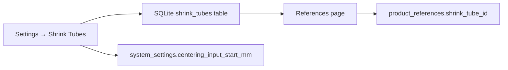

# Settings details for shrink tubes
_Exported on 6/19/2026 at 03:28:19 GMT+1 from Cursor (3.3.27)_

---

**User**

explan all detais on Settings → Shrink Tubes

---

**Cursor**

Searching the codebase for how Settings → Shrink Tubes is implemented and what it controls.


# Settings → Shrink Tubes — full breakdown

This page manages **heat-shrink tube profiles** used when configuring product references. Each profile describes tube size and how the machine’s **centring mechanism** should treat that tube. It also includes one **global centring setting** that applies to the whole machine, not to individual tubes.

---

## Purpose in the production flow

Heat-shrink tubes are applied after welding. Before that, the **centring mechanism** aligns the tube with the wire bundle (see `HARDWARE_ARCHITECTURE.md` §3.4). The Shrink Tubes settings page lets you:

1. Define reusable **tube profiles** (diameter, length, centring options).
2. Link those profiles to **product references** on the References page.
3. Set a **global pick-and-place axis position** where centring input starts.



**Important:** Tube profile data is stored and linked to references, but it is **not yet consumed** by the production sequence or centring Arduino firmware in this codebase. Runtime automation today uses the reference name for serial broadcast to weld/shrink machines; tube dimensions and centring fields are configuration data for future or external use.

---

## Access and visibility

| Gate | Value |
|------|--------|
| Minimum role | `ADMIN` |
| Tab access key | `settings_shrink_tubes` |
| French label (production bypass) | **Gaines thermo** |
| Icon | Cylinder |

Defined in `SettingsPage.tsx`. Users need both ADMIN rank and the tab key (unless their role bypasses tab gates). Admins automatically get `settings_shrink_tubes` in role tab access.

The section can also be toggled for production via **System → Settings pages (production)** using `productionLabels`.

---

## Page layout (two parts)

### 1. Centring mechanism card (top)

`CenteringMechanismGeneralSetting` sits above the tube list via `headerExtra`.

| Field | Key | Meaning |
|-------|-----|---------|
| **Input start position (mm)** | `centering_input_start_mm` | Pick-and-place axis position where the wire enters the centring zone |

- Stored in **`system_settings`** JSON (not in `shrink_tubes`).
- Saved with **Save position** → `PATCH` system settings API.
- Uses the on-screen **virtual keyboard** (read-only text field, kiosk-style).
- Validation: must be **≥ 0**.

This is a **machine-wide** setting. Per-tube centring options are separate (below).

### 2. Shrink tube profiles table (main)

Built with the shared `ReferenceManagementView` CRUD component (same pattern as References, but configured for tubes).

**UI choices for this section:**
- Search bar **hidden**
- Description field **hidden** in create/edit (table still shows an empty Description column from the shared view)
- Name is **not** forced uppercase (unlike barcode references)
- No Export/Import/Load buttons

---

## Tube profile fields

When creating or editing a profile:

| Field | Required | Validation | Input method |
|-------|----------|------------|--------------|
| **Name** | Yes | Non-empty, unique (case-insensitive) | Virtual keyboard |
| **Diameter (mm)** | Yes | Positive number | Virtual keyboard (decimal) |
| **Length (mm)** | Yes | Positive number | Virtual keyboard (decimal) |
| **Centring length tolerance (mm)** | Yes | ≥ 0 | Virtual keyboard (decimal) |
| **Centring mechanism** | No (default: Upper) | One of 3 options | Toggle buttons |
| **Active** | — | Boolean | Switch |

### Centring mechanism options

| Value | Label |
|-------|--------|
| `upper` | Upper Centring Mechanism |
| `lower` | Lower Centring Mechanism |
| `upper_and_lower` | Upper and Lower Centring Mechanism |

These map to the hardware’s two centring modules (A = upper, B = lower). `upper_and_lower` means both are used for this tube profile.

### Default form values (new tube)

```typescript
diameter_mm: ''
length_mm: ''
centring_length_tolerance_mm: ''
centring_mechanism: 'upper'
is_active: true
```

### Hidden legacy field: `rbk`

On create, the UI always sends `rbk: 'RBK1'`. It is stored in SQLite but **not shown or editable** in the UI (`shrinkTube.types.ts` marks it as legacy). RBK wire-bundle types live mainly on references, not tube profiles.

---

## Table columns

| Column | Content |
|--------|---------|
| **Name** | Profile name (monospace, barcode-style icon) |
| **Description** | Always `—` (field hidden in forms) |
| **Dimensions** | e.g. `6 mm × 25 mm` |
| **Tolerance** | e.g. `0.5 mm` |
| **Centring** | e.g. “Upper Centring Mechanism” |
| **Status** | Active / Inactive badge |
| **Actions** | Edit, Delete |

Display helpers:
- `formatShrinkTubeSize()` → `"diameter mm × length mm"`
- `formatShrinkTubeLabel()` → `"Name · 6 mm × 25 mm"` (used on References page dropdown)

---

## CRUD behavior

### Create
- **New** opens a dialog with virtual keyboard.
- ID auto-generated: `ST-{last 6 digits of timestamp}` (e.g. `ST-482931`).
- Success toast: `Shrink tube "{name}" created`.

### Update
- **Edit** opens the same dialog pre-filled.
- Partial updates supported on the API; the form sends all changed fields.
- Success toast: `Shrink tube updated`.

### Delete
- Blocked if any reference uses the tube:
  > `Cannot delete shrink tube — it is assigned to one or more references`
- Otherwise hard-deleted from SQLite.

### Deactivate (soft)
- Set **Active** → Inactive in edit dialog.
- Inactive tubes **cannot** be assigned to new/updated references (API rejects with `Invalid or inactive shrink tube`).
- Existing references keep their `shrink_tube_id` until changed manually.

---

## API endpoints

All under `/api/shrink-tubes` (frontend server and backend both implement them):

| Method | Path | Action |
|--------|------|--------|
| `GET` | `/api/shrink-tubes` | List all, sorted by name (case-insensitive) |
| `POST` | `/api/shrink-tubes` | Create |
| `PATCH` | `/api/shrink-tubes/:id` | Update |
| `DELETE` | `/api/shrink-tubes/:id` | Delete (if not in use) |

Auth: `optionalAuth` (same as other settings APIs).

---

## Database schema (`shrink_tubes`)

```sql
id TEXT PRIMARY KEY          -- e.g. ST-482931
name TEXT NOT NULL           -- unique (case-insensitive)
diameter_mm REAL NOT NULL
length_mm REAL NOT NULL
rbk TEXT NOT NULL DEFAULT 'RBK1'
centring_length_tolerance_mm REAL NOT NULL DEFAULT 0
centring_mechanism TEXT NOT NULL DEFAULT 'upper'
is_active INTEGER NOT NULL DEFAULT 1
created_at TEXT NOT NULL
updated_at TEXT NOT NULL
```

References link via `product_references.shrink_tube_id` → `shrink_tubes.id`.

Older databases get centring columns via migration (`migrateShrinkTubesColumns` in `db.mjs`).

---

## How it connects to References

On **References**, each product can pick a shrink tube profile:

- Dropdown: **Shrink tube profile**
- Only **active** profiles appear
- If none exist: *“No tube profiles yet. Create profiles in Settings → Shrink Tubes.”*
- References table shows a **Shrink tube** column with `formatShrinkTubeLabel()`

This is separate from:
- **Send barcode to shrink machine** — whether the reference name is sent over USB serial to the shrink machine
- **Vision inspection** — post-shrink quality check

A reference can enable shrink barcode + vision without selecting a tube profile (profile is optional).

---

## Hardware context

From `HARDWARE_ARCHITECTURE.md`:

- **Centring** aligns the heat-shrink tube with the wire bundle.
- Two modules (A/B), each with its own Arduino, servo, and Ethernet.
- Tube diameter guides tube alignment; wire bundle diameter guides bundle alignment.
- **Vision** (Program ID 2) inspects tube presence and alignment after application.

The Shrink Tubes settings capture the **configuration** side of that (sizes, which centring module(s), length tolerance). The global **input start position** defines where on the pick-and-place axis centring begins.

---

## Summary diagram

```
Settings → Shrink Tubes
├── Centring mechanism (global)
│   └── centering_input_start_mm  →  system_settings
│
└── Tube profiles (CRUD)
    ├── name, diameter, length
    ├── centring_length_tolerance_mm
    ├── centring_mechanism (upper | lower | upper_and_lower)
    └── is_active
         ↓
    shrink_tubes (SQLite)
         ↓
    References → shrink_tube_id
         ↓
    (stored for production; not yet driving centring firmware in code)
```

---

## Practical notes

1. **Create tube profiles first**, then assign them on References.
2. **Deactivate** instead of delete if a profile is still linked to references.
3. Numeric fields use the **touch virtual keyboard** (read-only inputs) — suited for kiosk HMI.
4. Tube centring settings are **per profile**; input start position is **machine-wide**.
5. **`rbk` on tubes** is legacy; wire bundle type (RBK1/2/3) is configured on the reference, not on the tube profile UI.

If you want, I can trace how a specific field (e.g. centring tolerance) would need to be wired into the production sequence or centring controller next.

