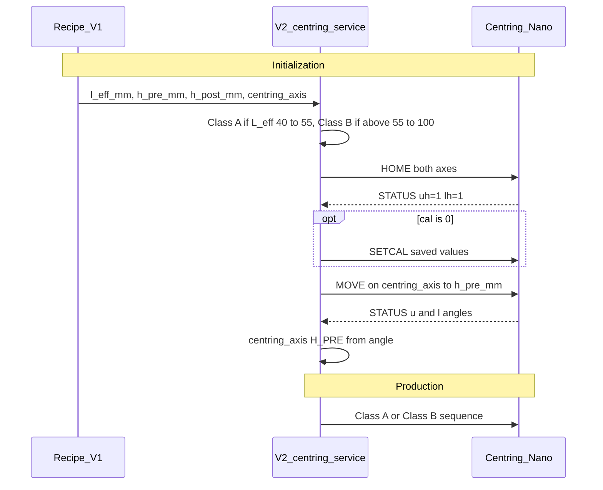

# Centring — Version 2 model and replaced Version 1 system

## Purpose

Describe the Centring subsystem of the US Machine:

1. **Version 2 (target)** — two production length classes (`L_eff` 40–55 mm and above 55–100 mm). `L_eff` is shrink-tube length and is independent of the centring frame. Five positions per axis: HOME and TRAVEL are the limits; H_PRE and H_POST are both between the limits and are confirmed from the last move’s pulse, angle, and height against the reference; UNKNOWN is any other pose between the limits. Limit drives, no command blocked by a pressed switch, new production orchestration, and an HMI full height calibration. The Version 1 height move (without its switch gates), height model, shrink-tube recipe, and TCP link are reused. Full contract: [VERSION_2_PHASE_REQUIREMENTS.md](./VERSION_2_PHASE_REQUIREMENTS.md).
2. **Version 1 (replaced, still running)** — the `v1.0.0` centring cycle that runs on the machine until Version 2 replaces it. Its HOME / SEEK_TRAVEL steps and orchestration are not a Version 2 design source.

Audience: maintainers (I/O and lifecycle), developers (code ownership), and operators (expected rest posture).

Related docs:

- [VERSION_2_CENTRING.md](../VERSION_2_CENTRING.md) — Version 2 mission, scope, ledger
- [VERSION_2_HEIGHT_CALIBRATION.md](./VERSION_2_HEIGHT_CALIBRATION.md) — Version 2 height calibration only
- [PULSE_ENDS_CALIBRATION_UX.md](./PULSE_ENDS_CALIBRATION_UX.md) — Pulse ends: drive Upper and Lower, save each switch pulse
- [DEVELOPMENT.md](./DEVELOPMENT.md) — branch and daily workflow
- [PRODUCTION_CYCLE.md](../PRODUCTION_CYCLE.md) — full production sequence
- [VERSION_2_NANO_FIRMWARE.md](./VERSION_2_NANO_FIRMWARE.md) — clean Version 2 Nano firmware contract (commands to keep, functions to remove, bugs that must not return)
- [FIRMWARE_E2E_ANALYSIS.md](./FIRMWARE_E2E_ANALYSIS.md) — Version 1 slave firmware analysis (height sections still valid for Version 2)
- Firmware source `Double_Actuator_Centring_Slave_Firmware/` is the **Version 2** firmware; Version 1 firmware is the saved image ([VERSIONING.md](../VERSIONING.md#restore-the-version-1-centring-nano-firmware))

---

## Version 2 centring (target)

Not implemented yet. Reuse boundary: [requirements §2](./VERSION_2_PHASE_REQUIREMENTS.md#2-reuse-boundary).

| New | Reused from Version 1 |
|-----|-----------------------|
| Simple drive to HOME (replaces `HOME`) and to TRAVEL (replaces `SEEK_TRAVEL`) | Height move `MOVE_UPPERMM` / `MOVE_LOWERMM` / `MOVEBOTHMM` without switch gates, quadratic height model, saved calibration values |
| Five positions per axis. HOME and TRAVEL are the switch limits. H_PRE and H_POST are both between the limits, confirmed from the last move’s pulse, angle, and height against the reference. UNKNOWN is any other pose between the limits | Recipe `h_pre_mm`, `h_post_mm`, `l_eff_mm`, `centring_axis` (`centringDerivedRecipe.mjs`, `centring_frame_model.js`) |
| Production orchestration per length class | Height as total opening `h(upper) + h(lower) + mechOff` |
| No switch-based command blocks on the Nano or in the session | TCP link `192.168.10.55:8177` and host session code (without `HOME` after E-stop) |
| HMI full height calibration (pulse, angle, height per axis); apply stored relation when `cal=0` | `ensureSlaveCal` / `setCal` path once the relation is stored |

### Architecture

The host owns the loaded reference, the production sequence, and the rest state. The Nano owns motion and switch reading, and knows only the total opening it is told to reach.

### Length classes

| Class | Condition | Production sequence |
|-------|-----------|---------------------|
| Class A | `40 ≤ L_eff ≤ 55 mm` (55 mm included) | Stay at `h_pre_mm`. UNKNOWN on a centring axis is an error; run initialization. |
| Class B | `55 < L_eff ≤ 100 mm` | Centring step: `MOVEAMMT2` to `centering_output_mm`, then `h_pre_mm` to `h_post_mm`. After the pick tail, return to `h_pre_mm`. UNKNOWN runs initialization. An unused axis is parked at TRAVEL. |

The class comes from the stored `l_eff_mm` of the loaded reference. The recipe rejects `L_eff` outside 40–100 mm. `L_eff` is shrink-tube length. The centring frame (guide spacing 40 mm and 300 mm) is the frame and is not this range.

### Five positions per axis

HOME is the open-end limit. TRAVEL is the close-end limit. H_PRE and H_POST are both between those limits. Each is confirmed only when the pulse, the angle, and the height of the last servo move all match the related reference (`h_pre_mm` or `h_post_mm`). UNKNOWN is any other pose between the limits: not HOME, not H_PRE, not H_POST, and not TRAVEL. Link loss is not UNKNOWN. Detail: [requirements §4](./VERSION_2_PHASE_REQUIREMENTS.md#4-five-positions-per-axis).

### Commands

| Command | Behaviour |
|---------|-----------|
| `SEEK_TRAVEL` (same command, new workflow) | `centring_axis` chooses `SEEK_TRAVEL`, `SEEK_TRAVEL_UPPER`, or `SEEK_TRAVEL_LOWER`. If the TRAVEL switch is already pressed, finish with no motion. Otherwise decrease the pulse toward TRAVEL. Do not stop on H_PRE, H_POST, a HOME switch that is already pressed, or UNKNOWN. Stop when the TRAVEL switch presses. |
| `HOME` (same command, new workflow) | If the HOME switch is already pressed, move toward TRAVEL until it releases, then back until it presses again. Otherwise increase the pulse toward HOME. Do not stop on H_PRE, H_POST, a TRAVEL switch that is already pressed, or UNKNOWN. Stop when the HOME switch presses. |
| Height move | `centring_axis` chooses `MOVE_UPPERMM`, `MOVE_LOWERMM`, or `MOVEBOTHMM` for both `h_pre_mm` and `h_post_mm`. To `h_pre_mm`: HOME if not already there, leave the switch, seek, confirm the edge, then move to `h_pre_mm`. To `h_post_mm`: move from the `h_pre_mm` position to `h_post_mm`. Uses calibration data. Calibration is not a command. |

There are no new Nano commands. **Switch states never block a command:** the Nano never rejects with `limit` / `both_limits`, never stops a height move or detaches servos because of a switch, and never rewrites the pulse from switch state; the host session never fails a command because of a switch. Remaining guards: timeout, pulse range, E-stop button, link loss, busy. The mechanical ends are protected by the calibrated pulse clamp of the height model and by the switch drives stopping at their own switch.

### Initialization

At machine initialization with a reference loaded, while a new reference loads, and when a centring axis is UNKNOWN during production: `HOME` on both axes; if `cal=0`, apply the stored pulse–angle–height relation; then the height move on `centring_axis` to `h_pre_mm`. No TRAVEL drive. With no stored relation, initialization stops at HOME and the HMI points to full height calibration. Production waits until the `centring_axis` axes are H_PRE. UNKNOWN is an error; this initialization is the recovery.

### Height calibration

The operator starts a full height calibration from the US Machine HMI. It establishes pulse, angle, and height for the upper axis and the lower axis. The Nano loses that relation from RAM at every power loss. Version 2 then applies the stored relation automatically when `cal=0`, and a maintenance user can apply it again from the HMI. Both applies are validated and audited.

### Limitations (Version 2)

- On Start, Class A and Class B turn the servo pulse on according to H_PRE, wait 1.5 s, then turn the signal off. The production sequence runs at the same time. Neither waits for the other.
- Without switch gates, wrong saved calibration can drive a jaw into its hard stop.
- H_PRE and H_POST require the last move’s pulse, angle, and height together. One of those three disagreeing with the reference leaves the jaw UNKNOWN.
- No Version 2 host or Nano code exists yet. The machine runs Version 1 below.

---

## Replaced system — Version 1 centring (`v1.0.0`)

**Replaced by Version 2. Still running on the machine.** Use this section to operate and maintain the current machine. Its HOME / SEEK_TRAVEL steps and orchestration must not be used to design Version 2; its height move (without the switch gates), height model, saved calibration values, recipe, and TCP link are reused by Version 2. Version 1 Nano firmware for rollback: saved image `Double_Actuator_Centring_Slave_Firmware/images/version-1/centring-nano-v1-flash.hex` ([VERSIONING.md](../VERSIONING.md#restore-the-version-1-centring-nano-firmware)).

### Summary

- Threshold: `shouldSkipCenteringTravel` treats `L_eff < 55` as short and `L_eff ≥ 55` as long (55 mm is long).
- Initialization: `SEEK_TRAVEL` → `HOME` → `SEEK_TRAVEL` closed idle (long), or `SEEK_TRAVEL` → `HOME` → `MOVE h_pre` (short). Long tubes then `MOVE h_pre` when a reference is loaded.
- Production: assert `h_pre` (no MOVE). Long tubes: `MOVEAMMT2` to `centering_output_mm`, then `MOVE h_post`, then restore after pick tail. Short tubes: skip carriage travel, no `h_post`, assert `h_pre` after pick tail.
- Restore: classic `SEEK_TRAVEL` closed idle; advanced `MOVE h_pre`. Short tubes stay at `h_pre` in both variants.
- Soft-stop / abort stops motion but does not restore posture; Recover / Setup is required before the next Start.

### Layer ownership (Version 1)

| Layer | Primary modules | Responsibility |
|-------|-----------------|----------------|
| Lifecycle / Setup | `machineSetup.mjs`, `machineSetupSequence.mjs`, `machineInit.mjs` | When Setup runs; reference initialized; load-time `h_pre` |
| Idle / posture | `centringIdle.mjs`, `centringHoming.mjs` | Closed idle, restore idle, short-tube establish |
| Gap strategy | `centringAdvancedGap.mjs` | `h_pre` apply/assert, advanced enqueue latch |
| Production orchestrator | `productionSequence.mjs` | Ordered steps, restore, abort recovery |
| Centring cycle | `productionCentringSequence.mjs`, `centringProduction.mjs` | Assert `h_pre`, travel, `h_post`; TCP preflight |
| Recipe / geometry | `centring_frame_model.js`, `centringDerivedRecipe.mjs` | `L_eff`, `centering_output_mm`, `h_pre`/`h_post`, axis |
| TCP adapter / slave | `centring.mjs` → `centringMaster/centring_master.js` → Nano `actuators.cpp` | `HOME`/`SEEK_TRAVEL`/`MOVE`/`STATUS` |

### Position in the production sequence (Version 1)

| # | Sequence step | Centring role |
|---|---------------|---------------|
| 1–7 | vision / clamps / lever / PP clamp / open clamps / lever down | Jaws at `h_pre` (or closed idle, classic long); no jaw MOVE |
| 8 | `centring` | Assert `h_pre`; long: travel then `h_post`; short: skip travel |
| 9 | `pick_place_tail` | P&P only; short tubes assert `h_pre` after the tail |
| 10 | `centring_restore_*` | Long: advanced `h_pre` / classic closed idle. Short: assert `h_pre` |
| 11 | `complete` | Lifecycle COMPLETE → RUN |

### Initialization (Version 1)

| Order | Phase | What happens | Success gate |
|-------|-------|--------------|--------------|
| I1 | connect + SETCAL | `connectWithRetry` → `ensureReady` | TCP up, `cal=1`, `!estop` |
| I2 | `SEEK_TRAVEL` | Close both axes before HOME | idle after seek |
| I3 | `HOME` | Both axes open | `busy=0`, `moveEnd=ok` |
| I4 | `SEEK_TRAVEL` | Closed idle, long `L_eff` only | `isCentringInitIdleReady` |
| I4s | `MOVE h_pre` | Short `L_eff` only, after HOME | `h` within tolerance |
| I5 | `MOVE h_pre` | Long `L_eff` with reference: `applyHPreAfterCentringHoming` | `h` within tolerance |
| I6 | Ready | `markReferenceInitialized`; advanced latch | `getCentringProductionBlockReason() == null` |

Retries: `CENTRING_INIT_ATTEMPTS` (default 3), `CENTRING_INIT_HOME_ATTEMPTS` (default 3). Skips: `CENTRING_SKIP_INIT=1` or `PRODUCTION_SKIP_CENTRING=1`.

### Production cycle (Version 1)

| Path | Order |
|------|-------|
| Long (`L_eff ≥ 55`) | `prepareProductionRun` → `centring_h_pre` (assert) → `move_centering_travel` (`MOVEAMMT2`, no stop at input) → `centring_h_post` → `pick_place_tail` → `centring_restore_h_pre` (advanced) or `centring_restore_idle` (classic) |
| Short (`L_eff < 55`) | `centring_h_pre` (assert) → `move_centering_travel_skipped` → `pick_place_tail` (no jaw MOVE) → assert `h_pre` (`assert_only_short_L_eff`) |

Short tubes: no `h_post`, no `centring_h_post_deferred`, `holdHPreEntireCycle: true`; jaws stay at `h_pre` until the next reference. `centring_h_post_deferred`, `move_to_centering_input`, and `centring_park_inactive` are not emitted by production; they remain only in lifecycle / HMI allowlists.

### Gate matrix (Version 1)

| Gate | Function | Accepts | On fail |
|------|----------|---------|---------|
| Enqueue | `getCentringProductionBlockReason` | `cal=1`, `!estop`, closed idle or latched `h_pre` | Recover or Init |
| Prepare | `ensureCentringReadyForProduction` | closed idle, production posture, or `h_pre` | Job fails before CYCLE actuation |
| Mid-cycle `h_pre` | `runCentringCycle` assert | `isCentringAtGapMm(st, h_pre_mm)` | Hard fault |
| Gap achieved | `assertCentringGapAchieved` | `\|h − target\| ≤ tol`, `moveEnd` `ok`/`none` | Centring cycle fault |
| Slave start | `precheckMotion` | `!estop`, `!both_limits`, `!busy`, `cal` for MOVE | `StartReject` reason in STATUS |

### Failure modes (Version 1)

| Symptom | Likely cause | Recovery |
|---------|--------------|----------|
| Init stuck / `home_fail` | Sticky HOME, switch wiring, drive not enabled | `CLEARESTOP` + retry; check `INIT_DRIVE_SETTLE_MS` |
| Start blocked: not at closed idle | Soft-stop left jaws mid-gap; latch cleared | Recover or Setup |
| `h_pre: expected gap … got h=…` | Load-time `h_pre` failed; wrong recipe | Re-scan reference / re-init |
| MOVE rejected `reason=limit` | Pose untrusted after `link_lost` | `HOME` then `SEEK_TRAVEL` |
| Short cable still travels / opens `h_post` | Persisted `L_eff ≥ 55` or skip flags | Check recipe `L_eff_mm` and `PRODUCTION_SKIP_*` |

### Env / settings (Version 1)

| Knob | Effect |
|------|--------|
| `PRODUCTION_SKIP_CENTRING=1` | Skip init, cycle, and enqueue gate |
| `CENTRING_SKIP_INIT=1` | Skip only Setup homing |
| `PRODUCTION_SKIP_CENTRING_PICK_PLACE` / `PRODUCTION_SKIP_PICK_PLACE` | Skip `MOVEAMMT2` inside centring |
| `production_cycle_variant` | Advanced restores `h_pre`; classic restores closed idle |
| `CENTRING_GAP_TOLERANCE_MM` / `CENTRING_MOVE_TOL_MM` | `h_pre` / `h_post` tolerance |
| `CENTRING_INIT_*_ATTEMPTS`, `CENTRING_INIT_RETRY_SETTLE_MS`, `INIT_DRIVE_SETTLE_MS` | Init resilience |

### Limitations (Version 1)

- Mid-cycle `h_pre` is assert-only; a failed load-time MOVE fails the next Start inside CYCLE.
- Soft-stop / abort does not restore posture automatically.
- Agent-debug `fetch` instrumentation (`localhost:7627`) remains on the Pi hot path in several backend modules, including `productionCentringSequence.mjs`, `machineSetupSequence.mjs`, `centringIdle.mjs`, and `centringMaster/centring_master.js`.

### Source of truth (Version 1 code)

| Concern | Path |
|---------|------|
| Setup centring | `backend/lib/machineSetupSequence.mjs` |
| Closed idle / restore | `backend/lib/centringIdle.mjs` |
| Homing | `backend/lib/centringHoming.mjs` |
| `h_pre` gap | `backend/lib/centringAdvancedGap.mjs` |
| Production steps | `backend/lib/productionSequence.mjs` |
| Centring cycle | `backend/lib/productionCentringSequence.mjs` |
| Preflight / gap verify | `backend/lib/centringProduction.mjs` |
| Recipe geometry | `backend/lib/centring_frame_model.js` |
| TCP adapter | `backend/lib/centring.mjs`, `backend/lib/centringMaster/` |
| Slave motion | `Double_Actuator_Centring_Slave_Firmware/src/actuators.cpp` |

---

## Future improvements

- Implement the Version 2 host service, Nano driver, and Nano firmware from the decided contract.
- Move this document to Version 2 only once Version 1 is retired from the machine.
