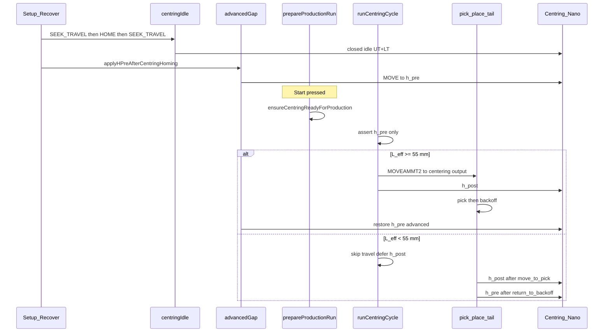

# Centring — end-to-end cycle analysis

## Purpose

Describe the Centring subsystem end-to-end: how Initialization establishes absolute pose and the reference closing gap (`h_pre`), how production asserts that posture and runs travel / opening gap (`h_post`), how short tubes (`L_eff < 55 mm`) hold `h_pre` for the full cycle, and how restore / abort / recovery close the loop for the next cable.

**Version 2 centring development:** [DEVELOPMENT.md](./DEVELOPMENT.md).

Audience: maintainers (I/O and lifecycle), developers (code ownership), and operators (expected rest posture between cycles).

Related docs:

- [FIRMWARE_E2E_ANALYSIS.md](./FIRMWARE_E2E_ANALYSIS.md) — slave firmware deep analysis (Nano FSM, TCP, kinematics)
- [PRODUCTION_CYCLE.md](../PRODUCTION_CYCLE.md) — full production sequence (clamps, lever, vision, pick-place)
- [PICK_PLACE_NANO_SYSTEM.md](../PICK_PLACE_NANO_SYSTEM.md) — carriage motion used during centring travel
- Slave firmware: [PRODUCTION_FSM.md](../../Double_Actuator_Centring_Slave_Firmware/docs/double_actuator_centring_slave/PRODUCTION_FSM.md), [MASTER_CONTROL.md](../../Double_Actuator_Centring_Slave_Firmware/docs/double_actuator_centring_slave/MASTER_CONTROL.md), [HEIGHT_MODEL.md](../../Double_Actuator_Centring_Slave_Firmware/HEIGHT_MODEL.md)
- Integration index: [MASTER_SLAVE_INTEGRATION.md](../../MASTER_SLAVE_INTEGRATION.md)

## Architecture

Centring is orchestrated on the Raspberry Pi host. Jaw motion runs on the Double Actuator Centring Nano over TCP. Carriage travel to the centering output uses the Pick & Place Nano (`MOVEAMMT2`). The HMI and controllers must not own the sequence; they call Setup / Recover and `requestProductionStart`.



### Verdict

Centring is a **two-phase contract**:

1. **Initialization** — establish absolute pose (`SEEK_TRAVEL` → `HOME` → `SEEK_TRAVEL` closed idle), then park jaws at the reference **closing gap** (`h_pre`) when a reference is loaded.
2. **Production** — do **not** re-home mid-cycle. **Assert** `h_pre` → carry cable to centering output (unless short `L_eff`) → open to **`h_post`** → finish pick-place → restore **`h_pre`** (advanced) or closed idle (classic).

Soft-stop / abort stops motion but does **not** automatically restore posture; Recover / Setup is required before the next Start.

### Layer ownership

| Layer | Primary modules | Responsibility |
|-------|-----------------|----------------|
| Lifecycle / Setup | `machineSetup.mjs`, `machineSetupSequence.mjs`, `machineInit.mjs` | When Setup runs; mark reference initialized; load-time `h_pre` reconcile |
| Centring idle / posture | `centringIdle.mjs`, `centringHoming.mjs` | `SEEK_TRAVEL` → `HOME` → `SEEK_TRAVEL` closed idle; restore idle; legacy production park |
| Gap strategy | `centringAdvancedGap.mjs` | `h_pre` apply/assert on load + after pick-tail; advanced enqueue latch |
| Production orchestrator | `productionSequence.mjs` | Prepare + ordered steps; short-`L_eff` gap deferral into `pick_place_tail` |
| Centring cycle | `productionCentringSequence.mjs`, `centringProduction.mjs` | `h_pre` assert → `MOVEAMMT2`→output → `h_post` (or defer); TCP preflight |
| Recipe / geometry | `centring_frame_model.js`, `centringDerivedRecipe.mjs` | `L_eff`, `centering_output_mm`, `h_pre`/`h_post`, axis from mechanism |
| TCP adapter / slave FSM | `centring.mjs` → `centring_master.js` → Nano `actuators.cpp` | `HOME`/`MOVE`/`STATUS`; modes Idle\|Home\|Move\|Calibrate; `cal` + estop gates |

### Where centring sits in the production sequence

From the ordered production steps (see [PRODUCTION_CYCLE.md](./PRODUCTION_CYCLE.md)):

| # | Sequence step | Centring role |
|---|---------------|---------------|
| 1–5 | vision / clamps / lever / PP clamp / vision | Idle at `h_pre` (advanced) |
| 6–7 | `open_clamps` → `lever_down` | Still holding `h_pre`; no jaw MOVE yet |
| 8 | `centring` | Assert `h_pre` → travel → `h_post` (or defer) |
| 9 | `pick_place_tail` | Short `L_eff`: apply deferred `h_post` / `h_pre` here |
| 10 | `centring_restore_*` | Restore rest posture for next cable |
| 11 | `complete` | Lifecycle COMPLETE → RUN |

## Dependencies

- Machine Setup / Recover completed (or production-light recovery) with centring not skipped
- Product reference loaded with active shrink tube (centring recipe: gaps, mechanism, length)
- Centring Nano reachable over TCP; `cal=1`, `estop=0`
- When travel is enabled: Pick & Place Nano reachable (`MOVEAMMT2`)
- EtherCAT / pneumatics sequence has already opened clamps and lowered the lever before the centring step
- Config / env:
  - `PRODUCTION_SKIP_CENTRING`, `CENTRING_SKIP_INIT`
  - `PRODUCTION_SKIP_CENTRING_PICK_PLACE` / `PRODUCTION_SKIP_PICK_PLACE`
  - `production_cycle_variant` / gap strategy (`advanced` vs `classic`)
  - `CENTRING_GAP_TOLERANCE_MM` / `CENTRING_MOVE_TOL_MM`
  - `CENTRING_INIT_ATTEMPTS`, `CENTRING_INIT_HOME_ATTEMPTS`, `CENTRING_INIT_RETRY_SETTLE_MS`
  - `INIT_DRIVE_SETTLE_MS` (drive enable settle after PNOZ / air)

## Posture model

| Posture | Soft angles / height | Switch authority | When used |
|---------|----------------------|------------------|-----------|
| Closed idle | `u≈+35°` `l≈+35°` (`S_MAX`) | UT+LT preferred over soft° | End of init `SEEK_TRAVEL`; classic restore; production-light recovery target |
| Open idle | `u≈−80°` `l≈−80°` (`S_MIN`) | UH+LH | After full HOME both; not the advanced production rest posture |
| `h_pre` gap | Total height ≈ `diameter_closing_gap_mm` | Gate uses `st.h` / model | After setup with reference; between advanced cycles; mid-cycle entry assert |
| `h_post` gap | Total height ≈ `diameter_opening_gap_mm` | Verified after MOVE | At centering output (normal) or after `move_to_pick` (short `L_eff`) |
| Production park (legacy) | upper: `u=S_MIN` `l=S_MAX`; lower inverse | Active at HOME, inactive at TRAVEL | `prepareCentringProductionPosture` — advanced path no longer parks mid-cycle |

Height kinematics: `S_MIN` (−80°) open / HOME; `S_MAX` (+35°) closed / TRAVEL. Slave `MOVE` requires `cal=1`. TRAVEL switches beat soft° for closed-idle detection (MASTER_CONTROL §8.6).

## Initialization cycle (centring)

Owned by `runSubsystemHomingSequence` inside full Setup and production-light Recover. Preceded by PNOZ reset, main air, pneumatics safe state, drive settle, and Pick & Place `HOMEA`/`HOMEB`.

| Order | Phase | What happens | Success gate |
|-------|-------|--------------|--------------|
| I1 | connect + SETCAL | `connectWithRetry` → `ensureReady` | TCP up, `cal=1`, `!estop` |
| I2 | SEEK_TRAVEL (pre-home) | Close both axes to TRAVEL before absolute HOME | idle after seek (`moveEnd=ok` or already on TRAVEL) |
| I3 | HOME | Always `HOME` both — absolute open reference after pre-seek | `busy=0`, `moveEnd=ok` (or near-home fallback) |
| I4 | SEEK_TRAVEL (closed idle) | Both axes to TRAVEL again (UT+LT / soft ≈`S_MAX`) — **long L_eff only** | `isCentringTravelIdleStatus` → `isCentringInitIdleReady` |
| I4s | `h_pre` (short L_eff) | After pre-seek + HOME only: `MOVE_*MM` to `h_pre_mm` | STATUS `h` within gap tolerance |
| I5 | `h_pre` (long L_eff + reference) | `applyHPreAfterCentringHoming` → `MOVE_*MM` or assert already at gap | STATUS `h` within gap tolerance of `h_pre_mm` |
| I6 | Ready for RUN | `markReferenceInitialized` + reconcile; advanced notes `h_pre` latch | `getCentringProductionBlockReason() == null` |

### Retries and skips

- Outer SEEK/full pass: `CENTRING_INIT_ATTEMPTS` (default 3)
- Inner HOME: `CENTRING_INIT_HOME_ATTEMPTS` (default 3)
- Recoverable errors (`home_fail`, busy, seek fail, `link_lost`) → stop + `CLEARESTOP` + `ensureReady` + retry
- Hard failures: both-limits wiring, SETCAL failure, CLEARESTOP failure, STATUS unavailable
- Skips: `CENTRING_SKIP_INIT=1` or `PRODUCTION_SKIP_CENTRING=1` — no closed-idle / no setup `h_pre`
- Reference load (outside Setup): `applyReferenceHPreAfterLoad` applies advanced `h_pre` then reconciles RUN when gates pass

**Closed idle vs `h_pre`:** Long tubes end init at closed idle, then Setup opens to `h_pre`. Short tubes (`L_eff < 55 mm`) use **SEEK_TRAVEL → HOME → MOVE `h_pre`** on load/Setup (no post-HOME SEEK). Between short-tube cycles jaws stay at `h_pre` until the next reference. Enqueue accepts closed idle **or** latched `h_pre` at STATUS (classic and advanced).

## Production centring cycle

### Prepare

`prepareProductionRun` opens/verifies centring (and pick-place when needed) TCP in parallel:

- `ensureCentringReadyForProduction(axis, { hPreMm, hPostMm, allowHPre })`
- Accepts closed idle, production posture, or (advanced) already at `h_pre`
- Holds centring TCP during preflight so health probes cannot close the session

### Normal path (`L_eff ≥ 55 mm`)

| Order | Phase | Detail |
|-------|-------|--------|
| P0 | `prepareProductionRun` | Parallel TCP preflight |
| P1 | `centring_h_pre` | **Assert-only** mid-cycle — no MOVE; jaws must already be at `h_pre` |
| P2 | `move_centering_travel` | P&P `MOVEAMMT2` to `centering_output_mm` (passes input, no stop) |
| P3 | `centring_h_post` | `applyShrinkTubeGapPhase(post)` + verify STATUS `h` / `moveEnd` |
| P4 | `pick_place_tail` | `move_to_pick` → ARM (evo500) → open PP clamp → `return_to_backoff` |
| P5 | `centring_restore_*` | advanced → restore `h_pre`; classic → `SEEK_TRAVEL` closed idle |

Threshold constant: `CENTERING_TRAVEL_MIN_L_EFF_MM = 55` in `productionCentringSequence.mjs` (not tied to frame `Wb`).

### Short-cable path (`L_eff < 55 mm`)

**Load / Setup (once per new reference id):** `SEEK_TRAVEL` → `HOME` → `MOVE h_pre` (no second `SEEK_TRAVEL`). Re-broadcast same id at `h_pre` → assert only.

**Production cycle:**

| Order | Phase | Detail |
|-------|-------|--------|
| S0 | `centring_h_pre` | Assert-only at cycle entry (`assert_only_mid_cycle`) |
| S1 | `move_centering_travel_skipped` | No P&P travel to centring output |
| S2 | `pick_place_tail` | Normal move_to_pick → ARM (evo) → clamp → return (no jaw MOVE) |
| S3 | `centring_restore_h_pre` | Assert-only (`assert_only_short_L_eff`) — jaws remain at `h_pre` |

No `h_post`, no `centring_h_post_deferred`, `holdHPreEntireCycle: true`. Operator rest posture: **`h_pre` from scan until next reference** — production does not open the jaws.

### Advanced vs classic

| Aspect | Advanced (default) | Classic |
|--------|--------------------|---------|
| Long L_eff between cycles | Jaws at `h_pre` after restore | `SEEK_TRAVEL` closed idle after restore |
| Short L_eff between cycles | Jaws stay at `h_pre` | Same — assert `h_pre`, no closed idle |
| Mid-cycle `h_pre` | Assert only (set on load) | Same assert contract |
| After pick-tail (long) | `centring_restore_h_pre` | `centring_restore_idle` |
| After pick-tail (short) | Assert `h_pre` | Assert `h_pre` (not closed idle) |
| Enqueue gate | Closed idle **or** latched `h_pre` | Closed idle **or** latched `h_pre` |
| Park HOME active axis | Not used mid-cycle | Legacy `prepareCentringProductionPosture` still available |

## Gate matrix

| Gate | Function | Accepts | On fail |
|------|----------|---------|---------|
| Enqueue | `getCentringProductionBlockReason` | `cal=1`, `!estop`, closed idle **or** at latched `h_pre` | Unreachable / STATUS missing / wrong posture → Recover or Init |
| Prepare preflight | `ensureCentringReadyForProduction` | closed idle \| production posture \| `allowHPre`+at `h_pre` | Job fails before CYCLE actuation; abort may open clamps |
| Mid-cycle `h_pre` | `runCentringCycle` assert | `isCentringAtGapMm(st, h_pre_mm)` | Hard fault — expected set on scan / init / prior restore |
| Gap achieved | `assertCentringGapAchieved` | `\|h − target\| ≤ tol`; `moveEnd` `ok`\|`none` | Centring cycle fault; soft-stop abort stops motion best-effort |
| Slave start | actuators `precheckMotion` | `!estop`, `!both_limits`, `!busy`, `cal` for MOVE | `StartReject` `nocal`/`limit`/`range`/`estop` → STATUS `reason` |

## Slave production FSM (Nano)

There is no C++ type named `ProductionFSM`. Live modes in `actuators.cpp`: **Idle** ↔ **Home** | **Move** | **Calibrate**.

Cross-cutting flags: `busy`, estop latch, `cal` validity, `completionPending` → STATUS `moveEnd`.

| Timing | Value | Use |
|--------|-------|-----|
| MOVE / HOME / CAL timeout | 60 s | Motion modes |
| TCP keepalive kill | 10 s | Link loss → `moveEnd=link_lost` |
| MOVE production gate | `cal=1` | Rejects with `nocal` otherwise |

Link loss / keepalive kills motion and resyncs soft PWM from switches when `cal=1`. The next `MOVE` can reject with `reason=limit` if the host assumes the old pose — prefer `HOME` then `SEEK_TRAVEL` before trusting angles again.

## Host call chain

| Trigger | Entry |
|---------|-------|
| Setup DI0 / HMI | `machineSetup` → `machineSetupSequence` |
| Centring init (long) | `initializeCentringTravelIdle` |
| Centring establish (short) | `initializeCentringShortTubeEstablish` → then `applyHPreAfterCentringHoming` |
| Post-init gap | `applyHPreAfterCentringHoming` |
| Reference scan | `applyReferenceHPreAfterLoad` |
| Start / enqueue | `requestProductionStart` → `prepareProductionRun` |
| Centring step | `runCentringCycle` (`holdHPreEntireCycle` when `L_eff < 55`) |
| Pick tail (short) | `runPickPlaceTail` + assert `h_pre` after tail |
| Restore (long) | `applyOrAssertHPre` \| `restoreCentringTravelIdle` |
| Abort | `abortProductionMotionBestEffort` → `centring.stop` |

## Usage (developers)

```text
initializeCentringTravelIdle(axis)           → SEEK → HOME → SEEK (long L_eff)
initializeCentringShortTubeEstablish(axis) → SEEK → HOME (short L_eff; then MOVE h_pre)
applyHPreAfterCentringHoming(refId)        → setup-time h_pre MOVE/assert
applyReferenceHPreAfterLoad(refId)         → scan-time establish + h_pre + RUN reconcile
ensureCentringReadyForProduction(...)      → prepare / cycle preflight
runCentringCycle({ shrinkTube, ... })      → assert h_pre → travel → h_post (long only)
applyOrAssertHPre(resolved)                → load / restore / abort recovery
restoreCentringTravelIdle(axis)            → classic closed idle (long L_eff)
```

Recipe resolution: load-only from persisted DB via `requirePersistedCentringRecipe` / `resolveShrinkTubeCentring` (`h_pre_mm`, `h_post_mm`, `L_eff_mm`, `centering_output_mm`, `centring_axis`).

Maintenance centering run (`runMaintenanceCentringCycle`, panel CENTERING RUN and `POST /api/machine/centring-production-cycle`) is the test-style production cycle. Short `L_eff` establishes `SEEK_TRAVEL → HOME → MOVE h_pre` once per reference, then asserts `h_pre` and does not restore closed idle. A later run of the same reference only asserts. Long `L_eff` keeps travel, `h_post`, and optional closed-idle restore. The production stepper reuses the same step builder as Start.

## Failure modes and recovery

| Symptom | Likely cause | Recovery |
|---------|--------------|----------|
| Init stuck / `home_fail` | Sticky HOME, UH/UT or LH/LT wiring, drive not enabled after PNOZ | `CLEARESTOP` + retry (`CENTRING_INIT_*_ATTEMPTS`); check `INIT_DRIVE_SETTLE_MS` |
| Start blocked: not at closed idle | Soft-stop left jaws mid-gap; advanced latch cleared; cache stale | Recover (subsystem homing) or Setup; advanced needs `h_pre` re-apply |
| `h_pre: expected gap … got h=…` | Reference load `h_pre` failed; restore skipped; wrong recipe | Re-scan reference / re-init; verify shrink-tube gaps in DB |
| MOVE rejected `reason=limit` | Pose untrusted after `link_lost`; soft° vs switch disagree | `HOME` then `SEEK_TRAVEL`; do not force MOVE from unknown pose |
| Short cable still travels / opens h_post | Persisted `L_eff ≥ 55` or skip flags | Check recipe `L_eff_mm` and `PRODUCTION_SKIP_*` env |

## Env / settings that change the cycle

| Knob | Effect on centring |
|------|--------------------|
| `PRODUCTION_SKIP_CENTRING=1` | Skip init + cycle + enqueue gate |
| `CENTRING_SKIP_INIT=1` | Skip only setup homing / SEEK |
| `PRODUCTION_SKIP_CENTRING_PICK_PLACE` / `SKIP_PICK_PLACE` | Skip `MOVEAMMT2` inside centring (gaps may still run) |
| `production_cycle_variant` / gapStrategy | advanced restore `h_pre` vs classic idle |
| `CENTRING_GAP_TOLERANCE_MM` / `CENTRING_MOVE_TOL_MM` | `h_pre` / `h_post` assert band |
| `CENTRING_INIT_*_ATTEMPTS` / `RETRY_SETTLE_MS` | Init resilience |
| `INIT_DRIVE_SETTLE_MS` | Delay after air before HOME/SEEK |

## Limitations

- Mid-cycle **`h_pre` is assert-only** — production does not re-apply it at the start of `runCentringCycle`. If load-time or restore-time `h_pre` failed (best-effort on broadcast), the next Start fails inside CYCLE after Pre-Start clamps may already have closed.
- Soft-stop / abort opens clamps and stops centring with a short timeout; it does **not** restore `h_pre` or closed idle automatically.
- Short `L_eff` holds `h_pre` for the whole cycle; abort/finally may still MOVE back to `h_pre` for recovery.
- Slave has no dedicated STOP wire command semantics beyond host `centring.stop` / link behaviour — abort is best-effort with timeout so the cycle can continue safing.
- Skip flags can omit large parts of the cycle; treat “full” as “all enabled steps for this reference/config”.

## Future improvements

- Fail Start / enqueue explicitly when advanced `h_pre` latch is missing after a reference that claims ready, instead of failing mid-cycle.
- Optional auto-restore to `h_pre` (or closed idle) after soft-stop settle before promoting to RUN.
- Operator-facing phase text that distinguishes “centring travel”, “opening gap”, and “restore gap” for short vs normal `L_eff`.
- Gate or remove leftover agent-debug `fetch`/file-append instrumentation on the Pi hot path before production hardening.
- Single settings surface for centring skip / gap strategy with safe apply policy (today partly env-driven).

## Source of truth (code)

| Concern | Path |
|---------|------|
| Setup centring + setup `h_pre` | `backend/lib/machineSetupSequence.mjs` |
| Closed idle / restore / park | `backend/lib/centringIdle.mjs` |
| Homing policy | `backend/lib/centringHoming.mjs` |
| Advanced `h_pre` | `backend/lib/centringAdvancedGap.mjs` |
| Production steps | `backend/lib/productionSequence.mjs` |
| Centring cycle | `backend/lib/productionCentringSequence.mjs` |
| Preflight / gap verify | `backend/lib/centringProduction.mjs` |
| Recipe geometry | `backend/lib/centring_frame_model.js` |
| Host TCP adapter | `backend/lib/centring.mjs`, `backend/lib/centringMaster/` |
| Slave motion FSM | `Double_Actuator_Centring_Slave_Firmware/src/actuators.cpp` |
