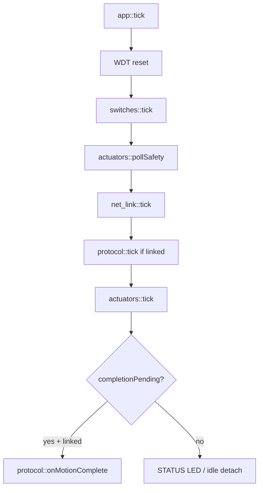
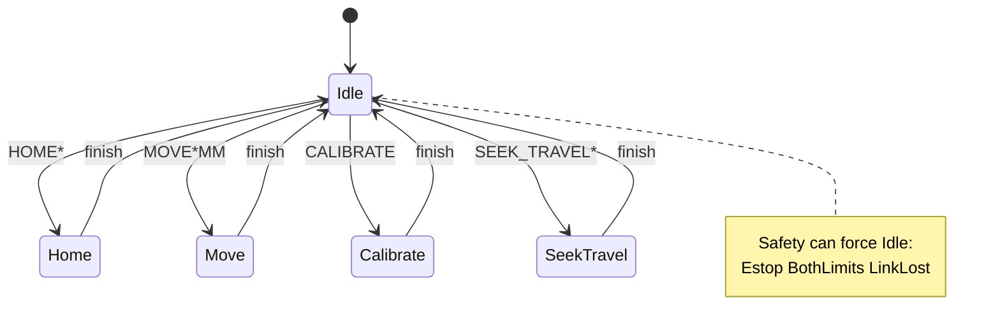
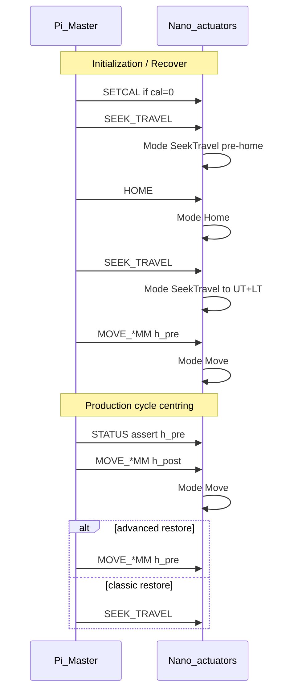

# Centring slave firmware — end-to-end deep analysis

## Purpose

Deep analysis of the **Double Actuator Centring Slave** firmware (`Double_Actuator_Centring_Slave_Firmware`): how the Arduino Nano runs the motion FSM, TCP protocol, height kinematics, safety overlays, and how those behaviours map onto the host Initialization / production centring cycles.

Audience: firmware maintainers, host Master developers, and field engineers diagnosing `moveEnd` / `reason` / switch faults.

**Scope: Version 1 Nano program.** The firmware tree itself is now the **Version 2** source (branch `version-2`), so code references here can drift from the tree as Version 2 lands; the Version 1 program is preserved as the saved image `Double_Actuator_Centring_Slave_Firmware/images/version-1/centring-nano-v1-flash.hex`. The clean Version 2 firmware contract (what to keep, what to delete, which current behaviours are bugs) is [VERSION_2_NANO_FIRMWARE.md](./VERSION_2_NANO_FIRMWARE.md). For Version 2 ([VERSION_2_PHASE_REQUIREMENTS.md](./VERSION_2_PHASE_REQUIREMENTS.md)):

- **Still valid (reused):** height move (`MOVE*MM`, `tickMove`), kinematics / height model, `SETCAL` / `SETHENDS` / `SETMECHOFF`, TCP link and STATUS (the host classifies the Version 2 rest state from STATUS switch bits and `u=` / `l=` angles).
- **Workflow changed, names kept:** `HOME*` and `SEEK_TRAVEL*` stay. The crawl inside `tickHome` and `tickSeekTravel` does not. Version 2 workflow: skip if the target switch is pressed, otherwise step the pulse until it is, and do not stop on H_PRE, H_POST, or UNKNOWN. Do not extend the old crawl sections into the Version 2 design.
- **Not used by Version 2:** `CALIBRATE` (its own HOME / TRAVEL crawls); the switch gates (`both_limits` reject and latch, `limit` reject and stop via `limit_policy`, `resyncSoftPulseFromSwitches`). In Version 2 no switch state blocks a command, and the host reads H_PRE / H_POST from the STATUS `u=` / `l=` angles. Saved calibration is applied with `SETCAL` at initialization when `cal=0`, or manually from HMI maintenance.

This document complements (does not replace) the in-tree slave docs:

| Slave doc | Focus |
|-----------|--------|
| [MASTER_CONTROL.md](../../Double_Actuator_Centring_Slave_Firmware/docs/double_actuator_centring_slave/MASTER_CONTROL.md) | Full command catalogue + Master workflows |
| [TCP_MASTER_SLAVE.md](../../Double_Actuator_Centring_Slave_Firmware/docs/double_actuator_centring_slave/TCP_MASTER_SLAVE.md) | Socket / keepalive / reconnect |
| [PRODUCTION_FSM.md](../../Double_Actuator_Centring_Slave_Firmware/docs/double_actuator_centring_slave/PRODUCTION_FSM.md) | Mode machine & safety matrix |
| [HEIGHT_MODEL.md](../../Double_Actuator_Centring_Slave_Firmware/HEIGHT_MODEL.md) | Quadratic height math |
| [Centring.md](./Centring.md) | Host e2e init + production cycle |

**Out of scope for reuse:** `not_used/` is reference-only archive and is not treated as implementation source here.

## Architecture

### Platform

| Item | Value |
|------|--------|
| MCU | Arduino Nano ATmega328P |
| Build | PlatformIO env `double_actuator_centring_slave` |
| Framework | Arduino + Servo + EthernetENC (ENC28J60) |
| Role | TCP **server** `192.168.10.55:8177` |
| Protocol | ASCII LF lines, one long-lived Master socket |
| Cal storage | **RAM only** — Master must persist and re-`SETCAL` |

### Module ownership

```text
main.cpp          setup/loop → app
app.cpp           WDT → switches → pollSafety → net → protocol → actuators::tick → completion
protocol.cpp      ASCII parse → start* / SETCAL / STATUS / CAL_RESULT
actuators.cpp     Mode FSM: Idle | Home | Move | Calibrate | SeekTravel
kinematics.cpp    t↔µs↔mm, calValid, hmin/hmax, targetPulsesForHeight
limit_policy.hpp  TowardHome (+µs) / TowardTravel (−µs); switch gate
switches.cpp      Debounced UH/UT/LH/LT + E-stop button
net_link.cpp      ENC28J60 accept / RX drain / single session
status_led.cpp    Idle / Busy / Reject RGB
```



### Design principles

1. **Physical switches beat soft PWM** — idle resync and MOVE start resync from HOME/TRAVEL before inverse height.
2. **`cal=1` is the only production MOVE gate** — there is no separate `homed` flag.
3. **Single active limit is valid** — motion into the pressed limit is blocked; motion toward the opposite limit is allowed.
4. **Both limits on one axis is a hard fault** — latch, detach, `moveEnd=both_limits`.
5. **Link loss must not invent pose** — `onDisconnect` resyncs soft PWM from switches; does **not** park to boot seeds (`1206`/`1641`).
6. **Flash/RAM constrained** — PROGMEM strings, LTO, EthernetENC UDP off, max 128-char lines, 48 RX bytes/tick.

## Dependencies

### Hardware I/O (`include/pins.h`)

| Pin | Signal | Role |
|-----|--------|------|
| D2 | Upper servo PWM | J1 |
| D3 | UH | Upper HOME (open), pressed = LOW |
| D4 | UT | Upper TRAVEL (closed), pressed = LOW |
| D5–D7 | RGB | Status LED |
| D8 | Button | Software E-stop, pressed = LOW |
| D9 | Lower servo PWM | J2 |
| A0 | LT | Lower TRAVEL |
| A1 | LH | Lower HOME |
| D10–D13 | ENC28J60 SPI | CS / MOSI / MISO / SCK |

### PWM polarity (`limit_policy.hpp`)

| Direction | PWM | Typical end |
|-----------|-----|-------------|
| Toward HOME (open) | **+µs** | `u_HOME` high, UH/LH |
| Toward TRAVEL (close) | **−µs** | `u_TRAVEL` low, UT/LT |

Cal ends must satisfy `u_HOME > u_TRAVEL` on each axis.

### Timing constants (`board_config.h`)

| Constant | Value | Use |
|----------|------:|-----|
| `kCrawlStepUs` | 4 µs | HOME crawl |
| `kCalCrawlStepUs` | 12 µs | CAL / SEEK_TRAVEL crawl |
| `kCrawlIntervalMs` | 20 ms | Crawl period |
| `kHomeLeaveMinUs` | 80 µs | Sticky-HOME leave distance |
| `kLeaveHeadroomUs` | 80 µs | RecoverHigh before Leave |
| `kHomeEdgeConfirmTicks` | 3 | Edge settle |
| `kMotionTimeoutMs` | 60 s | MOVE |
| `kHomeCalTimeoutMs` | 60 s | HOME / CAL / SEEK |
| `kStallWindowMs` | 3 s | No pulse progress |
| `kKeepaliveTimeoutMs` | 10 s | Idle link kill |
| `kEstopReleaseHoldMs` | 200 ms | Before CLEARESTOP allowed |
| `kIdleDetachMs` | 1500 ms | Release holding torque when idle |
| `kSwitchDebounceMs` | 25 ms | Contact bounce |
| `kDefaultSpeedDegS` | 45 °/s | HOME / CAL / default MOVE |
| `kMaxSpeedDegS` | 120 °/s | MOVE clamp |

### Network (`network_config.h`)

| Parameter | Value |
|-----------|--------|
| IPv4 | `192.168.10.55` |
| Port | `8177` |
| MAC | `02:00:00:CA:7E:55` |
| Gateway / DNS | `192.168.10.1` |
| Max command line | 128 chars |
| Line ending | LF (`\n`) |

## Motion FSM (as implemented)

Private `Mode` in `actuators.cpp` (not a public C++ type named `ProductionFSM`):

| Mode | Tick | Purpose | Success `moveEnd` |
|------|------|---------|-------------------|
| **Idle** | soft resync + idle detach | Wait for commands | — |
| **Home** | `tickHome` | Absolute open seek on selected axes | `ok` / `home_fail` |
| **Move** | `tickMove` | Height slew to pulse targets | `ok` / `limit` / stall / timeout |
| **Calibrate** | `tickCalibrate` | Measure HOME/TRAVEL ends U then L | `ok` / `cal_fail` |
| **SeekTravel** | `tickSeekTravel` | Crawl −µs until TRAVEL edge | `ok` / `limit` / stall / timeout |



### Shared start gate (`precheckMotion`)

| Condition | `StartReject` / STATUS `reason` |
|-----------|----------------------------------|
| Software E-stop latched | `estop` |
| Any axis UH+UT or LH+LT | `both_limits` |
| Already busy | `busy` |
| MOVE without `calValid` | `nocal` |
| Height outside band | `range` |
| Limit policy blocks start | `limit` |
| Neither axis selected | `parse` |

While E-stop latched, protocol accepts only `CLEARESTOP`, `PING`, `STATUS`.

### HOME (`startHome` / `tickHome`)

Per active axis phases (`HomePhase`):

1. **RecoverHigh** — if sticky HOME at low soft µs: crawl **+µs** for leave headroom
2. **Leave** — if sticky / disagreeing HOME: crawl **−µs** until release + `kHomeLeaveMinUs`
3. **Seek** — crawl **+µs** until HOME edge confirm ticks; snap to cal HOME when `cal=1`

Already soft-agreeing with cal HOME while UH/LH pressed → settle immediately (no grind).

Host mapping: Setup / Recover always runs `HOME` (both) between pre-seek and closed-idle seek; optional `HOME_UPPER` / `HOME_LOWER` for single-axis park (legacy production posture).

### SEEK_TRAVEL (`startSeekTravel` / `tickSeekTravel`)

- Crawl **TowardTravel** (−µs) with `kCalCrawlStepUs`
- Require TRAVEL switch edge confirm (`kHomeEdgeConfirmTicks`)
- Already on TRAVEL → immediate deactivate that axis
- Does **not** require `cal=1` to start (unlike MOVE)
- Failures: soft min hit → `limit`; both switches → `both_limits`; stall/timeout as usual

Host mapping: Setup runs `SEEK_TRAVEL` **before and after** `HOME` (closed idle end state). Classic restore also uses `SEEK_TRAVEL`. This is how the machine reaches UT+LT / soft ≈`S_MAX` (+35°).

### MOVE (`startMoveMm` / `tickMove`)

1. Require `calValid`
2. `resyncSoftPulseFromSwitches()` before inverse
3. `kinematics::targetPulsesForHeight` → per-axis pulse targets
4. `gateMove` via `limit_policy` — reject start if commanding further into pressed limit
5. Speed-limited slew; axis freezes on mid-move limit block (`moveEnd` may be `limit`)
6. Already at target → immediate `ok`

Wire commands:

| Command | Axes |
|---------|------|
| `MOVEBOTHMM <h> [speed]` | Both (equal per-side split) |
| `MOVE_UPPERMM <h> [speed]` | Upper only (lower holds current height contribution) |
| `MOVE_LOWERMM <h> [speed]` | Lower only |

Host mapping: `h_pre` / `h_post` gap phases resolve to one of these via Master `resolveGapMove` / `applyShrinkTubeGapPhase`.

### CALIBRATE

Sequential per axis: RecoverHigh → LeaveHome → SeekHome → SeekTravel → ReturnHome, then peer axis, then `applyCal` (`calId=meas-v1`). Prior SETCAL is suspended during measure and restored only if measure fails. Emits `CAL_RESULT` then STATUS on completion.

Production hosts typically use **Master-persisted `SETCAL`**, not on-floor CALIBRATE, after each reconnect when `cal=0`.

## Height model (firmware contract)

Full math: [HEIGHT_MODEL.md](../../Double_Actuator_Centring_Slave_Firmware/HEIGHT_MODEL.md).

| Symbol | Meaning |
|--------|---------|
| `t` | Switch fraction: 0 = HOME, 1 = TRAVEL |
| `H` | Total opening mm = `h_u + h_l + mechOff` |
| Soft ° | STATUS `u=` / `l=` only (HOME≈−80 … TRAVEL≈+35) — **not** hobby 0…180 |

Approximate band with `mechOff=0`:

| State | ≈ mm |
|-------|------:|
| Closed (both TRAVEL) | 1.80 |
| Open (both HOME) | 62.87 |

`SETMECHOFF` shifts the whole band. Cold boot: `calId=placeholder`, `cal=0`, `h=nan` until SETCAL / successful CALIBRATE.

## TCP session & keepalive

| Event | Slave behaviour |
|-------|-----------------|
| Accept | Banner `READY` then `PING` |
| Any RX line while idle | Resets 10 s keepalive |
| `busy=1` | Keepalive **suspended** |
| Completion STATUS | Keepalive **restarts** |
| Idle silence ≥ 10 s | STATUS `reason=link`, force disconnect, `moveEnd=link_lost` if was busy |
| Peer drop | `onDisconnect`: idle, resync soft from switches, detach, no completion over dead link |
| Second client | Closed immediately — session not stolen |

Master (Pi) must keep one socket, drain banner, `SETCAL` when `cal=0`, and PING/STATUS every few seconds while idle. Motion read timeout should be ≥ 60 s.

## Safety overlays

Run every loop via `pollSafety()` (independent of Mode tick).

| Overlay | Trigger | Effects |
|---------|---------|---------|
| **E-stop** | Debounced button pressed | Latch `estop=1`, force Idle, detach servos, `moveEnd=estop` |
| **Clear** | `CLEARESTOP` after release hold ≥ 200 ms | Re-attach, clear latch |
| **Both-limits** | UH+UT or LH+LT | Force Idle, detach, `moveEnd=both_limits`, hold last pulse |
| **Link lost** | TCP drop / keepalive | Soft resync + detach; **no** boot-seed park |

Idle detach after 1.5 s without motion reduces grind against hard stops; next motion re-attaches.

## Wire command surface (summary)

| Family | Commands |
|--------|----------|
| Link / query | `PING`, `STATUS` |
| Safety | `CLEARESTOP` |
| Cal / model | `SETCAL …`, `SETHENDS …`, `SETMECHOFF …`, `CALIBRATE` / `CALIBRATION` |
| Absolute pose | `HOME`, `HOME_UPPER`, `HOME_LOWER` |
| Closed idle | `SEEK_TRAVEL`, `SEEK_TRAVEL_UPPER`, `SEEK_TRAVEL_LOWER` |
| Height | `MOVEBOTHMM`, `MOVE_UPPERMM`, `MOVE_LOWERMM` |

Every handled line → one STATUS. Motion may return `busy=1` immediately, then a completion STATUS (`busy=0`, `moveEnd=…`). After calibrate: `CAL_RESULT` then STATUS.

Key STATUS fields for host gates: `u` `l` `h` `busy` `cal` `estop` `uh` `ut` `lh` `lt` `moveEnd` `accepted` `reason` `hu` `tu` `hl` `tl` `mechOff` `hmin` `hmax` `targetH` `lastCmd`.

## Host e2e mapping (firmware view)

How slave modes appear in the **Version 1** host cycles ([Centring.md](./Centring.md) § Replaced system). The command names `SEEK_TRAVEL` and `HOME` stay. Version 2 changes their workflow. Initialization sends `HOME` on both axes, then the reused height `MOVE_*MM` to `h_pre_mm` on `centring_axis` ([requirements §5–§6](./VERSION_2_PHASE_REQUIREMENTS.md#5-commands)). UNKNOWN on a centring axis in Class A or Class B runs that same initialization.



| Host phase | Typical slave commands | Expected posture |
|------------|------------------------|------------------|
| Setup connect | banner drain, `PING`/`STATUS`, `SETCAL` | `cal=1` |
| Setup pre-seek | `SEEK_TRAVEL` | Prefer UT+LT before HOME |
| Setup home | `HOME` (always in Setup) | UH+LH / soft ≈−80° |
| Setup closed idle | `SEEK_TRAVEL` again | UT+LT / soft ≈+35° |
| Setup / load `h_pre` | `MOVE_UPPERMM` / `MOVE_LOWERMM` / `MOVEBOTHMM` | `h ≈ h_pre_mm` |
| Production gap | `MOVE_*MM` | `h ≈ h_post` then restore |
| Soft-stop abort | host `stop` / socket close | `link_lost` or idle; **pose not restored** |
| Reconnect | banner → `SETCAL` if `cal=0` → SEEK→HOME→SEEK before trusting MOVE | — |

### Critical firmware↔host contracts

1. **Assert-only mid-cycle `h_pre`** — slave does not know about `h_pre`; host must leave jaws at the gap. A failed load-time MOVE leaves production to fail on STATUS assert.
2. **After `link_lost`, do not MOVE blind** — soft PWM was resynced to switches; if jaws are on HOME but host recipe assumes mid-gap, first MOVE may `reason=limit`. Prefer HOME → SEEK_TRAVEL (or re-apply gap from a known idle).
3. **SEEK_TRAVEL ≠ MOVE to min height** — SEEK parks on switches; MOVE uses model inverse and needs `cal=1`.
4. **Keepalive while idle** — production TCP hold / health PING must not starve the 10 s window; during `busy=1` Master silence is OK.
5. **No STOP command** — abort is disconnect, E-stop, or waiting for mode finish; host abort uses short timeouts around `centring.stop`.

## Failure modes (firmware-centric)

| Observation | Likely firmware cause | Master recovery |
|-------------|----------------------|-----------------|
| `accepted=0 reason=nocal` | Cold boot / failed CAL / never SETCAL | `SETCAL` from persisted pulses |
| `accepted=0 reason=limit` | Commanding into pressed switch; soft/switch desync | STATUS switches; HOME or SEEK opposite; avoid fake park |
| `accepted=0 reason=range` | Target outside `hmin`…`hmax` or per-side stroke | Check recipe gaps + `mechOff` |
| `moveEnd=home_fail` | HOME timeout/stall/step fail | Clear estop if needed; retry HOME; check D3/A1 wiring |
| `moveEnd=cal_fail` | Measure phase fail (`phase=` `ax=` `reason=` on CAL_RESULT) | Restore prior cal if any; fix switches/mechanics |
| `moveEnd=link_lost` | TCP drop or 10 s idle keepalive | Reconnect → SETCAL → re-home/seek before MOVE |
| `moveEnd=estop` | Panel button or latch | Release ≥200 ms → `CLEARESTOP` |
| `moveEnd=both_limits` | UH+UT or LH+LT | Wiring / mechanical jam; do not MOVE |
| `moveEnd=stall` / `timeout` | Bind, power, or unreachable target | Inspect mechanics; retry from known idle |
| Servo buzz at stop | Idle detach not yet elapsed / still attached against stop | Wait `kIdleDetachMs`; check soft vs switch |

## Usage

### Build / flash

```bash
cd Double_Actuator_Centring_Slave_Firmware
pio run -e double_actuator_centring_slave -t upload   # flashes Version 2 (this tree)
```

To put the Version 1 program back, flash the saved image: [VERSIONING.md](../VERSIONING.md#restore-the-version-1-centring-nano-firmware).

Bench jog (USB only, no Ethernet): env `servo_jog`.

### Terminal smoke (from host)

See [TERMINAL_COMMANDS.md](../../Double_Actuator_Centring_Slave_Firmware/docs/double_actuator_centring_slave/TERMINAL_COMMANDS.md) — `nc` / `scripts/slave_tcp.py` against `:8177`.

Minimal production bring-up on a fresh power cycle:

```text
connect → READY/PING
STATUS          # expect cal=0
SETCAL …        # Master persisted hu/tu/hl/tl
SEEK_TRAVEL
(wait busy=0 moveEnd=ok)
HOME
(wait busy=0 moveEnd=ok)
SEEK_TRAVEL
(wait busy=0, ut=1 lt=1)
MOVE_UPPERMM <h_pre>   # or axis from mechanism
(wait busy=0, |h - h_pre| ≤ tol)
```

## Limitations

- ATmega328 flash/RAM budget forces Ethernet and protocol compromises (small RX drain, no UDP, single client).
- Calibration is volatile across power loss — wrong or missing SETCAL after reboot blocks all MOVE.
- Soft ° in STATUS are model labels; diagnostics must prefer switch bits + `pu`/`pl` / `h` when `cal=1`.
- SEEK_TRAVEL / HOME crawl are slow by design (20 ms × small µs steps); Master timeouts must be ≥ 60 s.
- Firmware has no notion of production recipe, `L_eff`, or Pre-Start clamps — those are host-only.
- `not_used/` archive must not be copied into production without explicit approval.

## Future improvements

- Explicit STATUS field for “soft synced from switches this idle tick” to help Master debug `reason=limit`.
- Optional non-destructive `STOP` / cancel that finishes with a dedicated `moveEnd` without requiring TCP drop.
- Persist last-good cal in EEPROM as boot fallback (with Master still authoritative) to shorten reconnect.
- Align PRODUCTION_FSM.md Mode diagram with `SeekTravel` as a first-class mode (already in `actuators.cpp`).
- Host-side: after abort/`link_lost`, automatic HOME→SEEK or re-assert `h_pre` before promoting to RUN.

## Source of truth

| Artifact | Path |
|----------|------|
| Entry | `src/main.cpp` |
| Loop / keepalive | `src/app.cpp` |
| Modes / safety | `src/actuators.cpp`, `include/actuators.hpp` |
| Limit policy | `include/limit_policy.hpp` |
| Protocol | `src/protocol.cpp` |
| Kinematics | `src/kinematics.cpp`, `include/kinematics.hpp` |
| Pins / board / net | `include/pins.h`, `board_config.h`, `network_config.h` |
| PlatformIO | `platformio.ini` env `double_actuator_centring_slave` |
