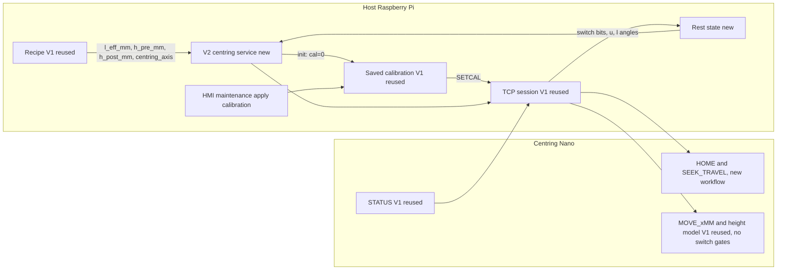
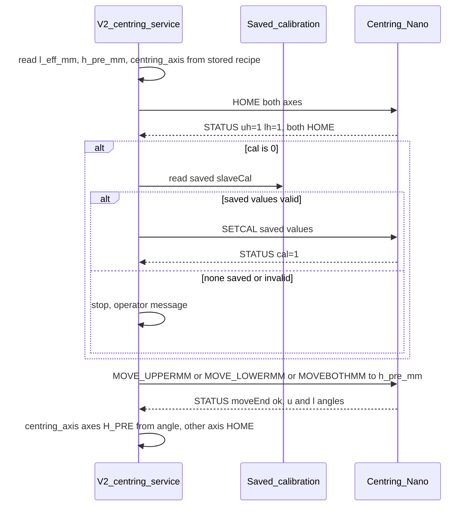

# Version 2 centring — requirements

Status: **target specification**. Nothing in this document is implemented yet. The running machine still uses the Version 1 centring system described in [Centring.md](./Centring.md) § Replaced system.

Related: [VERSION_2_CENTRING.md](../VERSION_2_CENTRING.md) (mission, branch, tooling) · [VERSION_2_HEIGHT_CALIBRATION.md](./VERSION_2_HEIGHT_CALIBRATION.md) (height calibration only) · [VERSION_2_NANO_FIRMWARE.md](./VERSION_2_NANO_FIRMWARE.md) (clean Nano firmware contract) · [DEVELOPMENT.md](./DEVELOPMENT.md) (daily workflow)

---

## 1. Purpose

Version 2 changes the centring system of the US Machine in a few focused places and reuses Version 1 everywhere else.

**New code:**

- the workflow of the two existing Nano commands `HOME` and `SEEK_TRAVEL` (§5.1–§5.2). The command names stay. There are no new Nano commands.
- the five positions of each axis (§4). HOME is the open-end limit and TRAVEL is the close-end limit. H_PRE and H_POST are both between those limits, each confirmed from the pulse, angle, and height of the last servo move against its reference. UNKNOWN is any other pose between the limits
- switch states never block a command, neither on the Nano nor in the host session (§5.5)
- the production length classes `L_eff ≤ 55 mm` and `L_eff > 55 mm`, and the production orchestration for each class (§7)
- initialization: HOME first, saved calibration applied if missing, then the reference height (§6)

**Reused from Version 1:**

- the height move on the Nano (`MOVE_UPPERMM`, `MOVE_LOWERMM`, `MOVEBOTHMM`) with its quadratic height model, **without its switch gates** (§5.5)
- the saved calibration values and the way they are applied (`slaveCal`, `SETCAL`, `ensureSlaveCal`)
- the reference target heights per shrink tube (`h_pre_mm`, `h_post_mm`) from `centringDerivedRecipe.mjs` and `centring_frame_model.js`
- the height definition: **one total opening** between the jaws, `H = h(upper) + h(lower) + mechOff`
- the recipe `centring_axis`, which decides whether one axis or both axes move to reach that opening
- the TCP link `192.168.10.55:8177` and the host session code in `centringMaster/centring_master.js`, except the Version 1 `HOME` after E-stop and the treatment of switch-related replies as errors (§2.1)

Why: the Version 1 HOME and TRAVEL steps (sticky-switch recover, leave, crawl, edge confirm, closed-idle bracketing), the switch gates that rejected or stopped commands, and the Version 1 production orchestration caused the complexity and posture confusion. The height model, link, calibration values, and recipe are proven on the machine and stay.

### Decision log

| Date | Decision |
|------|----------|
| 2026-10-05 | Production split is `L_eff ≤ 55 mm` vs `L_eff > 55 mm` (55 mm in the first class). |
| 2026-10-05 | HOME and TRAVEL steps and production orchestration are new code. |
| 2026-10-06 | Height move, height model, and saved calibration values reused from Version 1. |
| 2026-10-06 | Reference heights from the Version 1 recipe code; height is the total opening; `centring_axis` picks one axis or both. |
| 2026-10-06 | Class B (`L_eff > 55 mm`) may use a move to `h_post`. Superseded the same day: the centring step moves to `h_post_mm`, and the return to `h_pre_mm` is after the pick tail (§7.2). |
| 2026-10-06 | Class A production: if a moving axis is UNKNOWN, move it to the loaded reference `h_pre_mm`. Superseded the same day: UNKNOWN on a Class A centring axis is an error, and the service runs initialization (§7.1). |
| 2026-10-06 | HOME and TRAVEL steps are simple: if the target switch is pressed, skip; otherwise step the pulse until it is pressed. |
| 2026-10-06 | Recipe accepts `L_eff` only from 40 to 100 mm. |
| 2026-10-06 | Version 1 TCP link and host session code are kept. |
| 2026-10-06 | No command is blocked by the Nano or by the host session because a switch is pressed. Every command is applied. |
| 2026-10-06 | If calibration is missing during initialization, the saved values are applied automatically. (Replaces the earlier "only from the HMI maintenance session" decision; the maintenance action stays as a manual option.) |
| 2026-10-06 | Rest states are HOME, TRAVEL, h_pre, h_post. Superseded the same day: H_PRE and H_POST are confirmed from the pulse, angle, and height of the last servo move against the reference (§4). |
| 2026-10-06 | `L_eff` is shrink-tube length. The centring frame (guide spacing 40–300 mm) is the frame. The two are not the same range. |
| 2026-10-06 | Five positions per axis were drawn as HOME — H_PRE — H_POST — UNKNOWN — TRAVEL. Superseded the same day by the correction below. |
| 2026-10-06 | Correction: H_PRE and H_POST are both between the open-end and close-end limits, with no fixed order along the jaw. Each is confirmed from the pulse, angle, and height of the last servo move against its reference. UNKNOWN is any pose between the limits that is not HOME, H_PRE, H_POST, or TRAVEL. |
| 2026-10-06 | `HOME` and `SEEK_TRAVEL` keep their Version 1 names. Their workflow changes: skip if the target switch is pressed, otherwise step the pulse until it presses, and do not stop on H_PRE, H_POST, or UNKNOWN. No new Nano commands. |
| 2026-10-06 | Calibration is data the centring system needs in order to run. It is not a command. A move to `h_pre_mm` starts at HOME, leaves the switch, seeks, confirms the edge, then moves to `h_pre_mm`. A move to `h_post_mm` starts at `h_pre_mm` and goes to `h_post_mm`. |
| 2026-10-06 | A move to `h_post_mm` uses `MOVE_UPPERMM`, `MOVE_LOWERMM`, or `MOVEBOTHMM`, chosen by `centring_axis`. `SEEK_TRAVEL`, `SEEK_TRAVEL_UPPER`, or `SEEK_TRAVEL_LOWER` is also chosen by `centring_axis`. |
| 2026-10-06 | The US Machine HMI starts a full height calibration that establishes pulse, angle, and height for each axis. |
| 2026-10-06 | When the operator presses Start, Class A and Class B turn the servo pulse on according to H_PRE, wait 1.5 s, then turn the signal off. That runs together with the production sequence. The sequence does not wait for the release. The release does not wait for the sequence to end (§7.3). |
| 2026-10-06 | Parking an unused axis and carriage travel inside the centring step are reused from Version 1 (§2.2, §7.2). |

---

## 2. Reuse boundary

### 2.1 Must be new (Version 1 part not reused)

| Area | Version 2 requirement | Version 1 part it replaces |
|------|-----------------------|----------------------------|
| `HOME` workflow | Same commands `HOME`, `HOME_UPPER`, `HOME_LOWER`. New workflow in §5.2. | Firmware `startHome` / `tickHome` crawl (recover high, leave, seek, edge confirm, cal snap) |
| `SEEK_TRAVEL` workflow | Same commands `SEEK_TRAVEL`, `SEEK_TRAVEL_UPPER`, `SEEK_TRAVEL_LOWER`. New workflow in §5.1. | Firmware `startSeekTravel` / `tickSeekTravel` crawl |
| Position per axis | Host classification of five positions: HOME and TRAVEL from the switches; H_PRE, H_POST, and UNKNOWN between those switches (§4) | Angle-based posture helpers (`isCentringClosedIdle`, `isCentringOpenIdle`, ±3° `ANGLE_IDLE_TOL_DEG`), closed-idle and production-park postures, `isCentringAtGapMm` |
| Switch gates on the Nano | None: switch states never reject or stop a command (§5.5) | `precheckMotion` / `beginBusy` reject `both_limits`; `pollSafety` → `latchBothLimits` (aborts motion, detaches servos); `gateMove` rejects `limit` toward a pressed switch; `tryStep` + `limit_policy::allow` stop a move with `moveEnd=limit` |
| Pulse rewrite from switches | None: the pulse changes only by motion commands and `SETCAL` (§5.5) | `resyncSoftPulseFromSwitches` / `syncSoftToSwitches` (in `emitStatus`, `startMoveMm`, idle tick, `onDisconnect`) and the cal-end substitution in `gateMove` |
| Switch replies in the host session | Switch states are data, never an error (§5.5) | Rejections with `reason=limit` / `both_limits` and `moveEnd=limit` / `both_limits` thrown as errors (`assertMotionMoveEnd`, `assertAccepted`) |
| Production orchestration | New V2 centring service per length class (§7) | `productionCentringSequence.mjs`, centring steps in `productionSequence.mjs`, `centringIdle.mjs`, `centringHoming.mjs`, `centringAdvancedGap.mjs`, `centringProduction.mjs`, `centringMaintenance.mjs` |
| Host switch-drive calls | Same functions `homeBoth`, `homeUpper`, `homeLower`, `homeByAxis`, `seekTravelBoth`, `seekTravelByAxis` in `centring_master.js`. They send the same wire commands. The Nano workflow behind them changes (§5). | The Version 1 crawl those functions used to run |
| E-stop recovery | No motion on clear; the next initialization starts with `HOME` | `ensureReady` sends Version 1 `HOME` after clearing an E-stop |
| Height calibration | New HMI-started process that establishes pulse, angle, and height per axis (§6.3) | `CALIBRATE` crawl (recover, leave, seek, edge confirm) and `POST /api/centring/calibrate` |

### 2.2 Reused from Version 1

| Area | Reused parts |
|------|--------------|
| Link and session | TCP `192.168.10.55:8177`, ASCII lines, command queue, `STATUS` / `PING`, keepalive, reconnect in `centring_master.js` (without the `HOME` after E-stop and the switch-error handling above) |
| Nano height move | Firmware `startMoveMm` / `tickMove`, `kinematics.cpp` (quadratic height model, axis split, pulse clamp to the calibrated ends), commands `MOVE_UPPERMM`, `MOVE_LOWERMM`, `MOVEBOTHMM` — with the switch gates removed (§5.5) |
| Saved calibration | Persisted `slaveCal` (`hu`, `tu`, `hl`, `tl`, …), `SETCAL` wire command, `SETMECHOFF` / `STATUS mechOff=`, the `cal=1` gate for height moves; host `ensureSlaveCal`, `setCal`, `saveSlaveCal`, `setMechOffsetMm` |
| Host height path | `centring_height_model.js` (including `gapMmToMoveTarget`, used for the expected h_pre / h_post angle), `centring_calibration.js`; `moveUpper`, `moveLower`, `moveBoth`, `moveTo` in `centring_master.js` with their range checks |
| STATUS fields | `u=` / `l=` (servo angle per axis, from the pulse width and the saved calibration), `uh` `ut` `lh` `lt`, `h`, `targetH`, `busy`, `moveEnd`, `estop`, `cal` |
| Reference recipe | `centringDerivedRecipe.mjs`, `centring_frame_model.js`; persisted shrink-tube columns `h_pre_mm`, `h_post_mm`, `l_eff_mm`, `centring_axis` |
| Switch input | Nano switch reading and debounce (`switches.cpp`), treated as hardware input |
| Unused axis | When `centring_axis` is `upper` or `lower`, the other axis is parked at TRAVEL with `SEEK_TRAVEL_UPPER` or `SEEK_TRAVEL_LOWER` (Version 1 inactive-at-travel) |
| Carriage in the centring step | Class B: `MOVEAMMT2` to `centering_output_mm` inside the centring step, no stop at the centring input, then the move from `h_pre_mm` to `h_post_mm`. Class A does not run that carriage move |

### 2.3 Forbidden behaviours

These must not reappear in Version 2 under any name:

- a command rejected, held, or stopped by the Nano or the host session because a switch is pressed (§5.5)
- the pulse rewritten from switch states
- the `L_eff < 55` threshold and `shouldSkipCenteringTravel`
- `holdHPreEntireCycle`, assert-only mid-cycle height
- deferred opening gap into pick tail
- classic versus advanced restore
- closed-idle seek before or after HOME
- Version 1 phase IDs (`centring_h_pre`, `centring_h_post`, `centring_h_post_deferred`, `move_to_centering_input`, `centring_restore_idle`, `centring_restore_h_pre`, `centring_init`, `centring_init_skipped`); Version 2 defines its own, except the reused park and carriage behaviours below

A move to `h_pre` or `h_post` is allowed through the reused height move (§5.3). Parking the unused axis and the Class B carriage move inside the centring step are reused from Version 1 (§2.2). Classic versus advanced restore is not.

### 2.4 Forbidden design sources for the new parts

For the switch drives, rest state, and orchestration, do not take design from:

- firmware `tickHome`, `tickSeekTravel`, and the HOME / TRAVEL crawl phases of `tickCalibrate`
- the HOME, SEEK_TRAVEL, and posture sections of [MASTER_CONTROL.md](../../Double_Actuator_Centring_Slave_Firmware/docs/double_actuator_centring_slave/MASTER_CONTROL.md), [PRODUCTION_FSM.md](../../Double_Actuator_Centring_Slave_Firmware/docs/double_actuator_centring_slave/PRODUCTION_FSM.md), and [FIRMWARE_E2E_ANALYSIS.md](./FIRMWARE_E2E_ANALYSIS.md)
- `limit_policy.hpp` (the Version 1 rule "motion toward the active limit is blocked")
- `Double_Actuator_Centring_Slave_Firmware/not_used/` (off-limits by project rule)

The height, link, and STATUS sections of those documents and [HEIGHT_MODEL.md](../../Double_Actuator_Centring_Slave_Firmware/HEIGHT_MODEL.md) remain valid for the reused parts.

### 2.5 Physical facts

Two servo axes (upper, lower); per axis one HOME switch and one TRAVEL switch. The servos (TD-8135MG) have **no position feedback**: the servo angle the Nano reports is the angle commanded by the pulse width.

| Switch | Meaning | STATUS bit |
|--------|---------|------------|
| HOME switch (open end) | Pressed when the axis is fully open | `uh` (upper), `lh` (lower) |
| TRAVEL switch (close end) | Pressed when the axis is fully closed | `ut` (upper), `lt` (lower) |

Pulse direction: toward HOME = increase the pulse width (+µs); toward TRAVEL = decrease (−µs).

---

## 3. Architecture

The host owns the reference, the production sequence, and the rest state. The Nano owns motion and switch reading, and knows only the total opening it is told to reach.



| Layer | Responsibility |
|-------|----------------|
| Recipe (reused) | `l_eff_mm`, `h_pre_mm`, `h_post_mm`, `centring_axis` per shrink tube |
| V2 centring service (new) | Picks the length class, runs initialization (including calibration apply when missing) and production centring |
| Position (new) | Classifies each axis into one of five positions (§4) |
| Saved calibration (reused) | `slaveCal` persisted on the host, applied with `SETCAL` |
| TCP session (reused) | Link, command queue, STATUS, explicit connection state (Disconnected, Connecting, Connected, Fault, Recovering) |
| HMI maintenance (manual option) | Operator can apply saved calibration (§6.2) |
| Nano | New switch drives; reused height move without switch gates, kinematics, STATUS |

UI and controllers never talk to the Nano. They call the V2 centring service.

---

## 4. Five positions per axis

Each jaw axis has five positions. Only two of them are limits:

| Limit | Switch | Meaning |
|-------|--------|---------|
| HOME | Open-end (`uh` or `lh`) | The jaw is on the open-end switch |
| TRAVEL | Close-end (`ut` or `lt`) | The jaw is on the close-end switch |

H_PRE, H_POST, and UNKNOWN are not arranged in a fixed order between those switches. All three are simply between the open-end limit and the close-end limit.

| Position | Where it sits | How the host names it |
|----------|---------------|------------------------|
| HOME | Open-end limit | HOME switch pressed, TRAVEL switch of the same axis not pressed |
| TRAVEL | Close-end limit | TRAVEL switch pressed, HOME switch of the same axis not pressed |
| H_PRE | The reference closing height | The pulse, the angle, and the height of the **last servo move** all match the loaded reference `h_pre_mm`. A pressed switch does not remove this name |
| H_POST | Between the open-end limit and the close-end limit | Neither limit switch pressed, and the pulse, the angle, and the height of the **last servo move** all match the loaded reference `h_post_mm` |
| UNKNOWN | Between the open-end limit and the close-end limit | The jaw is between the limits and the position is not HOME, not H_PRE, not H_POST, and not TRAVEL |

UNKNOWN is the interior position left when the last move does not confirm either reference height. It is not a slot after H_POST, and it is not the name used for a lost link.

The servos have no position sensor. The pulse, angle, and height checked for H_PRE and H_POST are the values the last completed servo move left on that axis, read from the completion STATUS (`u=` / `l=` for angle, the pulse that produced it, and the height from the calibrated relation in §6.3). All three must match the related reference. The command name, `targetH`, or `moveEnd` alone is not enough. One of the three disagreeing with the reference means the position is UNKNOWN.

For the loaded reference, the host computes the expected pulse, angle, and height at `h_pre_mm` and at `h_post_mm` with the reused `gapMmToMoveTarget` (same quadratic model, same axis split as the Nano):

| `centring_axis` | Height move | Expected pose of the last move |
|-----------------|-------------|----------------|
| `both` | `MOVEBOTHMM` | Both axes: each side gives `(H − mechOff) / 2` |
| `upper` | `MOVE_UPPERMM` | Upper gives `(H − mechOff) − h(lower)`; lower stays at HOME |
| `lower` | `MOVE_LOWERMM` | Lower gives `(H − mechOff) − h(upper)`; upper stays at HOME |

**Classification per axis** (first matching rule wins):

| Order | Result | Rule |
|-------|--------|------|
| 1 | In motion | `busy=1`. Not one of the five positions. The position is named when the move ends, from that move. |
| 2 | H_PRE | The last move’s pulse, angle, and height all match `h_pre_mm` for an axis in `centring_axis`. Switch bits do not change this name |
| 3 | HOME | Open-end switch pressed, close-end switch of the same axis not pressed, and the pose is not H_PRE |
| 4 | TRAVEL | Close-end switch pressed, open-end switch of the same axis not pressed, and the pose is not H_PRE |
| 5 | H_POST | Both switches open, and the last move’s pulse, angle, and height all match `h_post_mm` for an axis in `centring_axis` |
| 6 | UNKNOWN | Between the limits, and the position is not HOME, H_PRE, H_POST, or TRAVEL |
| — | Not available | Link lost. No position is kept from memory. The next STATUS classifies the axis again. |
| — | Wiring warning | Both switches of one axis pressed. Not a position. Does not block a command (§5.5). |

H_PRE is named when the last move agrees with `h_pre_mm` in pulse, angle, and height together, including when a limit switch is pressed. HOME and TRAVEL are named from a switch only when that pose is not H_PRE. H_POST is named only between the switches, and only when the last move agrees with `h_post_mm`.

| ID | Requirement |
|----|-------------|
| V2-REQ-010 | The host refreshes the position when a move completes, from every STATUS reply, and on request. The H_PRE / H_POST check uses the pulse, angle, and height of the last completed servo move. |
| V2-REQ-011 | HOME is the open-end limit and TRAVEL is the close-end limit. Each comes from that axis’s switch only. |
| V2-REQ-012 | H_PRE is confirmed when the last move’s pulse, angle, and height all match the loaded reference `h_pre_mm`, including when any limit switch is pressed. H_POST is confirmed only between the switches, and only when the same three match `h_post_mm`. |
| V2-REQ-013 | Without a valid pulse–angle–height relation, a jaw between the switches is UNKNOWN. HOME and TRAVEL can still be named from the switches. |
| V2-REQ-014 | Production for an axis waits while it is in motion or its position is not available. UNKNOWN on a centring axis during Class A is an error: the service runs initialization (§7.1). This is sequencing in the V2 service, not a rejection of commands (§5.5). |
| V2-REQ-015 | Recipe validation requires that, on every moving axis, the expected pulse, angle, and height at `h_pre_mm` and at `h_post_mm` differ by more than 2 × tolerance, so one last move cannot match both references. |
| V2-REQ-016 | After link loss the position is not available until the next STATUS, then it is classified again from that STATUS and from the last completed move. Link loss is not the UNKNOWN position. |
| V2-REQ-017 | Both switches pressed on one axis does not block anything (§5.5). The HMI shows a wiring warning. The axis is not given one of the five names from that contradictory pair. |
| V2-REQ-018 | The match tolerance defaults to **0.5°**. The allowed range is **0.1° to 2.0°**. The HMI shows the value, the unit, and the range. Pulse and height match within the equivalent of that angle on the saved relation. |
| V2-REQ-019 | Superseded for the production cycle. When the operator presses Start, Class A and Class B run the production sequence and a 1.5 s H_PRE pulse together (§7.3). The sequence does not wait for that release. The release does not wait for the sequence to end. The 1.5 s idle detach remains at HOME, at TRAVEL, and after a fault. |

With a single-axis recipe (`centring_axis` = upper or lower), the other axis is parked at TRAVEL (§2.2).

The Nano does not need a new report field or a new motion command. STATUS already carries the angles and the switch bits. What changes on the Nano is the workflow inside `HOME` and `SEEK_TRAVEL`, removal of the switch gates, and support for the HMI height calibration (§6.3).

---

## 5. Commands

There are no new Nano commands. Two existing commands change workflow. The third motion is the existing height move.

| Motion | Existing command | Where it ends |
|--------|------------------|----------------|
| Move to HOME | `HOME`, `HOME_UPPER`, `HOME_LOWER` | Open-end limit |
| Move to TRAVEL | `SEEK_TRAVEL`, `SEEK_TRAVEL_UPPER`, `SEEK_TRAVEL_LOWER` | Close-end limit |
| Move to H_PRE or H_POST | `MOVE_UPPERMM`, `MOVE_LOWERMM`, `MOVEBOTHMM` | The recipe total opening `h_pre_mm` or `h_post_mm` |

`HOME` and `SEEK_TRAVEL` do not run the leave, seek, and edge-confirm steps. Those steps belong only to a move whose target is `h_pre_mm`. A limit command stops only on its own switch.

The centring system needs calibration data before it can run a move to `h_pre_mm` or `h_post_mm`, and before it can name H_PRE or H_POST. Calibration is that data. It is not a Nano command. `HOME` and `SEEK_TRAVEL` do not read it to decide when to stop. `MOVE_UPPERMM`, `MOVE_LOWERMM`, and `MOVEBOTHMM` use it to turn the recipe opening into pulse, angle, and height (§6).

### 5.1 Move to TRAVEL — `SEEK_TRAVEL`, `SEEK_TRAVEL_UPPER`, `SEEK_TRAVEL_LOWER`

`centring_axis` chooses the command:

| `centring_axis` | Command |
|-----------------|---------|
| `upper` | `SEEK_TRAVEL_UPPER` |
| `lower` | `SEEK_TRAVEL_LOWER` |
| `both` | `SEEK_TRAVEL` |

1. If the TRAVEL switch is already pressed, finish with no motion.
2. Otherwise decrease the pulse toward TRAVEL.
3. Do not stop on H_PRE, H_POST, a HOME switch that is already pressed, or UNKNOWN.
4. Stop when the TRAVEL switch presses.

### 5.2 Move to HOME — `HOME`, `HOME_UPPER`, `HOME_LOWER`

1. If the HOME switch is already pressed, decrease the pulse toward TRAVEL until that switch releases, then increase the pulse until the HOME switch presses again.
2. If the HOME switch is not pressed, increase the pulse toward HOME.
3. Do not stop on H_PRE, H_POST, a TRAVEL switch that is already pressed, or UNKNOWN.
4. Stop when the HOME switch presses.

`SEEK_TRAVEL` follows `centring_axis` (V2-REQ-026). Initialization still sends `HOME` on both axes. On a both-axes command, each axis stops when its own target switch is pressed.

### 5.3 Move to H_PRE or H_POST — reused Version 1 height move, without switch gates

This is the third motion. The command is chosen by `centring_axis`:

| `centring_axis` | Command |
|-----------------|---------|
| `upper` | `MOVE_UPPERMM` |
| `lower` | `MOVE_LOWERMM` |
| `both` | `MOVEBOTHMM` |

The target is the recipe total opening: `h_pre_mm` or `h_post_mm`. The command uses calibration data for that conversion. It does not run without that data.

**When the target is `h_pre_mm`.** The moving axes are those named by `centring_axis`. On each of those axes the sequence is:

1. If the axis is not at HOME, move it to HOME (§5.2). If it is already at HOME, skip that move.
2. Leave the HOME switch.
3. Seek the HOME switch again.
4. Confirm the edge.
5. Move to the recipe opening `h_pre_mm`.

**When the target is `h_post_mm`.** The command is the same family, chosen by `centring_axis`: `upper` → `MOVE_UPPERMM`, `lower` → `MOVE_LOWERMM`, `both` → `MOVEBOTHMM`. Each moving axis is already at the `h_pre_mm` height. That command moves it from that position to `h_post_mm`. It does not go to HOME first, and it does not leave, seek, or confirm the HOME edge.

| Item | Version 2 use |
|------|---------------|
| Commands | Chosen by recipe `centring_axis`: `upper` → `MOVE_UPPERMM`, `lower` → `MOVE_LOWERMM`, `both` → `MOVEBOTHMM` |
| Target `H` | Recipe total opening: `h_pre_mm`, or `h_post_mm` (Class B) |
| Split between axes | `both`: each side moves to `(H − mechOff) / 2`. Single axis: the moving side takes `(H − mechOff) − h(other side)`; the other side does not move |
| Nano internals | Version 1 `startMoveMm` / `tickMove` and inverse height model for the final millimetre move, with the switch gates removed (§5.5). The `h_pre_mm` path adds the HOME approach above before that move. |
| Preconditions | Calibration data present; axis not already moving; no E-stop. For `h_post_mm`, the moving axes are at `h_pre_mm`. |
| Success | `moveEnd=ok`, neither limit switch pressed, and the pulse, angle, and height of that move all match the reference that was commanded (`h_pre_mm` → H_PRE, `h_post_mm` → H_POST) |

| ID | Requirement |
|----|-------------|
| V2-REQ-040 | A move to `h_pre_mm` on a `centring_axis` axis starts with HOME when that axis is not already at HOME, then leaves the HOME switch, seeks it again, confirms the edge, and only then moves to `h_pre_mm`. |
| V2-REQ-041 | The moving axes come from `centring_axis`; the target is the recipe total opening. |
| V2-REQ-042 | With no calibration data, the V2 service first applies the saved calibration (§6.2). If that fails, no height move is sent. |
| V2-REQ-043 | A single-axis recipe is rejected at validation when `h_pre_mm` is below the opening reachable with the other axis at HOME (about 32.3 mm plus `mechOff` with the current height model). |
| V2-REQ-044 | A move to `h_post_mm` uses `MOVE_UPPERMM`, `MOVE_LOWERMM`, or `MOVEBOTHMM`, chosen by `centring_axis`. It starts from the `h_pre_mm` position and ends at `h_post_mm`. It does not repeat the HOME leave, seek, and edge confirm. |

### 5.4 Guards that are not switch-related

| ID | Requirement |
|----|-------------|
| V2-REQ-020 | `HOME` and `SEEK_TRAVEL` have a timeout. On timeout the axis stops and `moveEnd` reports a fault. |
| V2-REQ-021 | *Withdrawn 2026-10-06* (was: reject on both switches pressed). Replaced by §5.5. |
| V2-REQ-022 | Link loss or E-stop button during motion: the axis stops. |
| V2-REQ-023 | A new motion command for an axis that is already moving is rejected (`busy`). |
| V2-REQ-024 | The pulse never steps past the servo pulse range (544–2400 µs). A switch drive that reaches that limit without its target switch ends with a fault. |
| V2-REQ-025 | `HOME` and `SEEK_TRAVEL` step **4 µs** every **20 ms**. The timeout is **60 s per axis**. On timeout the axis stops and `moveEnd` reports a fault (V2-REQ-020). |
| V2-REQ-026 | `centring_axis` chooses the `SEEK_TRAVEL` command: `upper` → `SEEK_TRAVEL_UPPER`, `lower` → `SEEK_TRAVEL_LOWER`, `both` → `SEEK_TRAVEL`. The same field chooses the height command: `upper` → `MOVE_UPPERMM`, `lower` → `MOVE_LOWERMM`, `both` → `MOVEBOTHMM`, for both `h_pre_mm` and `h_post_mm`. Initialization sends `HOME` on both axes. |

### 5.5 Switch states never block a command

| ID | Requirement |
|----|-------------|
| V2-REQ-060 | The Nano accepts and executes every command whatever `uh`, `ut`, `lh`, `lt` report. It never rejects a command with `reason=limit` or `reason=both_limits`. |
| V2-REQ-061 | The Nano never stops or aborts a height move because a switch is pressed, never latches a both-switches fault, and never detaches the servos because of a switch state. |
| V2-REQ-062 | The host session (reused `centring_master.js`) never rejects, holds, or fails a command because of a switch state. Switch bits are passed to the rest-state classifier as data. |
| V2-REQ-063 | `HOME` stops only on the HOME switch. It does not stop because H_PRE, H_POST, UNKNOWN, or an already-pressed TRAVEL switch is true. `SEEK_TRAVEL` stops only on the TRAVEL switch. It does not stop because H_PRE, H_POST, UNKNOWN, or an already-pressed HOME switch is true. |
| V2-REQ-064 | The Nano does not rewrite the pulse from the switch states. The pulse width changes only by `HOME`, `SEEK_TRAVEL`, a height move, or `SETCAL`. Required because H_PRE and H_POST are read from the pulse width (§4). |

What still protects the mechanical ends once the switch gates are gone:

- height-move targets are clamped by the reused model to the calibrated pulse range of each axis (`tu`…`hu`, `tl`…`hl`)
- the switch drives stop at their target switch
- the pulse range limit and timeouts (§5.4)

Risk: with wrong saved calibration values, a height move can drive a jaw into its hard stop and nothing switch-based will stop it. Calibration validation (V2-REQ-051) is therefore a safety requirement.

---

## 6. Initialization and calibration

### 6.1 Initialization

Applies to both length classes: at machine initialization when a reference is already loaded, while a new reference is loading, and when production finds a `centring_axis` axis at UNKNOWN in Class A or Class B (§7.1, §7.2). UNKNOWN is an error. The recovery is this initialization, not a height move on its own.



| ID | Requirement |
|----|-------------|
| V2-REQ-030 | Initialization runs `HOME` on both axes, then (if needed) applies the saved calibration, then runs the height move on `centring_axis` to `h_pre_mm`. |
| V2-REQ-031 | Initialization runs at machine initialization when a reference is already loaded. |
| V2-REQ-032 | Initialization runs while a new reference is loading. |
| V2-REQ-033 | No `SEEK_TRAVEL` runs during initialization. |
| V2-REQ-034 | Production for a reference waits until the `centring_axis` axes are H_PRE for that reference. |
| V2-REQ-035 | If `cal=0` after `HOME`, initialization applies the saved calibration values automatically (§6.2) and checks `cal=1` in the reply STATUS. |
| V2-REQ-036 | If no valid saved relation exists, or `SETCAL` fails, initialization stops with both axes at HOME. The HMI says what happened, why, and that recovery is the full height calibration in §6.3. |
| V2-REQ-037 | With no reference loaded, both axes rest at HOME. No height move runs. |

Calibration is applied **after** `HOME` on purpose: the reused Version 1 `SETCAL` handler sets both pulses to the calibrated HOME values (`onMasterCalApplied`), which matches the jaws only when they are already at HOME.

With no reference loaded, initialization is `HOME` on both axes and then stops. Both axes rest at HOME. Production cannot start (V2-REQ-037).

### 6.2 Applying saved calibration

The Nano keeps calibration in RAM only, so it is lost at every Nano power loss. Version 2 applies the saved values in two ways:

| Way | When | Actor |
|-----|------|-------|
| Automatic | Initialization finds `cal=0` (V2-REQ-035) | System (V2 centring service) |
| Manual | Operator chooses "Apply saved calibration" in an HMI maintenance session | Maintenance user |

| ID | Requirement |
|----|-------------|
| V2-REQ-050 | Both ways send the persisted `slaveCal` through the reused `ensureSlaveCal` / `setCal` path (one implementation). |
| V2-REQ-051 | Before sending, the values are validated (`hu > tu`, `hl > tl`, minimum span, all finite, inside 544–2400 µs). Invalid values are never sent. |
| V2-REQ-052 | The manual action requires maintenance access, asks for confirmation, then shows loading, success (`cal=1` confirmed by STATUS), or failure with the reason. It uses a resource-style Version 2 endpoint, not the Version 1 action-style `POST /api/centring/setcal`. |
| V2-REQ-053 | Every apply is logged and audited: actor (system or user), when, previous Nano values, applied values, result. |
| V2-REQ-054 | The reused session may keep its connect-time `ensureSlaveCal`; it applies the same saved values. Initialization still checks `cal` itself and does not rely on it. |
| V2-REQ-055 | Calibration is data, not a command. The centring system needs it before a move to `h_pre_mm` or `h_post_mm` and before naming H_PRE or H_POST. `HOME` and `SEEK_TRAVEL` do not use that data to decide their stop. The height commands do. |

### 6.3 Full height calibration — started from the HMI

The centring system needs this data in order to run. The data is not a command, and it is not tied to one command. The operator starts the measurement from the US Machine HMI. Applying a saved copy (§6.2) only restores data the host already has. `MOVE_UPPERMM`, `MOVE_LOWERMM`, and `MOVEBOTHMM` use the data when they move to `h_pre_mm` or `h_post_mm`. `HOME` and `SEEK_TRAVEL` do not.

For each axis (upper, then lower) the process establishes the relation the height model needs:

| Quantity | Meaning |
|----------|---------|
| Pulse at HOME | Pulse width (µs) when that axis is on the HOME switch |
| Pulse at TRAVEL | Pulse width (µs) when that axis is on the TRAVEL switch |
| Angle | Commanded angle (degrees) along that pulse span |
| Height | Per-side opening (mm) along that same span |

Pulse, angle, and height are one relation per axis. After it is saved, the host can name H_PRE and H_POST between the switches, and the height move can aim at `h_pre_mm` and `h_post_mm`.

Pulse-end measurement and the curve poses to the switches use `CALDRV OPEN|CLOSE U|L|BOTH`. Each drive steps 4 µs every 20 ms until its own switch is pressed. If that switch is already pressed, the first step sees it and stops without another pulse. It does not run the Version 1 `HOME` / `SEEK_TRAVEL` crawl, and it does not stop because the other switch is pressed. Production `HOME` and `SEEK_TRAVEL` are unchanged. The process is not `POST /api/centring/calibrate`.

| ID | Requirement |
|----|-------------|
| V2-REQ-070 | Only a BYPASS user can open the height-calibration pages on the US Machine HMI. The pages are Pulse ends and Quadratic curve. |
| V2-REQ-071 | The process covers the upper axis and the lower axis. |
| V2-REQ-072 | The result for each axis is the relation among pulse (µs), angle (degrees), and height (mm), including the pulse at the HOME limit and the pulse at the TRAVEL limit. |
| V2-REQ-073 | The HMI asks for confirmation before the jaws move, then shows loading, success, or failure. Failure says what happened, why, and how to recover. |
| V2-REQ-074 | On success the host stores the relation, applies it to the Nano, and audits the apply (§6.2). Invalid relations are not stored (`hu > tu`, `hl > tl`, height at HOME greater than height at TRAVEL, finite values, pulses inside 544–2400 µs). |
| V2-REQ-075 | Until a valid relation is stored, no height move is sent. A jaw between the switches is UNKNOWN. |
| V2-REQ-076 | The endpoint is a resource-style Version 2 route under maintenance permission. It does not reuse the Version 1 action route `POST /api/centring/calibrate`. |

---

## 7. Production behaviour by length class

| Class | Condition |
|-------|-----------|
| Class A | `40 ≤ L_eff ≤ 55 mm` |
| Class B | `55 < L_eff ≤ 100 mm` |

| ID | Requirement |
|----|-------------|
| V2-REQ-001 | The class is chosen from the recipe `l_eff_mm` of the loaded reference. `L_eff = 55 mm` is Class A. |
| V2-REQ-002 | A reference with missing or non-finite `l_eff_mm` cannot start production (no default class). |
| V2-REQ-003 | Both classes use `HOME`, `SEEK_TRAVEL`, and the reused height move. Class B also uses the Version 1 carriage move inside the centring step (§7.2). |
| V2-REQ-004 | Production cycles differ between Class A and Class B. |
| V2-REQ-005 | The recipe accepts `L_eff` only from 40 to 100 mm; values outside are rejected when the shrink tube is saved and when a reference loads. |

### 7.1 Class A (`40 ≤ L_eff ≤ 55 mm`)

The loaded reference stays at its closing height for the whole production cycle. Centring does not move to `h_post_mm`. Carriage travel is not part of this step. If `centring_axis` is one axis, the unused axis is parked at TRAVEL (§2.2).

| ID | Requirement |
|----|-------------|
| V2-REQ-080 | Entry and the rest between cycles: every `centring_axis` axis is H_PRE for the loaded reference. An axis already at H_PRE is not moved. |
| V2-REQ-081 | UNKNOWN on a `centring_axis` axis during Class A production is an error. The service runs initialization (§6.1) for the loaded reference. It does not send a height move to `h_pre_mm` on its own. |
| V2-REQ-082 | That initialization uses the loaded reference only. It moves to `h_pre_mm` and does not move to `h_post_mm`. |
| V2-REQ-083 | Initialization succeeds when the `centring_axis` axes are H_PRE. If it does not, production stays stopped. The HMI says what happened, why, and how to recover. |
| V2-REQ-084 | HOME, TRAVEL, or H_POST on a `centring_axis` axis during Class A production is a different error from UNKNOWN. Production stops with that position named. Recovery is initialization (§6.1). |

### 7.2 Class B (`55 < L_eff ≤ 100 mm`)

Entry is H_PRE, the same as Class A. The centring step then reuses the Version 1 carriage move, and then opens from `h_pre_mm` to `h_post_mm`. If `centring_axis` is one axis, the unused axis is parked at TRAVEL before that carriage move.

| ID | Requirement |
|----|-------------|
| V2-REQ-090 | At the production centring step, the moving axes are at `h_pre_mm`. The step runs `MOVEAMMT2` to `centering_output_mm` with no stop at the centring input, then one height move on `centring_axis` from `h_pre_mm` to `h_post_mm` (V2-REQ-044). Success of the height move is H_POST (§4). |
| V2-REQ-096 | When `centring_axis` is `upper`, the lower axis is parked at TRAVEL with `SEEK_TRAVEL_LOWER`. When `centring_axis` is `lower`, the upper axis is parked at TRAVEL with `SEEK_TRAVEL_UPPER`. This runs in Class A centring and before the Class B carriage move. `centring_axis` = `both` has no unused axis. |
| V2-REQ-091 | The axes stay at H_POST through the pick-and-place tail. |
| V2-REQ-092 | After the pick-and-place tail, the return to `h_pre_mm` uses the `h_pre_mm` sequence (V2-REQ-040): HOME if not already there, leave the switch, seek, confirm the edge, then move to `h_pre_mm`. Success is H_PRE. |
| V2-REQ-093 | Between cycles the `centring_axis` axes rest at H_PRE. |
| V2-REQ-094 | UNKNOWN on a `centring_axis` axis during Class B is an error. The service runs initialization (§6.1). It does not shortcut with a height move to `h_pre_mm` or `h_post_mm`. After initialization succeeds, the centring step may still move to `h_post_mm` (V2-REQ-090). |
| V2-REQ-095 | HOME or TRAVEL on a `centring_axis` axis during Class B production stops the cycle. The HMI names the limit. Recovery is initialization. |

### 7.3 Servo pulse when Start is pressed — Class A and Class B

When the operator presses Start, two things run together for Class A and for Class B:

1. The production sequence from `buildProductionSteps()`.
2. The servo pulse for the loaded H_PRE.

The servo pulse turns on according to H_PRE, waits 1.5 seconds, then the servo signal turns off.

The production sequence does not stop and does not wait for that 1.5 s release. The 1.5 s release does not stop and does not wait until the production sequence ends. They run at the same time.

| ID | Requirement |
|----|-------------|
| V2-REQ-100 | On Start, Class A and Class B turn the servo pulse on according to the loaded H_PRE. |
| V2-REQ-101 | That pulse stays on for 1.5 s, then the servo signal turns off. |
| V2-REQ-102 | The production sequence runs at the same time. It is not paused for the 1.5 s H_PRE release. |
| V2-REQ-103 | The 1.5 s H_PRE release is not held until the production sequence ends. It ends at 1.5 s. |

---

## 8. Tube length, frame, and reference height

`L_eff` and the centring frame are different objects.

| Item | What it is |
|------|------------|
| `L_eff` | Shrink-tube length: tube length plus the centring length tolerance. Stored as `l_eff_mm`. Version 2 accepts 40–100 mm and uses that number only to choose Class A or Class B (V2-REQ-005). It is not a jaw target and it is not a frame dimension. |
| Centring frame | The frame. On this machine the guide spacing is side B 40 mm and side A 300 mm, with a module length. Those settings describe the frame. They do not define `L_eff` and they do not define the 40–100 mm tube range. |
| `h_pre_mm` | Shrink-tube closing gap (`diameter_closing_gap_mm`), stored by the recipe. Interior position H_PRE when the calibrated relation matches it (§4). |
| `h_post_mm` | Shrink-tube opening gap (`diameter_opening_gap_mm`), same path. Interior position H_POST when the calibrated relation matches it. |
| `centring_axis` | Which jaw moves: `upper`, `lower`, or `both` |
| Height meaning | Total opening `h(upper) + h(lower) + mechOff` |

Version 1 carriage travel (`centeringTravelMm` in `centring_frame_model.js`) compares tube length with the frame spacing. That comparison belongs to the carriage. Version 2 centring does not use the frame spacing as the allowed tube length, and it does not implement the 40–100 mm limit by changing `sideA_guide_spacing_mm` or `sideB_guide_spacing_mm`.

**Stored data check (2026-10-06):** 4 shrink tubes, `L_eff` 50–66.5 mm (all inside 40–100), 2 in Class A and 2 in Class B; all use `centring_axis` = `both`; `h_pre_mm` 2–4 mm, `h_post_mm` 20–25 mm. Both openings are between the open-end and close-end limits. Which name applies is decided by the pulse, angle, and height of the last servo move against that tube’s reference, not by a fixed place along the jaw.

---

## 9. Dependencies

- Version 1 recipe and persisted shrink-tube columns (§8)
- Version 1 TCP link, session code, Nano height move, kinematics, STATUS angles, and saved calibration values (§2.2)
- Changed workflow inside the existing `HOME` and `SEEK_TRAVEL` commands (§5.1–§5.2). No new Nano command names.
- Removal of the Version 1 switch gates and switch-based pulse rewrite on the Nano (§5.5)
- New host V2 centring service and five-position classifier
- Change in the reused session code: no `HOME` after E-stop; switch-related replies not treated as errors
- HMI maintenance: apply a saved relation, and start the full height calibration (§6.3)

---

## 10. Usage (target)

```text
Reference loads (or machine init with reference loaded)
  → recipe: l_eff_mm, h_pre_mm, h_post_mm, centring_axis
  → HOME U, HOME L               → HOME, HOME (skip if already pressed)
  → cal=0 ? SETCAL saved relation            → cal=1 (logged, audited)
            no saved relation → stop at HOME; HMI points to full height calibration
  → MOVE_<centring_axis>MM h_pre_mm          → last move pulse, angle, and height match h_pre → H_PRE
  → production allowed (Class A if L_eff ≤ 55, Class B if 55 < L_eff ≤ 100)

Class A, during production
  → centring_axis already H_PRE              → no move
  → centring_axis is UNKNOWN                 → error → run initialization (§6.1) → H_PRE

Class B
  → centring step: MOVE to h_post_mm         → H_POST through the pick tail
  → after the pick tail: MOVE to h_pre_mm    → H_PRE between cycles
  → centring_axis is UNKNOWN                 → error → run initialization (§6.1) → H_PRE

Maintenance session
  → operator: Start full height calibration → pulse, angle, and height per axis, then save and apply
  → operator: Apply saved calibration       → SETCAL, STATUS cal=1 (audited)
```

---

## 11. Decisions

Every question in this list is decided.

| ID | Decision |
|----|----------|
| Q-01 | **Class A:** stay at the loaded `h_pre_mm`. UNKNOWN on a centring axis is an error; the service runs initialization (§7.1). **Class B:** at the centring step move to `h_post_mm`; after the pick tail return to `h_pre_mm`; rest at H_PRE between cycles. UNKNOWN runs initialization, then the centring step may move to `h_post_mm` (§7.2). |
| Q-02 | Reference height is the Version 1 recipe, one total opening, `centring_axis` (§8). |
| Q-03 | Positions are HOME, H_PRE, H_POST, UNKNOWN, TRAVEL. In motion and link loss are not positions (§4). |
| Q-04 | The Nano reaches a reference height with the Version 1 height move, without switch gates (§5.3). |
| Q-05 | Transport is the Version 1 TCP link and host session (§2.2). |
| Q-06 | Limit drives step 4 µs every 20 ms, with a 60 s timeout per axis (V2-REQ-025). |
| Q-07 | With no reference loaded, both axes rest at HOME (V2-REQ-037). |
| Q-08 | No new Nano commands. `centring_axis` chooses `SEEK_TRAVEL` / `SEEK_TRAVEL_UPPER` / `SEEK_TRAVEL_LOWER`, and chooses `MOVE_UPPERMM` / `MOVE_LOWERMM` / `MOVEBOTHMM` for both `h_pre_mm` and `h_post_mm` (V2-REQ-026, V2-REQ-044). Initialization sends `HOME` on both axes. |
| Q-09 | The HMI shows one position per axis and one operator sentence (§11.1). |
| Q-10 | The HMI starts full height calibration (§6.3). A stored relation is applied when `cal=0`, and manually from maintenance (§6.2). |
| Q-11 | H_POST is between the limits when the last move’s pulse, angle, and height all match `h_post_mm` (§4). |
| Q-12 | The pulse–angle–height relation comes from the HMI height calibration (§6.3). |
| Q-13 | Match tolerance defaults to 0.5°, allowed 0.1° to 2.0° (V2-REQ-018). |
| Q-14 | On Start, Class A and Class B turn the servo pulse on according to H_PRE, wait 1.5 s, then turn the signal off. The production sequence runs at the same time. Neither waits for the other (§7.3). |
| Q-15 | H_PRE and H_POST are both between the limits. UNKNOWN is any other pose between the limits (§4). |

### 11.1 HMI position text

One line per axis. The sentence says what the position is and, when the cycle cannot continue, how to recover.

| Position | Operator text |
|----------|----------------|
| HOME | Open-end limit. |
| TRAVEL | Close-end limit. |
| H_PRE | At the reference closing height. |
| H_POST | At the reference opening height. |
| UNKNOWN | Error. The centring axis is between the limits and is not at HOME, H_PRE, H_POST, or TRAVEL. |
| In motion | Jaw is moving. |
| Not available | Link lost. Wait for the next status. |
| Wiring | Both switches are pressed on this axis. Check the wiring. Motion is not blocked. |

Class A, when a centring axis is UNKNOWN: “Error. Centring axis is in an unknown position. Running initialization.” If initialization fails: “Initialization failed.” followed by what happened, why, and how to recover.

---

## 12. Limitations

- Requirements only. No Version 2 code exists yet.
- The servos have no position feedback. H_PRE and H_POST mean the last move’s pulse, angle, and height match the reference. After the 1.5 s H_PRE pulse that starts with Start, the servo signal is off, so a jaw can be pushed while the reported pulse stays the same (§7.3).
- STATUS `u=` / `l=` are clamped to the calibrated range of each axis and have 2 decimals. Finer or unclamped data would need an additional raw-pulse field in STATUS.
- Without switch gates, a wrong pulse–angle–height relation can drive a jaw into its hard stop (§5.5).
- Without that relation, Version 2 can still drive to HOME and TRAVEL. It cannot run a height move or name H_PRE / H_POST. The jaw between the switches is then UNKNOWN.

---

## 13. Future improvements

- Replace the crawl inside the existing `HOME` and `SEEK_TRAVEL` handlers with the §5 workflow, and remove the switch gates, next to the reused height move
- V2 centring service, five-position classifier, and tests per command, per position, per switch combination, and per length class
- HMI per-axis position indicator, apply-saved action, and full height calibration (§6.3)
- Optional raw pulse fields in STATUS if angle resolution proves insufficient
- Remove the Version 1 crawl phases from `HOME` and `SEEK_TRAVEL`, and retire the switch gates and Version 1 orchestration modules, once Version 2 is validated on the machine

---

## 14. Replaced parts (warning only)

The running machine uses the Version 1 centring orchestration from tag `v1.0.0`: `SEEK_TRAVEL` → `HOME` → `SEEK_TRAVEL` closed idle or `SEEK_TRAVEL` → `HOME` → `MOVE h_pre`, mid-cycle `h_pre` assert, carriage travel then `h_post` at `L_eff ≥ 55`, classic versus advanced restore, switch gates that reject or stop commands (`limit`, `both_limits`), and switch-based pulse resync. Described in [Centring.md](./Centring.md) § Replaced system. Those parts are not a Version 2 design source; the height move (without switch gates), height model, saved calibration values, recipe, and TCP link are reused as listed in §2.2.
