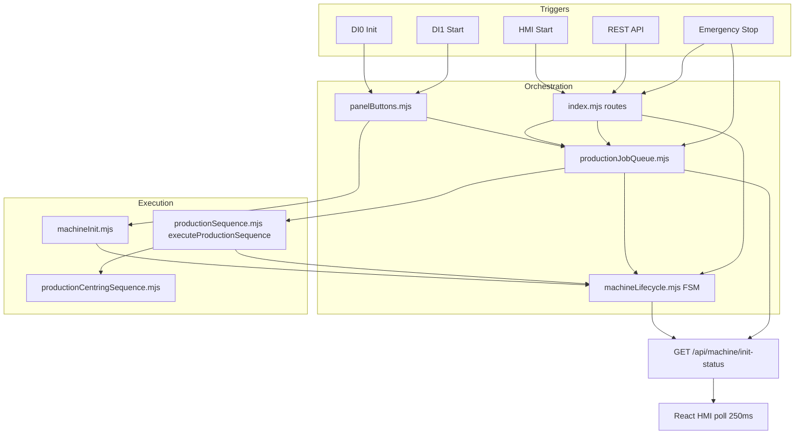
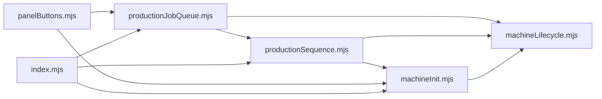

# Lifecycle State Machine & Production Job Queue

**Document version:** 1.0  
**Codebase:** `USW_Machine-main`  
**Last updated:** June 2026  

This document describes the **formal backend lifecycle state machine** and **production job queue** introduced to replace the previous ad-hoc flag-based orchestration (`_productionRunning`, `_currentPhase`, `_initInProgress`).

For the full physical production sequence (pneumatics, centring, pick tail), see [PRODUCTION_FLOW_ANALYSIS.md](./PRODUCTION_FLOW_ANALYSIS.md).

---

## Table of Contents

1. [Problem Statement](#1-problem-statement)
2. [Design Goals](#2-design-goals)
3. [Architecture Overview](#3-architecture-overview)
4. [Module Reference](#4-module-reference)
5. [Lifecycle State Machine](#5-lifecycle-state-machine)
6. [Production Job Queue](#6-production-job-queue)
7. [Integration with Existing Modules](#7-integration-with-existing-modules)
8. [API & Wire Format](#8-api--wire-format)
9. [Frontend Integration](#9-frontend-integration)
10. [Event Flows (Step by Step)](#10-event-flows-step-by-step)
11. [Configuration](#11-configuration)
12. [Error Handling & Edge Cases](#12-error-handling--edge-cases)
13. [Known Limitations](#13-known-limitations)
14. [Migration Notes (Before vs After)](#14-migration-notes-before-vs-after)

---

## 1. Problem Statement

Before this implementation, production orchestration relied on informal module-level flags:

| Old mechanism | Location | Limitation |
|---------------|----------|------------|
| `_productionRunning` | `productionSequence.mjs` | Binary flag; no phase semantics |
| `_currentPhase` | `productionSequence.mjs` | String only; not tied to a formal FSM |
| `_initInProgress` | `machineInit.mjs` | Duplicated init state outside lifecycle |
| `_initLock`, `_productionLock` | `panelButtons.mjs` | Prevented re-entrancy but did not queue work |

Consequences:

- **No job queue** — a second Start while a cycle was running was rejected, not queued.
- **No formal state machine** — the frontend defined a rich lifecycle contract (`machineLifecycle.types.ts`) but the backend did not publish it.
- **Split source of truth** — HMI inferred state locally; backend used unrelated flags.
- **Poor observability** — no job IDs, queue depth, or transition history in API responses.

---

## 2. Design Goals

1. **Single canonical lifecycle** on the backend, aligned with frontend codes 0–10.
2. **Validated transitions** — illegal state changes throw at development/runtime.
3. **FIFO job queue** — serialize production cycles; allow bounded backlog when busy.
4. **Separation of concerns:**
   - `machineLifecycle.mjs` — *what state is the machine in?*
   - `productionJobQueue.mjs` — *when does work run?*
   - `productionSequence.mjs` — *what physical steps execute?*
5. **Backward-compatible API** — `GET /api/machine/init-status` extended, not replaced; HMI Start still blocks until its job completes.

---

## 3. Architecture Overview


```mermaid
flowchart TB
  subgraph Triggers
    DI0[DI0 Init]
    DI1[DI1 Start]
    HMI[HMI Start]
    API[REST API]
    ESTOP[Emergency Stop]
  end

  subgraph Orchestration
    PB[panelButtons.mjs]
    IDX[index.mjs routes]
    LC[machineLifecycle.mjs FSM]
    JQ[productionJobQueue.mjs]
  end

  subgraph Execution
    MI[machineInit.mjs]
    PS[productionSequence.mjs executeProductionSequence]
    PCS[productionCentringSequence.mjs]
  end

  DI0 --> PB --> MI
  MI --> LC
  DI1 --> PB --> JQ
  HMI --> IDX --> JQ
  API --> IDX --> JQ
  JQ --> LC
  JQ --> PS
  PS --> LC
  PS --> PCS
  ESTOP --> IDX --> LC
  ESTOP --> JQ

  POLL[GET /api/machine/init-status] --> HMI2[React HMI poll 250ms]
  LC --> POLL
  JQ --> POLL
```

### Responsibility split

| Layer | Responsibility | Does NOT do |
|-------|----------------|-------------|
| **Lifecycle FSM** | State, transitions, phase→state mapping, safety lockout | Motion, pneumatics, TCP |
| **Job queue** | Enqueue, FIFO drain, job records, waiters | Direct I/O |
| **Production sequence** | EtherCAT + P&P + centring steps | Scheduling, global state |

---

## 4. Module Reference

| File | Role |
|------|------|
| `backend/lib/machineLifecycle.mjs` | Canonical FSM — states, transitions, snapshots |
| `backend/lib/productionJobQueue.mjs` | FIFO queue, worker, job history, `requestProductionStart()` |
| `backend/lib/productionSequence.mjs` | `executeProductionSequence()` — physical cycle; delegates scheduling to queue |
| `backend/lib/machineInit.mjs` | Init sequence; calls `beginInit()` / `completeInit()` / `failInit()` |
| `backend/lib/panelButtons.mjs` | DI0→init, DI1→`requestProductionStart()` |
| `backend/lib/doorInterlock.mjs` | STCS-evo500 door monitor — DI5/DI6/DI7 → DO6 + `SAFETY_LOCKOUT` |
| `backend/lib/indicatorTower.mjs` | Status tower — DO7/DO10/DO11 lights + DO12 buzzer from lifecycle |
| `backend/lib/lifter.mjs` | On EtherCAT connect → `notifyEtherCATConnected()`, starts panel + door + tower monitors |
| `backend/index.mjs` | REST routes; emergency stop clears queue + lockout |
| `frontend/src/types/machineLifecycle.types.ts` | Frontend contract (codes 0–10) |
| `frontend/src/hooks/useMachineInitialization.ts` | Polls backend lifecycle + queue |
| `frontend/src/services/machineInitApi.ts` | Extended `MachineInitStatus` type |

---

## 5. Lifecycle State Machine

**Source:** `backend/lib/machineLifecycle.mjs`

### 5.1 States and numeric codes

Aligned with `frontend/src/types/machineLifecycle.types.ts`:

| Code | State | Meaning |
|------|-------|---------|
| 0 | `POWER_OFF` | EtherCAT disconnected / de-energized |
| 1 | `INIT` | Reference loaded awaiting DI0, or init in progress / failed |
| 2 | `IDLE` | Initialized and ready for production (or no active work) |
| 3 | `PRECHECK` | Production job dequeued; pre-execution validation |
| 4 | `CYCLE_START` | Pneumatics prep phase |
| 5 | `RUN` | Centring + pick tail |
| 6 | `COMPLETE` | Cycle finished (transient) |
| 7 | `UNLOAD` | Post-process (reserved; not used in current sequence) |
| 8 | `RESET` | Internal cleanup between cycles (transient) |
| 9 | `SAFETY_LOCKOUT` | Emergency stop |

Legacy wire code `10` is accepted on the frontend and maps to `INIT` for backward compatibility.

### 5.2 Transition table

Valid transitions are enforced in `VALID_TRANSITIONS`. Invalid transitions throw:

```
Invalid lifecycle transition: IDLE → RUN
```

```mermaid
stateDiagram-v2
  [*] --> POWER_OFF
  POWER_OFF --> IDLE: EtherCAT connect
  POWER_OFF --> INIT

  IDLE --> INIT: reference loaded / not initialized
  INIT --> IDLE: setup complete
  INIT --> SAFETY_LOCKOUT: e-stop

  IDLE --> PRECHECK: job dequeued
  PRECHECK --> CYCLE_START: first pneumatic phase
  PRECHECK --> IDLE: abort / error / stop

  CYCLE_START --> RUN: centring or pick phase
  CYCLE_START --> IDLE: error / stop

  RUN --> COMPLETE: cycle complete
  RUN --> IDLE: error / stop

  COMPLETE --> RESET --> IDLE: happy path cleanup

  IDLE --> SAFETY_LOCKOUT: emergency stop / door open
  SAFETY_LOCKOUT --> INIT: Setup (full path)
  SAFETY_LOCKOUT --> IDLE: production-light recover (when applicable)
```

> **Stop/recovery note:** A stop (`requestProductionStop`) and a queue reset settle the
> active state **directly to `IDLE`** (the only legal target from `PRECHECK`/`CYCLE_START`/`RUN`);
> they do not pass through `RESET`. After an emergency stop or a door interlock trip the
> lifecycle sits in `SAFETY_LOCKOUT` and is recovered by running **Setup**
> (`SAFETY_LOCKOUT → INIT → IDLE`), which re-arms the PNOZ X2.8P (DO9 reset + DI3 feedback).

> **Additional legal edges:** The diagram above shows the primary happy/recovery
> paths. `VALID_TRANSITIONS` also permits these edges (used by reset/recovery and
> reserved tail flows): `RESET → INIT`, `SAFETY_LOCKOUT → IDLE`, `SAFETY_LOCKOUT → POWER_OFF`,
> `RUN → UNLOAD`, and `COMPLETE → UNLOAD`.
> Lockout entry itself uses `forceState()` (see `enterSafetyLockout`), so it is not
> gated by the table.

> **Setup-while-running guard:** `runMachineSetup()` rejects with
> *"Cannot run setup while production is running — stop the cycle first"* (HTTP 409)
> when the lifecycle is `PRECHECK`/`CYCLE_START`/`RUN`. This prevents the illegal
> `RUN → INIT` transition that was otherwise reachable by scanning a new reference
> mid-cycle (which clears the initialized flag) and then triggering init before the
> running cycle finished.

> **Lockout preserved across reconnect:** If EtherCAT drops while in `SAFETY_LOCKOUT`,
> the lifecycle is forced to `POWER_OFF` but a flag records the prior lockout. On
> reconnect, `onEtherCATConnected()` restores `SAFETY_LOCKOUT` (instead of going to
> `IDLE`), so a transient bridge drop cannot silently clear a safety lockout. Recovery
> still requires running **Setup** (`SAFETY_LOCKOUT → INIT`).

### 5.3 Production phase → lifecycle mapping

When `setProductionPhase(phase)` is called from `productionSequence.mjs`:

**→ `CYCLE_START`**

| Production phase |
|------------------|
| `vision_welding_splice` |
| `vision_heat_shrink_tube` |
| `close_clamps` |
| `lever_up` |
| `pp_clamp_close` |
| `open_clamps` |
| `lever_down` |

**→ `RUN`**

| Production phase |
|------------------|
| `centring` |
| `move_to_centering_input` |
| `centring_h_pre` |
| `move_centering_travel` |
| `centring_h_post` |
| `centring_park_inactive` |
| `centring_restore_idle` |
| `move_to_pick` |
| `pick_clamp_open` |
| `return_to_backoff` |

**→ `COMPLETE` → `RESET` → `IDLE`**

| Production phase |
|------------------|
| `complete` |

**→ `IDLE` (with error)**

| Production phase |
|------------------|
| `error` |

### 5.4 Key lifecycle functions

| Function | When called | Effect |
|----------|-------------|--------|
| `onEtherCATConnected()` | EtherCAT bridge ready | `POWER_OFF`/`REARM` → `IDLE` |
| `onEtherCATDisconnected()` | Bridge lost | Force `POWER_OFF`, clear job context |
| `beginInit()` | DI0 init starts | `INIT`, `_initActive = true` |
| `completeInit()` | DI0 init succeeds | `IDLE`, `_initActive = false` |
| `failInit(err)` | DI0 init throws | Stay `INIT`, set `lastError` |
| `syncIdleInitFromReference(ctx)` | Every status poll | `INIT` if ref loaded but not initialized |
| `beginProductionJob(id, source)` | Worker picks job | `PRECHECK`, set `activeJobId` |
| `setProductionPhase(phase)` | Each production step | Map phase → lifecycle + store `productionPhase` |
| `finishProductionJob({ failed })` | Worker after execute | Success: cleanup; fail: `IDLE` + error |
| `enterSafetyLockout(reason)` | Emergency stop / door open | Force `SAFETY_LOCKOUT` |
| `requestProductionStop()` | HMI Stop | Active state → `IDLE` directly, clear active job |
| `resetLifecycleAfterReferenceChange()` | New barcode scanned | → `INIT` if safe; **deferred** if a cycle is active (see note below) |

> **Reference change during an active cycle (deferred):** If a new reference is
> loaded (barcode broadcast / `reference-loaded`) while the lifecycle is
> `PRECHECK`/`CYCLE_START`/`RUN`, both `resetLifecycleAfterReferenceChange()` and
> `resetLifecycleProductionFlags()` leave the running job untouched — the FSM state
> and `activeJobId`/`productionPhase` are preserved so the snapshot stays in sync
> with the still-`running` queue job. The new reference takes effect on the **next**
> cycle; the running cycle is settled to `IDLE` by `finishProductionJob()` as usual.
> A reference change while in `SAFETY_LOCKOUT` is ignored (lockout is preserved).
> Init triggered during a cycle is rejected by `runMachineInitialization()`
> ("Cannot initialize while production is running").

> **Init start logging:** When a reference scan already left the FSM in `INIT`,
> `beginInit()`'s transition is a no-op; it logs `[Lifecycle] Initialization started
> (already in INIT)` so the init start is visible even without a state change.

### 5.5 Snapshot object

Returned by `getLifecycleSnapshot()` and merged into init-status:

```javascript
{
  lifecycleState: 'IDLE',           // string
  lifecycleCode: 2,                 // 0–10
  previousLifecycleState: 'RESET',
  lifecycleEnteredAt: 1718800000000, // ms timestamp
  initInProgress: false,
  productionPhase: null,            // e.g. 'centring', 'move_to_pick'
  lastError: null,
  activeJobId: null,
  activeJobSource: null,            // 'panel' | 'hmi' | 'api'
  isProductionActive: false,
  isSafetyLockout: false,
}
```

### 5.6 `isProductionActive()`

True when lifecycle is one of:

- `PRECHECK`
- `CYCLE_START`
- `RUN`
- `COMPLETE`
- `UNLOAD`

Used for `productionRunning` in API responses (replaces old `_productionRunning` flag).

### 5.7 Door interlock (model-gated)

**Source:** `backend/lib/doorInterlock.mjs`

On **STCS-evo500** the backend monitors three door sensors on Safety Channel 1
(`1 = open`):

| Input | Door |
|-------|------|
| `DI6` `DOOR_RIGHT_1` | Right-side door, first port |
| `DI5` `DOOR_RIGHT_2` | Right-side door, second port |
| `DI7` `DOOR_BACK` | Backside door |

A poll loop (`DOOR_INTERLOCK_POLL_MS`, default 100 ms) runs alongside the panel-button
monitor. On the **rising edge** of any door opening it:

1. Drives `DO6` `ESTOP_CH2` ON (PNOZ X2.8P Safety Channel 2 emergency level).
2. Calls `resetMachineInitialization()` so the operator must re-initialize.
3. Calls `clearProductionQueueOnEmergency()` → cancels the queue and forces `SAFETY_LOCKOUT`.

Pneumatic outputs (DO0–DO5) are **not** changed (the hardware safety channel cuts motion
power). When all doors close again, `DO6` is released, but the lifecycle stays in
`SAFETY_LOCKOUT` — recovery requires running **Initialization**, whose PNOZ reset releases
`DO6` and re-arms the relay. While a door is open, `getMachineInitBlockReason()` returns
`"Close all doors to initialize"`.

On **STCS-CS19** the doors are not enforced in software (the monitor is a no-op). Disable
entirely with `DOOR_INTERLOCK_DISABLE=1`.

The init-status snapshot includes `doorInterlockModel`, `doorRight1Open`, `doorRight2Open`,
`doorBackOpen`, `anyDoorOpen`, and `do6Asserted`.

### 5.8 Indicator tower + buzzer

**Source:** `backend/lib/indicatorTower.mjs`

A status tower mirrors the lifecycle FSM onto four EtherCAT outputs (both models):

| Output | Light |
|--------|-------|
| `DO7` `TOWER_RED` | Fault / emergency |
| `DO10` `TOWER_GREEN` | Running / ready |
| `DO11` `TOWER_YELLOW` | Needs attention |
| `DO12` `BUZZER` | Audible alarm |

A poll loop (`TOWER_POLL_MS`, default 250 ms) maps state → outputs via the pure
function `computeTowerOutputs()` (priority order):

| Condition | Tower |
|-----------|-------|
| Disconnected / `POWER_OFF` | All off |
| `SAFETY_LOCKOUT` | RED flashing + BUZZER one-shot on entry |
| `lastError` set (not lockout) | RED flashing (no buzzer) |
| Any door open without lockout (CS19 warning) | YELLOW flashing |
| `INIT` / `REARM` / init in progress | YELLOW steady |
| `IDLE` or production active | GREEN steady |

Flashing uses a `TOWER_FLASH_MS` (default 500 ms) clock; outputs are only written on
change. The buzzer fires a **one-shot** pulse (`TOWER_BUZZER_MS`, default 1500 ms) when
`SAFETY_LOCKOUT` is *entered*, then auto-silences even if the lockout persists; it
re-arms only after the lockout clears. Tower outputs are independent of pneumatics
(per-pin writes), and `getMachineInitSnapshot()` exposes the last-written state under
`tower`. Disable with `INDICATOR_TOWER_DISABLE=1`.

---

## 6. Production Job Queue

**Source:** `backend/lib/productionJobQueue.mjs`

### 6.1 Design

- **Single worker** — only one `executeProductionSequence()` runs at a time.
- **FIFO** — jobs processed in enqueue order.
- **Bounded depth** — default 8 pending jobs (`PRODUCTION_QUEUE_MAX_DEPTH`).
- **Job history** — last 20 completed/failed/cancelled jobs kept in memory.
- **Waiters** — API callers can `await` their specific job via `waitForProductionJob(jobId)`.

### 6.2 Job record

```javascript
{
  id: 'uuid-v4',
  source: 'panel' | 'hmi' | 'api',
  opts: { requireButton, centringContext, ... },
  status: 'pending' | 'running' | 'completed' | 'failed' | 'cancelled',
  enqueuedAt: 1718800000000,
  startedAt: null | number,
  finishedAt: null | number,
  error: null | string,
  result: null | { ok, phases, timing, pickPlace, centring },
}
```

### 6.3 Worker algorithm (`drainQueue`)

```
1. If worker already running → return
2. Set workerRunning = true
3. Loop:
   a. If stopRequested → cancel all pending, clear queue, break
   b. Find next pending job → if none, break
   c. If lifecycle cannot accept jobs → pause worker, break
   d. Mark job running → beginProductionJob()
   e. await executeProductionSequence(ecm, job.opts)
   f. On success → finishProductionJob({ failed: false }), resolve waiter
   g. On error   → finishProductionJob({ failed: true }), reject waiter
   h. Move job to history, remove from queue
4. Set workerRunning = false
5. If more pending jobs arrived during step 3 → next enqueue triggers drain again
```

### 6.4 Public API

| Function | Description |
|----------|-------------|
| `enqueueProductionJob(source, opts, ecm)` | Add job; start worker |
| `requestProductionStart(ecm, opts)` | Enqueue + optionally wait |
| `waitForProductionJob(jobId, timeoutMs)` | Promise for job completion (default 600s timeout) |
| `stopProductionQueue()` | Cancel pending jobs; lifecycle stop |
| `clearProductionQueueOnEmergency()` | Cancel all; `SAFETY_LOCKOUT` |
| `resetProductionQueue()` | Cancel pending; reset lifecycle production flags |
| `getProductionQueueSnapshot()` | Queue depth, pending/running/recent jobs + lifecycle |

### 6.5 `requestProductionStart` options

| Option | Default | Effect |
|--------|---------|--------|
| `source` | `'api'` | Job source tag |
| `requireButton` | `true` | Require DI1 pressed (HMI passes `false`) |
| `wait` | `true` | Block until job completes |
| `centringContext` | — | Optional pre-resolved centring context |

**HMI / API (blocking):**

```javascript
await requestProductionStart(ecm, { source: 'hmi', requireButton: false, wait: true })
// Returns { ok: true, jobId, phases, timing, ... }
```

**Fire-and-forget (optional):**

```javascript
await requestProductionStart(ecm, { source: 'panel', wait: false })
// Returns { ok: true, queued: true, jobId, queuePosition }
```

Panel buttons currently use `wait: true` so DI1 behaviour matches a full cycle before accepting the next edge.

### 6.6 Enqueue guards

`getProductionEnqueueBlockReason()` (in `productionSequence.mjs`) blocks enqueue when:

- No reference loaded
- Not initialized for current reference
- Init in progress
- Lifecycle in `SAFETY_LOCKOUT` or init active (`canAcceptProductionJobs()` false)
- Invalid / missing shrink tube profile

**Note:** Unlike the old design, **"production already running" is NOT a block reason** — the job is queued instead.

**Setup access:** `POST /api/machine/setup` (Initialize / Recover), panel DI0 SETUP, and the HMI setup button are **never** gated by `require_login` or a loaded reference. Production enqueue still requires a reference, initialization for that reference, and sign-in when `require_login` is enabled.

Queue-full is a separate error:

```
Production queue full (8 pending jobs)
```

---

## 7. Integration with Existing Modules

### 7.1 `machineInit.mjs`

| Before | After |
|--------|-------|
| `_initInProgress` flag | `isInitInProgress()` from lifecycle |
| No lifecycle updates | `beginInit()` at start, `completeInit()` / `failInit()` at end |
| Reference change | `resetLifecycleAfterReferenceChange()` + `syncIdleInitFromReference()` |
| EtherCAT connect hook | `notifyEtherCATConnected()` exported |

### 7.2 `productionSequence.mjs`

| Before | After |
|--------|-------|
| `runProductionSequence()` ran directly | `executeProductionSequence()` — worker only |
| `_productionRunning`, `_currentPhase` | `setProductionPhase()` → lifecycle |
| `runProductionSequence()` | Delegates to `requestProductionStart()` |
| `stopProductionSequence()` | Async; delegates to `stopProductionQueue()` |
| `getProductionSnapshot()` | Merges lifecycle + queue snapshots |

### 7.3 `panelButtons.mjs`

```javascript
// DI1 rising edge
await requestProductionStart(ecm, { requireButton: false, source: 'panel', wait: true })
```

Enqueue guards replace old `canStartProduction() && !isProductionRunning()`.

### 7.4 `index.mjs` routes

| Route | Behaviour |
|-------|-----------|
| `POST /api/machine/setup` | `runMachineSetup()` — canonical initialize / recover / re-arm |
| `POST /api/machine/initialize` | **Deprecated** — wrapper to `runMachineSetup()` |
| `POST /api/machine/recover` | **Deprecated** — wrapper to `runMachineSetup()` |
| `POST /api/machine/start-production` | `requestProductionStart()` with `wait: true` |
| `POST /api/machine/stop-production` | `stopProductionQueue()` |
| `POST /api/pneumatics/emergency-stop` | `clearProductionQueueOnEmergency()` + init reset |
| `POST /api/machine/clear-reference` | `resetProductionQueue()` |
| `GET /api/machine/init-status` | Full lifecycle + queue in response |

### 7.5 `lifter.mjs`

On successful EtherCAT connect:

```javascript
notifyEtherCATConnected()  // POWER_OFF → IDLE
startPanelButtonMonitor(ecm)
```

---

## 8. API & Wire Format

### 8.1 `GET /api/machine/init-status`

Extended response (key new fields):

```json
{
  "ok": true,
  "connected": true,
  "referenceLoaded": true,
  "referenceId": "42",
  "initialized": true,
  "initInProgress": false,

  "lifecycleState": "RUN",
  "lifecycleCode": 5,
  "previousLifecycleState": "CYCLE_START",
  "lifecycleEnteredAt": 1718800123456,
  "productionPhase": "centring",
  "lastError": null,
  "activeJobId": "a1b2c3d4-....",
  "activeJobSource": "hmi",
  "isProductionActive": true,
  "isSafetyLockout": false,

  "productionRunning": true,
  "canStartProduction": true,
  "canEnqueueProduction": true,
  "productionBlockReason": null,

  "queueDepth": 2,
  "queueMaxDepth": 8,
  "workerRunning": true,
  "pendingJobs": [
    { "id": "...", "source": "panel", "enqueuedAt": 1718800200000 }
  ],
  "runningJob": {
    "id": "a1b2c3d4-....",
    "source": "hmi",
    "startedAt": 1718800100000
  },
  "recentJobs": [
    {
      "id": "...",
      "source": "api",
      "status": "completed",
      "enqueuedAt": 1718800000000,
      "finishedAt": 1718800080000,
      "error": null
    }
  ],

  "initButton": false,
  "startButton": false
}
```

### 8.2 `POST /api/machine/start-production`

**Request:**

```json
{
  "referenceId": "42",
  "requireButton": false
}
```

**Success (after job completes):**

```json
{
  "ok": true,
  "jobId": "uuid",
  "phases": [ ... ],
  "timing": { ... },
  "lifecycleState": "IDLE",
  "queueDepth": 0
}
```

**Error codes:**

| HTTP | Condition |
|------|-----------|
| 409 | Not initialized, no reference, queue full, lifecycle block |
| 503 | EtherCAT disconnected, execution failure |

---

## 9. Frontend Integration

### 9.1 Type extensions

`frontend/src/services/machineInitApi.ts` — `MachineInitStatus` includes lifecycle and queue fields.

### 9.2 `useMachineInitialization` hook

| Export | Source |
|--------|--------|
| `lifecycleState` | `parseLifecycleState(status.lifecycleState)` with fallback |
| `isLifecycleRunning` | `isProductionActive` or RUN/CYCLE_START/PRECHECK |
| `canStartProduction` | `canEnqueueProduction` from backend |
| `queueDepth` | Pending job count |
| `initError` | `status.lastError` |

Poll interval: **250 ms** (unchanged).

### 9.3 `MainPage.tsx`

- Status title shows `Running (+N queued)` when `queueDepth > 0`.
- Status bar `lifecycleState` driven by backend (`backendLifecycleState`).
- Start button modes (blue Init / green Start) unchanged — driven by `needsInitialization` / `isInitializing`.

### 9.4 Frontend ↔ backend contract

The backend now publishes the contract defined in `machineLifecycle.types.ts`:

```typescript
// frontend/src/types/machineLifecycle.types.ts
export const LIFECYCLE_CODE_TO_STATE: Record<number, LifecycleState> = {
  0: 'POWER_OFF',
  1: 'INIT',
  2: 'IDLE',
  // ...
}
```

Use `parseLifecycleState()` on API responses for safe parsing.

---

## 10. Event Flows (Step by Step)

### 10.1 Happy path — scan, init, single production

```
1. Scan barcode
   → setLoadedReference()
   → lifecycle: IDLE → INIT (reference loaded, not initialized)

2. Press DI0 (or on-screen Setup button → `POST /api/machine/setup`)
   → `runMachineSetup()` → `beginInit()` → INIT (active)
   → PNOZ X2.8P reset (DO9 pulse) + await DI3 feedback
                  → pneumatics + P&P home + centring idle
   → `completeInit()` → IDLE (Ready)

3. Press DI1 or HMI Start
   → enqueueProductionJob(source)
   → lifecycle: IDLE → PRECHECK (beginProductionJob)

4. Worker runs executeProductionSequence()
   → setProductionPhase('close_clamps') → CYCLE_START
   → ... pneumatics ...
   → setProductionPhase('centring') → RUN
   → ... centring + pick ...
   → setProductionPhase('complete') → COMPLETE → RESET → IDLE

5. finishProductionJob({ failed: false })
   → HMI poll shows lifecycleState: IDLE, queueDepth: 0
```

### 10.2 Queued production — double Start while busy

```
1. Job A running (lifecycle: RUN)
2. Operator presses Start again
   → Job B enqueued (status: pending, queueDepth: 1)
   → API returns after Job A if caller waits on A; new caller waits on B

3. Job A completes → worker picks Job B
   → lifecycle: PRECHECK → CYCLE_START → RUN → ... → IDLE
```

### 10.3 Stop during queue

```
1. Jobs A (running), B and C (pending)
2. POST /api/machine/stop-production
   → B, C cancelled
   → requestProductionStop() on lifecycle
   → Job A may still complete in-flight motion (see limitations)
```

### 10.4 Emergency stop

```
1. Live E-stop (PNOZ CH1) or POST /api/pneumatics/emergency-stop
   → DI3 release→trip edge (live) or API path
   → lifecycle: SAFETY_LOCKOUT + latched safetyRootCause
   → Queue cancelled; init flag cleared

2. Operator releases E-stop and closes all required doors

3. Operator presses Recover / Initialization (HMI or DI0)
   → prepareFullRecover: sync PNOZ Channel 2 (DO6 released unless back door open)
   → PNOZ reset (DO9 pulse) + wait DI3=1  [while still in SAFETY_LOCKOUT]
   → SAFETY_LOCKOUT → INIT → pneumatics safe → homing → IDLE
   → clearSafetyRootCause; same sequence as after software restart

   On failure: lifecycle returns to SAFETY_LOCKOUT with original root cause.
```

### 10.5 Door open (STCS-evo500)

```
1. Operator opens a door (DI5 / DI6 / DI7 → 1)
   → doorInterlock poll detects rising edge
   → DO6 ESTOP_CH2 ON
   → resetMachineInitialization()
   → clearProductionQueueOnEmergency()
   → lifecycle: SAFETY_LOCKOUT, queue cancelled

2. Operator closes all doors
   → DO6 released (OFF); lifecycle stays SAFETY_LOCKOUT

3. Operator presses Recover / Initialization (DI0 / HMI)
   → No sign-in or reference required — same unified recover sequence as §10.4 step 3
   → IDLE when complete
```

### 10.6 Init failure

```
1. DI0 init throws (e.g. centring not homed)
   → failInit(error)
   → lifecycle: INIT (inactive), lastError set
   → Operator must fix fault and press DI0 again
```

---

## 11. Configuration

| Variable | Default | Description |
|----------|---------|-------------|
| `PRODUCTION_QUEUE_MAX_DEPTH` | `8` | Max pending jobs (not including running) |
| `ETHERCAT_AUTO_CONNECT` | on | Connect triggers `onEtherCATConnected()` |
| `PRODUCTION_SKIP_CENTRING` | — | Bench bypass (unchanged) |
| `PRODUCTION_SKIP_PICK_PLACE` | — | Bench bypass (unchanged) |
| `DOOR_INTERLOCK_DISABLE` | — | Disable the STCS-evo500 door interlock monitor |
| `DOOR_INTERLOCK_POLL_MS` | `100` | Door sensor poll interval |
| `INDICATOR_TOWER_DISABLE` | — | Disable the indicator tower / buzzer monitor |
| `TOWER_POLL_MS` | `250` | Indicator tower poll interval |
| `TOWER_FLASH_MS` | `500` | Indicator tower flash half-period |
| `TOWER_BUZZER_MS` | `1500` | Buzzer one-shot duration on lockout entry |

Defined in `backend/.env.example`.

Worker job wait timeout: **600 000 ms** (10 min) — hardcoded in `waitForProductionJob()`.

Job history retention: **20 jobs** — hardcoded in `productionJobQueue.mjs`.

---

## 12. Error Handling & Edge Cases

| Scenario | Behaviour |
|----------|-----------|
| Invalid lifecycle transition | Throws `Error` — logged; indicates programming bug |
| Enqueue while safety lockout | Blocked by `getProductionEnqueueBlockReason()` |
| Enqueue while init running | Blocked — init must finish first |
| Queue full | HTTP 409 / thrown error |
| Job execution throws | Job `failed`, lifecycle → `IDLE`, `lastError` set, waiter rejected |
| Reference changed mid-session | Queue reset, lifecycle → `INIT` |
| EtherCAT disconnect during run | Force `POWER_OFF`; in-flight motion undefined |
| Concurrent drainQueue calls | `_workerRunning` guard — only one worker |
| Panel double-press same cycle | `_productionLock` in panelButtons still prevents duplicate panel enqueue from same poll burst |

---

## 13. Known Limitations

1. **Stop is not motion-abortive** — `stopProductionQueue()` cancels pending jobs and resets lifecycle, but the currently executing `executeProductionSequence()` continues until it throws or completes. In-flight Nano moves and pneumatics are not halted.

2. **No persistent queue** — Jobs exist in memory only; server restart loses pending jobs and history.

3. **Unified setup** — `runMachineSetup()` in `machineSetup.mjs` replaces separate initialize/recover runners. Panel DI0 dispatches `SETUP` (with legacy `INITIALIZE`/`REARM`/`RECOVER` aliases). Production-light faults on an initialized machine skip PNOZ/homing and only verify subsystems before clearing `lastError`.

4. **UNLOAD state unused** — Reserved in FSM; production sequence goes `COMPLETE` → `RESET` → `IDLE` without an `UNLOAD` step.

5. **Single worker only** — By design; no parallel production on one machine.

6. **Running job on emergency stop** — Marked cancelled in queue record, but physical sequence may still run to completion or error.

---

## 14. Migration Notes (Before vs After)

| Concern | Before | After |
|---------|--------|-------|
| Production running? | `_productionRunning === true` | `isProductionActive()` or `lifecycleState` in RUN path |
| Current step? | `_currentPhase` string | `productionPhase` + `lifecycleState` |
| Init running? | `_initInProgress` | `initInProgress` from lifecycle |
| Second Start while busy | Error: "already running" | Job queued (if depth allows) |
| API init-status | Flags only | Flags + lifecycle + queue |
| Frontend lifecycle | Locally inferred | Parsed from backend |
| Emergency stop | Reset flags | `SAFETY_LOCKOUT` + queue clear |
| `runProductionSequence()` | Direct execution | Enqueue + wait (backward compatible) |
| `stopProductionSequence()` | Sync flag clear | Async queue + lifecycle stop |

### Deprecated but retained

- `getProductionStartBlockReason()` → alias for `getProductionEnqueueBlockReason()`
- `canStartProduction()` → same guards as enqueue (no longer checks "already running")
- `startProductionSequence()` → alias for `runProductionSequence()`

---

## Appendix A — File dependency graph


```mermaid
flowchart LR
  LC[machineLifecycle.mjs]
  JQ[productionJobQueue.mjs]
  PS[productionSequence.mjs]
  MI[machineInit.mjs]
  PB[panelButtons.mjs]
  IDX[index.mjs]

  JQ --> LC
  JQ --> PS
  PS --> LC
  PS --> MI
  MI --> LC
  PB --> JQ
  PB --> MI
  IDX --> JQ
  IDX --> MI
  IDX --> PS
```

---

## Appendix B — Console log prefixes

| Prefix | Module |
|--------|--------|
| `[Lifecycle]` | State transitions |
| `[JobQueue]` | Enqueue, complete, fail |
| `[Production]` | Physical step execution |
| `[MachineInit]` | DI0 initialization |
| `[PanelButtons]` | DI0/DI1 rising edges |

Example transition log:

```
[JobQueue] Enqueued a1b2c3d4 (hmi) — depth 0
[Lifecycle] IDLE → PRECHECK (job a1b2c3d4-...)
[Lifecycle] PRECHECK → CYCLE_START (close_clamps)
[Lifecycle] CYCLE_START → RUN (centring)
[Production] Centring complete — mechanism upper (upper), travel 163.265 mm
[Lifecycle] RUN → COMPLETE (cycle complete)
[Lifecycle] COMPLETE → RESET (prepare next cycle)
[Lifecycle] RESET → IDLE (ready for next job)
[JobQueue] Completed a1b2c3d4 (hmi)
```

---

*Related documentation: [PRODUCTION_FLOW_ANALYSIS.md](./PRODUCTION_FLOW_ANALYSIS.md)*
