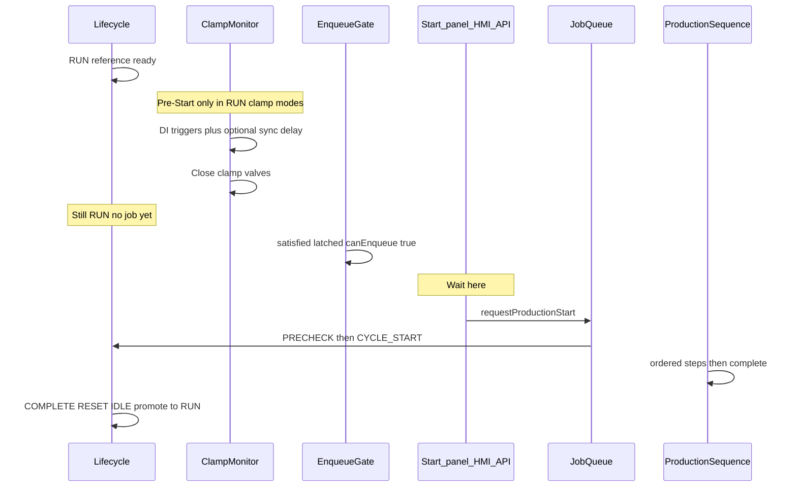
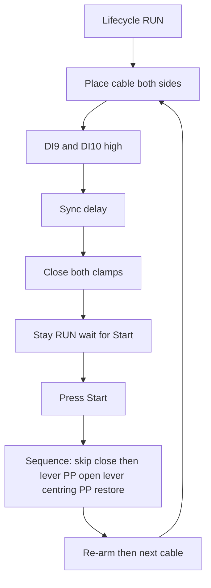

# Production cycle

## Purpose

Describe the end-to-end production cycle on the US Machine HMI stack: how the machine becomes ready, how cable placement (clamp Pre-Start) works, how Start is armed, what ordered steps run after Start, and how the cycle settles for the next cable.

Audience: operators (behaviour), maintainers (I/O and lifecycle), and developers (code ownership).

**Pending changes (do not implement until reviewed):** [PRODUCTION_CYCLE_BOTH_MODE_CHANGE_PLAN.md](./PRODUCTION_CYCLE_BOTH_MODE_CHANGE_PLAN.md) — sync-delay UI/DB verification, open_clamps/re-arm explanation, step delays, next-cable options.

**Panel & HMI buttons/LEDs (mode both):** [PRODUCTION_CYCLE_BOTH_PANEL_HMI.md](./PRODUCTION_CYCLE_BOTH_PANEL_HMI.md).

## Architecture

Production is orchestrated on the Raspberry Pi backend. Hardware actuation goes through EtherCAT pneumatics and TCP slaves (centring, pick & place). Vision is optional per reference.



### Layer ownership

| Layer | Responsibility | Primary modules |
|-------|----------------|-----------------|
| Lifecycle FSM | RUN / PRECHECK / CYCLE_* / ERROR / lockout | `backend/lib/machineLifecycle.mjs` |
| Clamp Pre-Start | Live DI→close, Start gate, re-arm | `backend/lib/clampTriggerMode.mjs` |
| Panel | DI0/DI1 meaning + LEDs | `backend/lib/panelModes.mjs`, `panelButtons.mjs` |
| Job queue | Enqueue, worker, soft-stop | `backend/lib/productionJobQueue.mjs` |
| Sequence | Prepare + ordered steps | `backend/lib/productionSequence.mjs` |
| Abort | Safe pneumatics + slave STOP | `backend/lib/productionAbort.mjs` |
| Centring / P&P | TCP slave motion | `centringV2Production.mjs` → `centringV2/` (Version 2 service), `pickPlace*.mjs` |
| Vision | Optional checkpoints | `productionVisionInspection.mjs` |

UI and controllers must not own the sequence; they call `requestProductionStart` / stop APIs.

## Dependencies

- Machine initialized (Setup complete) and a product reference loaded → lifecycle **RUN**
- EtherCAT connected (clamp DOs/DIs, lever, PP clamp, panel buttons)
- When centring / pick-place are enabled: TCP reachability to those slaves (preflight in `prepareProductionRun`)
- Optional: Vision Pi for enabled inspection checkpoints
- Config:
  - `CLAMP_TRIGGER_MODE` in `backend/.env` (`off` \| `di10` \| `di9` \| `both`)
  - Production Sequence settings (delays, sync close delay for `both`)
  - `PANEL_TWO_HAND_MODE` / `PANEL_TWO_HAND_DISABLE` (panel mapping only; does not block enqueue)

Related docs: [ETHERCAT_IO_CONFIGURATION.md](./ETHERCAT_IO_CONFIGURATION.md), [PICK_PLACE_NANO_SYSTEM.md](./PICK_PLACE_NANO_SYSTEM.md), [Centring/Centring.md](./Centring/Centring.md) (host e2e), [Centring/FIRMWARE_E2E_ANALYSIS.md](./Centring/FIRMWARE_E2E_ANALYSIS.md) (slave firmware e2e).

## Step-by-step: `CLAMP_TRIGGER_MODE=both`

This is the full cycle when both clamps must be placed and closed **before** Start. Lifecycle stays **RUN** through Pre-Start; production only begins when Start is pressed.

### A. Machine ready

1. Load / scan a product reference.
2. Run **Setup / Initialization** until the machine is ready.
3. Lifecycle becomes **RUN** (ready to produce).
4. Clamp monitor is polling DI9 (left) and DI10 (right). Live close is allowed **only** in RUN.

### B. Pre-Start (cable place — still RUN)

5. Operator places the cable on **both** clamps.
6. Wait until **both** DI9 and DI10 are high.
   - Only one DI high → **nothing** closes (never one side alone).
7. Hold both DIs high through the **sync delay** (Settings → Production Sequence; `0` = immediate).
   - If either DI drops during the wait → delay cancels; start again from both high.
8. When the delay elapses → close **left and right together** (DO1 + DO0).
9. Satisfied latches for both sides → Start / enqueue is armed.
   - Lifecycle is still **RUN** (no job yet).
   - DI may drop after close; Start stays armed until reopen / re-arm.
10. Panel: Init LED steady on, Start LED flashes. Short **Start** begins production. Short **Init** opens clamps to re-place if needed.

### C. Start (operator)

11. Press **Start** (panel DI1 or HMI Start button).
12. Job is enqueued → lifecycle **PRECHECK** → then **CYCLE_START**.
13. `prepareProductionRun` re-checks gates and TCP preflight (centring / pick-place if enabled).

### D. Production sequence (after Start)

Exact order from `buildProductionSteps` when mode is `both`:

| # | Step | What happens |
|---|------|----------------|
| 1 | `vision_welding_splice` | Optional — only if that vision check is enabled for the reference |
| 2 | `close_clamps_skipped` | **Note only** — clamps already closed in Pre-Start; no DO write |
| 3 | `lever_up` | Lever up (DO2 = 1), then delay |
| 4 | `pp_clamp_close` | P&P clamp close (DO3 = 1), then delay |
| 5 | `vision_heat_shrink_tube` | Optional — if enabled |
| 6 | `open_clamps` | Open **both** valves (DO0/DO1 = 0); **both-side re-arm armed**; **satisfied cleared** |
| 7 | `lever_down` | Lever down (DO2 = 0), then delay |
| 8 | `centring_v2` | Version 2 centring step (or `centring_skipped`). Class A: confirm H_PRE (UNKNOWN → initialization), no carriage, no `h_post`. Class B: `MOVEAMMT2` to `centering_output_mm`, then one height move to `h_post`. |
| 9 | `pick_place_tail` | See sub-steps. No jaw moves. |
| 10 | `centring_v2_return` | Class B only: HOME the centring axes, then the move back to `h_pre`. Class A has no step here. |
| 11 | `complete` | Cycle done |

Steps 8–10 are the Version 2 host wiring (phase 4). `centring_axis` `upper` / `lower` is refused with `SINGLE_AXIS_UNDECIDED` before any motion (the unused-jaw rest position is not decided). A failed centring step fails the job with the cycle's own message; no second restore is attempted.

**Rest gate (phase 5).** One rule, in `backend/lib/centringV2/restGate.mjs`, decides both the Start gate (`referenceProductionReady` → `getCentringV2StartBlockReason`, cached STATUS) and Setup "already ready" (`machineSetup` → `isCentringV2SetupReady`, fresh STATUS): every `centring_axis` of the loaded reference is H_PRE (`classifyAxisPosition` on the STATUS pulses, angles and heights), `cal=1`, E-stop clear, not busy. Closed idle (both TRAVEL) is not ready. No marker of an earlier move is kept; every Version 2 result publishes its STATUS to the STATUS cache, and the gate classifies that STATUS. Without a reference, Setup does not ask the centring question. Every block reason starts with "Centring", so the HMI offers Initialization / Recover.

**Operator text (phase 5).** The machine status payload carries `centringPosition`: one line per axis (`backend/lib/centringV2/positionText.mjs`, requirements §11.1), and, during a Class A step that found an axis UNKNOWN, the notice "Error. Centring axis is in an unknown position. Running initialization." If that initialization fails, the line under it is "Initialization failed." followed by the cycle's own message (what happened, why, how to recover). The notice clears when the step ends without a failure, and on reference change. The production screen shows these lines under the status bar.

**E-stop clear (phase 5).** After `CLEARESTOP`, a loaded reference with `centring_axis` `upper` / `lower` throws `SINGLE_AXIS_UNDECIDED` without any motion command (the latch stays cleared, `err.status` holds that STATUS). `both` runs the Version 2 initialization as before.

**Height move completion (phase 5).** `assertMotionMoveEnd` never accepts `moveEnd=limit` / `both_limits` or `reason=limit` / `both_limits` as a reached height, even when `h` is in tolerance. Those switch stops stay valid for `HOME` / `SEEK_TRAVEL`. Switch bits `uh` / `ut` / `lh` / `lt` are data and are passed through.

**Start pulse (phase 6, requirements §7.3, V2-REQ-100 … 103).** On Start, `executeProductionSequence` runs the steps above through `runStartWithPulse` (`backend/lib/centringV2/startPulse.mjs`). Before step 1 it fires the existing height move to `h_pre_mm` (`moveCommandForCentringAxis` → `MOVEBOTHMM`) and does not await it; the move is not in the step list and the step order is unchanged. The Nano is already on that pulse, so it attaches the servo signal at the H_PRE pulse and replies `moveEnd=ok` at once; its idle detach (`board::kIdleDetachMs` = 1500 ms) turns the signal off 1.5 s later. The host has no 1.5 s timer. The steps do not wait for the 1.5 s, and the 1.5 s does not wait for the steps. The centring command queue still runs the next centring command after this move's reply (one short STATUS + MOVE round trip), with no added delay.

- **Sent only when:** centring is not skipped, `centring_axis` is `both`, the length class is A or B, and the Start STATUS (production preflight) shows every centring axis at H_PRE with `cal=1`, E-stop clear, not busy. Otherwise nothing is sent; the centring step owns recovery. Single-axis is never sent (Start is refused with `SINGLE_AXIS_UNDECIDED`).
- **Reply:** not a step. Once step 1 has begun, a failed reply is logged and ignored, except a link loss or E-stop failure: during the cycle it fails the job at the next step boundary (`START_PULSE_FAILED`, message starts "Centring Start pulse (MOVEBOTHMM h mm) failed:"); after the cycle it is logged and the centring STATUS cache is cleared, so the next Start waits for a fresh STATUS.
- **Not covered:** the maintenance step-by-step runner (`productionStepper.mjs`) does not send the Start pulse.

#### Centring travel vs short L_eff (Version 1 history — no longer on the production path)

When the loaded shrink tube has **L_eff &lt; 55 mm**:

1. **Reference load / Setup:** `SEEK_TRAVEL` → `HOME` → `MOVE h_pre` (no post-HOME `SEEK_TRAVEL`). Jaws stay at `h_pre` until the next reference.
2. **Each production cycle:** assert `h_pre` at centring entry; skip `move_centering_travel`; no `h_post`.
3. After `pick_place_tail`, assert `h_pre` again (`assert_only_short_L_eff`). No mid-cycle or tail jaw MOVE on the success path.

L_eff ≥ 55 mm keeps the normal order: closed-idle init → travel → h_post in centring → restore after pick-tail.

#### Centring in Version 2 (host wired in phase 4; Nano flash pending)

Production, setup and reference load call `centringV2Production.mjs` (phase 4). Single-jaw recipes are refused until the unused-jaw rule is decided; the "Unused axis" line below is the target, not wired. Version 2 rebuilds the HOME / TRAVEL drives, rest state, and centring orchestration, removes switch-based command blocks, and reuses the Version 1 height move (without its switch gates), height model, saved calibration values, shrink-tube recipe, and TCP link. Contract: [Centring/VERSION_2_PHASE_REQUIREMENTS.md](./Centring/VERSION_2_PHASE_REQUIREMENTS.md).

- **Length class** from the loaded reference: Class A `40 ≤ L_eff ≤ 55 mm` (55 mm included), Class B `55 < L_eff ≤ 100 mm`. `L_eff` is shrink-tube length, independent of the centring frame (guide spacing 40 mm and 300 mm). The recipe rejects `L_eff` outside 40–100 mm. The cycles differ between classes.
- **Five positions per axis.** HOME is the open-end limit and TRAVEL is the close-end limit. H_PRE and H_POST are both between those limits; each is confirmed when the last servo move’s pulse, angle, and height all match that reference. UNKNOWN is any other pose between the limits. Production waits while an axis is in motion or its position is not available.
- **Switches never block a command** on the Nano or in the host session. They name the limit positions and they end `HOME` / `SEEK_TRAVEL`.
- **Commands:** `HOME` stops only on the HOME switch. It does not stop on H_PRE, H_POST, UNKNOWN, or a TRAVEL switch that is already pressed. `centring_axis` chooses `SEEK_TRAVEL`, `SEEK_TRAVEL_UPPER`, or `SEEK_TRAVEL_LOWER`. That command stops only on the TRAVEL switch. It does not stop on H_PRE, H_POST, UNKNOWN, or a HOME switch that is already pressed. A move to `h_pre_mm` or `h_post_mm` uses `MOVE_UPPERMM`, `MOVE_LOWERMM`, or `MOVEBOTHMM`, also chosen by `centring_axis`. To `h_pre_mm`, go to HOME if needed, leave the switch, seek, confirm the edge, then move to `h_pre_mm`. To `h_post_mm`, start at `h_pre_mm` and move to `h_post_mm`.
- **Initialization** (machine init with a reference loaded, or while a new reference loads): `HOME` both axes; if `cal=0`, apply the saved relation; then the height move to `h_pre_mm`. With no saved relation, initialization stops at HOME and the HMI points to full height calibration. Production waits until the `centring_axis` axes are H_PRE.
- **Calibration:** data the centring system needs in order to run. It is not a command. The height moves use it. `HOME` and `SEEK_TRAVEL` do not use it to decide their stop. The HMI measures it. A stored copy is applied when the Nano has lost it.
- **Servo pulse on Start:** for Class A and Class B, the servo pulse turns on according to H_PRE, stays on for 1.5 s, then the servo signal turns off. This runs at the same time as the production sequence. The sequence does not wait for the 1.5 s release. The 1.5 s release does not wait until the sequence ends. Wired in phase 6 (see "Start pulse" above); the 1.5 s is the Nano idle detach, not a host timer.
- **Class A** (`40 ≤ L_eff ≤ 55 mm`): stay at the loaded `h_pre_mm` for the cycle and between cycles. UNKNOWN on a centring axis is an error; the service runs initialization (open both axes, then the height move to `h_pre_mm`). No move to `h_post_mm`.
- **Class B** (`55 < L_eff ≤ 100 mm`): at the centring step, `MOVEAMMT2` to `centering_output_mm` (no stop at the centring input), then move from `h_pre_mm` to `h_post_mm` and stay there through the pick tail; then return with the `h_pre_mm` sequence and rest at H_PRE between cycles. UNKNOWN is an error and runs initialization.
- **Unused axis:** when `centring_axis` is one jaw, the other jaw is parked at TRAVEL, reused from Version 1.

#### `pick_place_tail` sub-steps (STCS-evo500)

After the carriage arrives at pick (`move_to_pick`), ARM runs from Settings → Production Sequence, then the cycle continues to restore → **complete**:

| Sub-phase | Action | Delay |
|-----------|--------|-------|
| `move_to_pick` | `MOVEAMMT2` to `movePositionEvoMm` | Motion time |
| `arm_evo500_wait_before` | Wait before ARM | `armDelayBeforeMs` (default 0) |
| `arm_evo500` | **DO15 `ARM_EVO500` = 1**, hold, then **= 0** | `armPulseMs` (default **500 ms**) |
| `arm_evo500_wait_after` | Wait after ARM | `armDelayAfterMs` (default 0) |
| `pick_clamp_open` | Open P&P clamp (DO3 = 0) | `delayAfterPickClampOpenMs` |
| `return_to_backoff` | `MOVEAMMT2` to backoff | Motion time |

STCS-CS19: same move / open / return path, **no** DO15 pulse (uses `movePositionMm`).

### E. After the cycle / next cable

14. Lifecycle settles: COMPLETE → RESET → IDLE → promote back to **RUN**.
15. Because `open_clamps` armed re-arm:
    - Remove the cable so DI9 and DI10 go **low**.
    - Place the next cable so both go **high** again.
    - Sync delay → both clamps close again (Pre-Start).
    - Press **Start** for the next job.

### F. If placement is wrong before Start

- **Short-press Init** while READY (Init LED steady on) → opens both clamps, arms re-arm.
- Remove and re-place (DI low → high on both) → Pre-Start close again → then Start.



## Operator flow (all clamp modes — summary)

1. Scan / load reference and run **Setup** until status is ready (**RUN**).
2. **Pre-Start** (when clamp mode ≠ `off`): place the cable so the required clamp trigger DI(s) go high; valves close per mode.
3. Lifecycle stays **RUN**. Start / enqueue becomes armed when live close is satisfied.
4. Press **Start** (panel DI1 or HMI Start). Do **not** short-press Init to start — that was historically used for reopen.
5. Full production sequence runs (see steps below).
6. Cycle completes → lifecycle returns to **RUN** for the next cable (after re-arm rules when clamps were opened).

### Panel after Pre-Start (clamp mode on, READY)

| Action | Behaviour |
|--------|-----------|
| **Start** (DI1 short) | Begin production |
| **Init** (DI0 short, LED steady on) | Open clamps to re-place cable |
| **READY_BLOCKED** | Edge reopen: Init (single) or Start (sequential) while Start is blocked |

## Clamp Pre-Start (`CLAMP_TRIGGER_MODE`)

Live auto-close runs **only** while lifecycle is **RUN**. It never enqueues a job and never enters PRECHECK by itself.

| Mode | Live close | Start gate | Sequence `close_clamps` |
|------|------------|------------|-------------------------|
| `off` | None | Not gated by clamps | Closes **both** |
| `di10` | DI10 → right | Right satisfied | Closes **left** only |
| `di9` | DI9 → left | Left satisfied | Closes **right** only |
| `both` | DI9 **and** DI10 high → sync delay → **both** together | Both satisfied | **Skipped** (`close_clamps_skipped`) |

Notes for `both`:

- Holding only one DI never closes a clamp.
- Sync delay = max of Settings pair / env (`CLAMP_TRIGGER_CLOSE_DELAY_*_MS`); `0` = immediate.
- Either DI low during the wait cancels the pending delay; once closed, **satisfied stays latched** so Start stays armed even if DI drops.
- After `open_clamps` / abort / panel reopen: re-arm — remove cable (DI low) then re-place (DI high) before the next live close.

Hardware: DI9 left trigger, DI10 right trigger; DO0 right clamp, DO1 left clamp (1 = close).

## Lifecycle around a job

| Phase | Meaning |
|-------|---------|
| `RUN` | Ready; Pre-Start live close allowed |
| `PRECHECK` | Job accepted; prepare / gates |
| `CYCLE_START` | Actuation steps in progress |
| `COMPLETE` → `RESET` → `IDLE` | Job finished settle |
| Promote to `RUN` | Reference still loaded → ready again |
| `ERROR` / `SAFETY_LOCKOUT` | Fault paths; Setup / recover required |

Soft Stop (long-press Start while running) cancels the job without treating soft-stop as a hard machine fault when no independent failure occurred.

## Production sequence steps

Built by `buildProductionSteps()` and executed by `executeProductionSequence()` (job queue worker). Optional steps depend on reference vision config and skip flags.

Ordered list (typical full cycle):

| Step | What happens |
|------|----------------|
| `vision_welding_splice` | Optional vision checkpoint (inspection or capture-only — see below) |
| `close_clamps` **or** `close_clamps_skipped` | Close remaining / both clamps — or note-only skip in mode `both` |
| `lever_up` | Lever up (DO2) |
| `pp_clamp_close` | Pick & place clamp close (DO3) |
| `vision_heat_shrink_tube` | Optional vision checkpoint (inspection or capture-only — see below) |
| `open_clamps` | Open both clamps + arm re-arm |
| `lever_down` | Lever down |
| `centring_v2` **or** `centring_skipped` | Version 2 centring step (Class A stay at `h_pre`; Class B carriage → `h_post`) |
| `pick_place_tail` **or** `pick_place_skipped` | Tail move / pulse (model-dependent) |
| `centring_v2_return` | Class B only — back to `h_pre` after P&P |
| `complete` | Lifecycle settle |

### Close outputs by mode (non-`both`)

| Mode | `getCloseClampsOutputs()` |
|------|---------------------------|
| `off` | `{ clampRight, clampLeft }` |
| `di10` | `{ clampLeft }` |
| `di9` | `{ clampRight }` |
| `both` | `null` (step skipped) |

### Vision production capture-only mode

System setting `vision_production_capture_only` (default **false**, Settings → Vision; also System for Bypass):

| Value | Behavior at `vision_welding_splice` / `vision_heat_shrink_tube` |
|-------|------------------------------------------------------------------|
| `false` | Unchanged: Vision `run-once` + tool PASS/FAIL gating |
| `true` | Vision `capture-and-save` into allowlisted folders (`vision_welding_splice` / `vision_heat_shrink_tube`); PNG saved on Vision Pi under `Master_capture_option/{folder}/`; returned image shown on the main HMI canvas; **no** tool PASS/FAIL |

- Successful capture **advances** the step; capture failure **faults** the cycle (`VISION_FAIL` path).
- Does not run run-once in parallel when capture-only is on.
- Maintenance panel DI1 vision remains inspection (`forceInspection`).
- Details: [MASTER_PRODUCTION_CAPTURE_HANDOFF.md](./MASTER_PRODUCTION_CAPTURE_HANDOFF.md).

### Skip / variant flags (env / settings)

Common overrides (see `backend/.env.example`):

- `PRODUCTION_SKIP_CENTRING=1`
- `PRODUCTION_SKIP_PICK_PLACE` / `PRODUCTION_SKIP_PICK_TAIL`
- `PRODUCTION_SKIP_VISION=1` (or reference vision disabled)
- `PRODUCTION_SKIP_CENTRING_PICK_PLACE=1` — Class B carriage move inside centring is skipped (bench)
- `production_cycle_variant` (full / advanced) no longer changes centring (Version 2)

Delays between pneumatic phases come from Production Sequence settings / `PRODUCTION_DELAY_*` env overrides.

## Start paths

All start paths enqueue through `requestProductionStart()`:

| Source | Typical trigger |
|--------|-----------------|
| `panel` | DI1 Start (after Pre-Start / gates) |
| `hmi` | On-screen Start (`requireButton: false`) |
| `api` | `POST /api/machine/start-production` |

Enqueue is blocked when `getProductionEnqueueBlockReason()` is non-null (no reference, not initialized, clamp gate, etc.).

## Abort and re-arm

On sequence failure or soft stop, `abortProductionMotionBestEffort()` safes pneumatics (opens clamps, leaves lever policy as designed) and stops P&P / centring motion with a short timeout. Opening clamps arms clamp re-arm so valves do not snap shut on return to RUN while trigger DIs stay high.

## Usage (developers)

```text
prepareProductionRun(ecm, opts)   → gates, timing, TCP preflight, vision config
buildProductionSteps(ecm, ctx, …) → ordered step list
executeProductionSequence(ecm)    → prepare + run steps (queue worker)
requestProductionStart(ecm, opts) → enqueue (+ optional wait)
```

Maintenance step-through reuses the same step builder via the production stepper.

## Limitations

- Clamp mode is **env-only** (`CLAMP_TRIGGER_MODE`); changing it requires a backend restart.
- Pre-Start live close is **level-based**, not edge-based; one DI alone never closes in mode `both`.
- Two-hand panel mode does **not** gate enqueue; it only affects DI0/DI1 mapping when clamp reopen is off.
- Abort opens clamps; a failed cycle after Pre-Start will release the cable grips.
- Centring / P&P TCP failures fail the job during prepare or mid-cycle; operator must recover (Setup / fix slaves) as needed.
- Vision and skip flags can omit large parts of the cycle; treat “full” as “all enabled steps for this reference/config”.

## Future improvements

- Explicit HMI phase for “Pre-Start complete — press Start” without implying a new lifecycle state.
- Clearer operator messaging when abort opens Pre-Start clamps after an early failure.
- Optional leave-clamps-on-prepare-failure to avoid releasing a good Pre-Start grip when TCP preflight fails before any cycle actuation.
- Single settings UI toggle for clamp mode (today `.env` only) with safe restart / apply policy.
