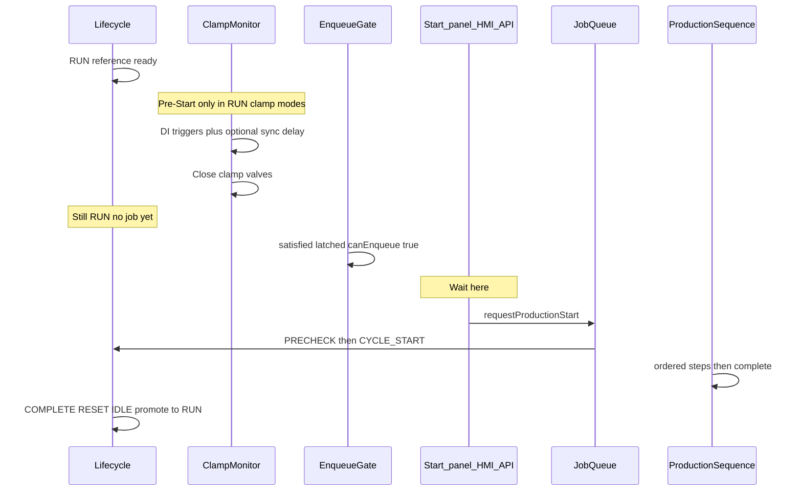
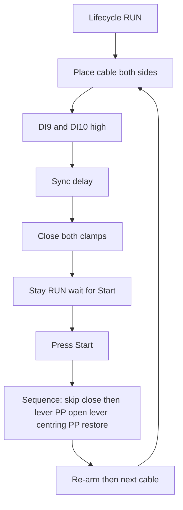

# Production cycle

## Purpose

Describe the end-to-end production cycle on the US Machine HMI stack: how the machine becomes ready, how cable placement (clamp Pre-Start) works, how Start is armed, what ordered steps run after Start, and how the cycle settles for the next cable.

Audience: operators (behaviour), maintainers (I/O and lifecycle), and developers (code ownership).

**Pending changes (do not implement until reviewed):** [PRODUCTION_CYCLE_BOTH_MODE_CHANGE_PLAN.md](./PRODUCTION_CYCLE_BOTH_MODE_CHANGE_PLAN.md) — sync-delay UI/DB verification, open_clamps/re-arm explanation, step delays, next-cable options.

**Panel & HMI buttons/LEDs (mode both):** [PRODUCTION_CYCLE_BOTH_PANEL_HMI.md](./PRODUCTION_CYCLE_BOTH_PANEL_HMI.md).

## Architecture

Production is orchestrated on the Raspberry Pi backend. Hardware actuation goes through EtherCAT pneumatics and TCP slaves (centring, pick & place). Vision is optional per reference.



### Layer ownership

| Layer | Responsibility | Primary modules |
|-------|----------------|-----------------|
| Lifecycle FSM | RUN / PRECHECK / CYCLE_* / ERROR / lockout | `backend/lib/machineLifecycle.mjs` |
| Clamp Pre-Start | Live DI→close, Start gate, re-arm | `backend/lib/clampTriggerMode.mjs` |
| Panel | DI0/DI1 meaning + LEDs | `backend/lib/panelModes.mjs`, `panelButtons.mjs` |
| Job queue | Enqueue, worker, soft-stop | `backend/lib/productionJobQueue.mjs` |
| Sequence | Prepare + ordered steps | `backend/lib/productionSequence.mjs` |
| Abort | Safe pneumatics + slave STOP | `backend/lib/productionAbort.mjs` |
| Centring / P&P | TCP slave motion | `productionCentringSequence.mjs`, `pickPlace*.mjs` |
| Vision | Optional checkpoints | `productionVisionInspection.mjs` |

UI and controllers must not own the sequence; they call `requestProductionStart` / stop APIs.

## Dependencies

- Machine initialized (Setup complete) and a product reference loaded → lifecycle **RUN**
- EtherCAT connected (clamp DOs/DIs, lever, PP clamp, panel buttons)
- When centring / pick-place are enabled: TCP reachability to those slaves (preflight in `prepareProductionRun`)
- Optional: Vision Pi for enabled inspection checkpoints
- Config:
  - `CLAMP_TRIGGER_MODE` in `backend/.env` (`off` \| `di10` \| `di9` \| `both`)
  - Production Sequence settings (delays, sync close delay for `both`)
  - `PANEL_TWO_HAND_MODE` / `PANEL_TWO_HAND_DISABLE` (panel mapping only; does not block enqueue)

Related docs: [ETHERCAT_IO_CONFIGURATION.md](./ETHERCAT_IO_CONFIGURATION.md), [PICK_PLACE_NANO_SYSTEM.md](./PICK_PLACE_NANO_SYSTEM.md), [Centring/Centring.md](./Centring/Centring.md) (host e2e), [Centring/FIRMWARE_E2E_ANALYSIS.md](./Centring/FIRMWARE_E2E_ANALYSIS.md) (slave firmware e2e).

## Step-by-step: `CLAMP_TRIGGER_MODE=both`

This is the full cycle when both clamps must be placed and closed **before** Start. Lifecycle stays **RUN** through Pre-Start; production only begins when Start is pressed.

### A. Machine ready

1. Load / scan a product reference.
2. Run **Setup / Initialization** until the machine is ready.
3. Lifecycle becomes **RUN** (ready to produce).
4. Clamp monitor is polling DI9 (left) and DI10 (right). Live close is allowed **only** in RUN.

### B. Pre-Start (cable place — still RUN)

5. Operator places the cable on **both** clamps.
6. Wait until **both** DI9 and DI10 are high.
   - Only one DI high → **nothing** closes (never one side alone).
7. Hold both DIs high through the **sync delay** (Settings → Production Sequence; `0` = immediate).
   - If either DI drops during the wait → delay cancels; start again from both high.
8. When the delay elapses → close **left and right together** (DO1 + DO0).
9. Satisfied latches for both sides → Start / enqueue is armed.
   - Lifecycle is still **RUN** (no job yet).
   - DI may drop after close; Start stays armed until reopen / re-arm.
10. Panel: Init LED steady on, Start LED flashes. Short **Start** begins production. Short **Init** opens clamps to re-place if needed.

### C. Start (operator)

11. Press **Start** (panel DI1 or HMI Start button).
12. Job is enqueued → lifecycle **PRECHECK** → then **CYCLE_START**.
13. `prepareProductionRun` re-checks gates and TCP preflight (centring / pick-place if enabled).

### D. Production sequence (after Start)

Exact order from `buildProductionSteps` when mode is `both`:

| # | Step | What happens |
|---|------|----------------|
| 1 | `vision_welding_splice` | Optional — only if that vision check is enabled for the reference |
| 2 | `close_clamps_skipped` | **Note only** — clamps already closed in Pre-Start; no DO write |
| 3 | `lever_up` | Lever up (DO2 = 1), then delay |
| 4 | `pp_clamp_close` | P&P clamp close (DO3 = 1), then delay |
| 5 | `vision_heat_shrink_tube` | Optional — if enabled |
| 6 | `open_clamps` | Open **both** valves (DO0/DO1 = 0); **both-side re-arm armed**; **satisfied cleared** |
| 7 | `lever_down` | Lever down (DO2 = 0), then delay |
| 8 | `centring` | Centring cycle (or `centring_skipped`). **L_eff &lt; 55 mm**: assert `h_pre`, skip `move_centering_travel`, no `h_post` (`holdHPreEntireCycle`). |
| 9 | `pick_place_tail` | See sub-steps. Short L_eff: normal P&P only (no jaw gap moves). |
| 10 | `centring_restore_*` | Long L_eff: advanced `h_pre` or classic closed idle. Short L_eff: **assert** `h_pre` only (classic and advanced). |
| 11 | `complete` | Cycle done |

#### Centring travel vs short L_eff

When the loaded shrink tube has **L_eff &lt; 55 mm**:

1. **Reference load / Setup:** `SEEK_TRAVEL` → `HOME` → `MOVE h_pre` (no post-HOME `SEEK_TRAVEL`). Jaws stay at `h_pre` until the next reference.
2. **Each production cycle:** assert `h_pre` at centring entry; skip `move_centering_travel`; no `h_post`.
3. After `pick_place_tail`, assert `h_pre` again (`assert_only_short_L_eff`). No mid-cycle or tail jaw MOVE on the success path.

L_eff ≥ 55 mm keeps the normal order: closed-idle init → travel → h_post in centring → restore after pick-tail.

#### `pick_place_tail` sub-steps (STCS-evo500)

After the carriage arrives at pick (`move_to_pick`), ARM runs from Settings → Production Sequence, then the cycle continues to restore → **complete**:

| Sub-phase | Action | Delay |
|-----------|--------|-------|
| `move_to_pick` | `MOVEAMMT2` to `movePositionEvoMm` | Motion time |
| `arm_evo500_wait_before` | Wait before ARM | `armDelayBeforeMs` (default 0) |
| `arm_evo500` | **DO15 `ARM_EVO500` = 1**, hold, then **= 0** | `armPulseMs` (default **500 ms**) |
| `arm_evo500_wait_after` | Wait after ARM | `armDelayAfterMs` (default 0) |
| `pick_clamp_open` | Open P&P clamp (DO3 = 0) | `delayAfterPickClampOpenMs` |
| `return_to_backoff` | `MOVEAMMT2` to backoff | Motion time |

STCS-CS19: same move / open / return path, **no** DO15 pulse (uses `movePositionMm`).

### E. After the cycle / next cable

14. Lifecycle settles: COMPLETE → RESET → IDLE → promote back to **RUN**.
15. Because `open_clamps` armed re-arm:
    - Remove the cable so DI9 and DI10 go **low**.
    - Place the next cable so both go **high** again.
    - Sync delay → both clamps close again (Pre-Start).
    - Press **Start** for the next job.

### F. If placement is wrong before Start

- **Short-press Init** while READY (Init LED steady on) → opens both clamps, arms re-arm.
- Remove and re-place (DI low → high on both) → Pre-Start close again → then Start.



## Operator flow (all clamp modes — summary)

1. Scan / load reference and run **Setup** until status is ready (**RUN**).
2. **Pre-Start** (when clamp mode ≠ `off`): place the cable so the required clamp trigger DI(s) go high; valves close per mode.
3. Lifecycle stays **RUN**. Start / enqueue becomes armed when live close is satisfied.
4. Press **Start** (panel DI1 or HMI Start). Do **not** short-press Init to start — that was historically used for reopen.
5. Full production sequence runs (see steps below).
6. Cycle completes → lifecycle returns to **RUN** for the next cable (after re-arm rules when clamps were opened).

### Panel after Pre-Start (clamp mode on, READY)

| Action | Behaviour |
|--------|-----------|
| **Start** (DI1 short) | Begin production |
| **Init** (DI0 short, LED steady on) | Open clamps to re-place cable |
| **READY_BLOCKED** | Edge reopen: Init (single) or Start (sequential) while Start is blocked |

## Clamp Pre-Start (`CLAMP_TRIGGER_MODE`)

Live auto-close runs **only** while lifecycle is **RUN**. It never enqueues a job and never enters PRECHECK by itself.

| Mode | Live close | Start gate | Sequence `close_clamps` |
|------|------------|------------|-------------------------|
| `off` | None | Not gated by clamps | Closes **both** |
| `di10` | DI10 → right | Right satisfied | Closes **left** only |
| `di9` | DI9 → left | Left satisfied | Closes **right** only |
| `both` | DI9 **and** DI10 high → sync delay → **both** together | Both satisfied | **Skipped** (`close_clamps_skipped`) |

Notes for `both`:

- Holding only one DI never closes a clamp.
- Sync delay = max of Settings pair / env (`CLAMP_TRIGGER_CLOSE_DELAY_*_MS`); `0` = immediate.
- Either DI low during the wait cancels the pending delay; once closed, **satisfied stays latched** so Start stays armed even if DI drops.
- After `open_clamps` / abort / panel reopen: re-arm — remove cable (DI low) then re-place (DI high) before the next live close.

Hardware: DI9 left trigger, DI10 right trigger; DO0 right clamp, DO1 left clamp (1 = close).

## Lifecycle around a job

| Phase | Meaning |
|-------|---------|
| `RUN` | Ready; Pre-Start live close allowed |
| `PRECHECK` | Job accepted; prepare / gates |
| `CYCLE_START` | Actuation steps in progress |
| `COMPLETE` → `RESET` → `IDLE` | Job finished settle |
| Promote to `RUN` | Reference still loaded → ready again |
| `ERROR` / `SAFETY_LOCKOUT` | Fault paths; Setup / recover required |

Soft Stop (long-press Start while running) cancels the job without treating soft-stop as a hard machine fault when no independent failure occurred.

## Production sequence steps

Built by `buildProductionSteps()` and executed by `executeProductionSequence()` (job queue worker). Optional steps depend on reference vision config and skip flags.

Ordered list (typical full cycle):

| Step | What happens |
|------|----------------|
| `vision_welding_splice` | Optional vision checkpoint (inspection or capture-only — see below) |
| `close_clamps` **or** `close_clamps_skipped` | Close remaining / both clamps — or note-only skip in mode `both` |
| `lever_up` | Lever up (DO2) |
| `pp_clamp_close` | Pick & place clamp close (DO3) |
| `vision_heat_shrink_tube` | Optional vision checkpoint (inspection or capture-only — see below) |
| `open_clamps` | Open both clamps + arm re-arm |
| `lever_down` | Lever down |
| `centring` **or** `centring_skipped` | Centring cycle (classic or advanced gap) |
| `pick_place_tail` **or** `pick_place_skipped` | Tail move / pulse (model-dependent) |
| `centring_restore_idle` **or** `centring_restore_h_pre` | Restore guides after P&P |
| `complete` | Lifecycle settle |

### Close outputs by mode (non-`both`)

| Mode | `getCloseClampsOutputs()` |
|------|---------------------------|
| `off` | `{ clampRight, clampLeft }` |
| `di10` | `{ clampLeft }` |
| `di9` | `{ clampRight }` |
| `both` | `null` (step skipped) |

### Vision production capture-only mode

System setting `vision_production_capture_only` (default **false**, Settings → Vision; also System for Bypass):

| Value | Behavior at `vision_welding_splice` / `vision_heat_shrink_tube` |
|-------|------------------------------------------------------------------|
| `false` | Unchanged: Vision `run-once` + tool PASS/FAIL gating |
| `true` | Vision `capture-and-save` into allowlisted folders (`vision_welding_splice` / `vision_heat_shrink_tube`); PNG saved on Vision Pi under `Master_capture_option/{folder}/`; returned image shown on the main HMI canvas; **no** tool PASS/FAIL |

- Successful capture **advances** the step; capture failure **faults** the cycle (`VISION_FAIL` path).
- Does not run run-once in parallel when capture-only is on.
- Maintenance panel DI1 vision remains inspection (`forceInspection`).
- Details: [MASTER_PRODUCTION_CAPTURE_HANDOFF.md](./MASTER_PRODUCTION_CAPTURE_HANDOFF.md).

### Skip / variant flags (env / settings)

Common overrides (see `backend/.env.example`):

- `PRODUCTION_SKIP_CENTRING=1`
- `PRODUCTION_SKIP_PICK_PLACE` / `PRODUCTION_SKIP_PICK_TAIL`
- `PRODUCTION_SKIP_VISION=1` (or reference vision disabled)
- Gap strategy classic vs advanced (advanced restores `h_pre` instead of closed idle)

Delays between pneumatic phases come from Production Sequence settings / `PRODUCTION_DELAY_*` env overrides.

## Start paths

All start paths enqueue through `requestProductionStart()`:

| Source | Typical trigger |
|--------|-----------------|
| `panel` | DI1 Start (after Pre-Start / gates) |
| `hmi` | On-screen Start (`requireButton: false`) |
| `api` | `POST /api/machine/start-production` |

Enqueue is blocked when `getProductionEnqueueBlockReason()` is non-null (no reference, not initialized, clamp gate, etc.).

## Abort and re-arm

On sequence failure or soft stop, `abortProductionMotionBestEffort()` safes pneumatics (opens clamps, leaves lever policy as designed) and stops P&P / centring motion with a short timeout. Opening clamps arms clamp re-arm so valves do not snap shut on return to RUN while trigger DIs stay high.

## Usage (developers)

```text
prepareProductionRun(ecm, opts)   → gates, timing, TCP preflight, vision config
buildProductionSteps(ecm, ctx, …) → ordered step list
executeProductionSequence(ecm)    → prepare + run steps (queue worker)
requestProductionStart(ecm, opts) → enqueue (+ optional wait)
```

Maintenance step-through reuses the same step builder via the production stepper.

## Limitations

- Clamp mode is **env-only** (`CLAMP_TRIGGER_MODE`); changing it requires a backend restart.
- Pre-Start live close is **level-based**, not edge-based; one DI alone never closes in mode `both`.
- Two-hand panel mode does **not** gate enqueue; it only affects DI0/DI1 mapping when clamp reopen is off.
- Abort opens clamps; a failed cycle after Pre-Start will release the cable grips.
- Centring / P&P TCP failures fail the job during prepare or mid-cycle; operator must recover (Setup / fix slaves) as needed.
- Vision and skip flags can omit large parts of the cycle; treat “full” as “all enabled steps for this reference/config”.

## Future improvements

- Explicit HMI phase for “Pre-Start complete — press Start” without implying a new lifecycle state.
- Clearer operator messaging when abort opens Pre-Start clamps after an early failure.
- Optional leave-clamps-on-prepare-failure to avoid releasing a good Pre-Start grip when TCP preflight fails before any cycle actuation.
- Single settings UI toggle for clamp mode (today `.env` only) with safe restart / apply policy.
