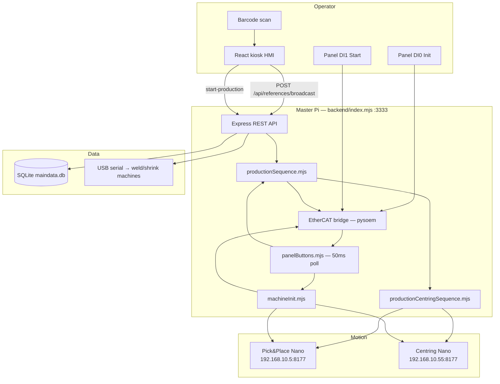
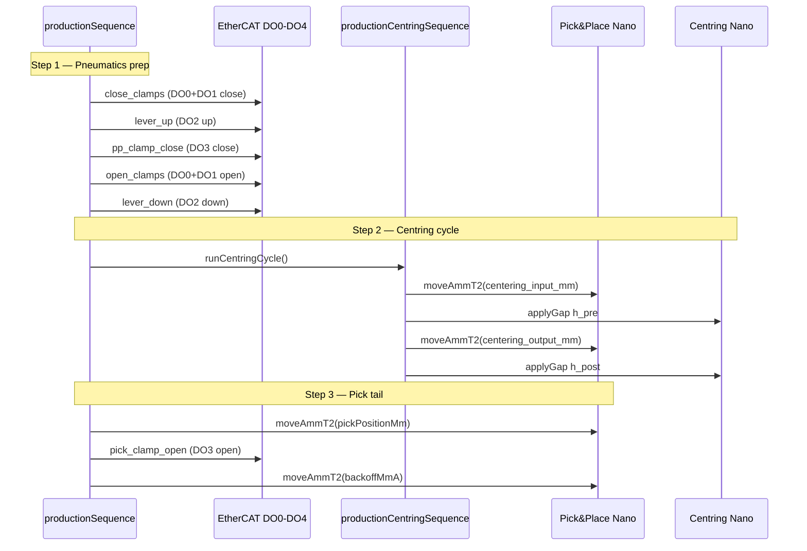
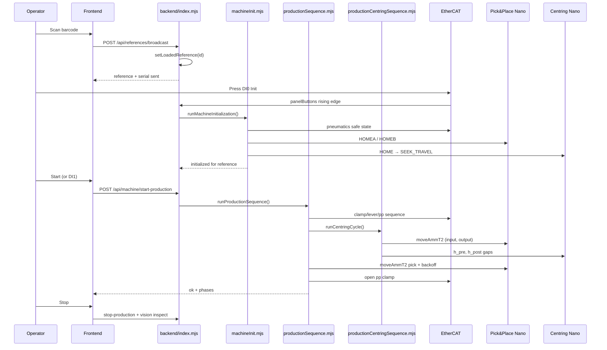
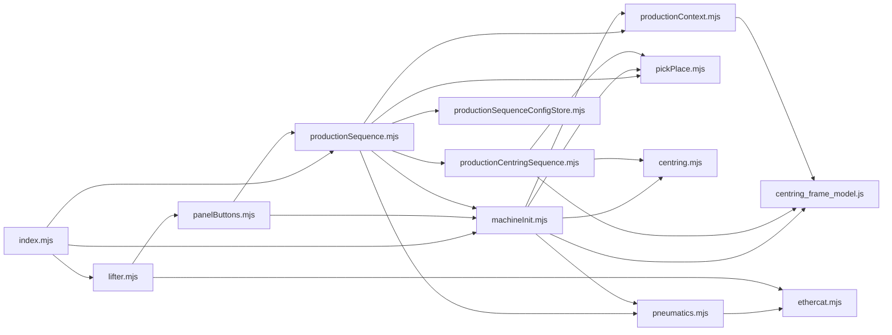

# Deep Analysis: USW Machine Production Flow

**Document version:** 1.0  
**Codebase:** `USW_Machine-main`  
**Last reviewed:** June 2026  

This document describes the **end-to-end production path** as implemented in the codebase: from barcode scan through machine initialization, the full motion/pneumatics cycle, and operator stop. Orchestration lives primarily in the Express backend; motion runs on two Nanos over TCP; pneumatics and panel buttons run over EtherCAT.

---

## Table of Contents

1. [Executive Summary](#1-executive-summary)
2. [System Architecture](#2-system-architecture)
3. [Entry Points and Boot Sequence](#3-entry-points-and-boot-sequence)
4. [Phase A — Reference Loading](#4-phase-a--reference-loading)
5. [Phase B — Machine Initialization (DI0)](#5-phase-b--machine-initialization-di0)
6. [Phase C — Production Cycle (DI1 / HMI Start)](#6-phase-c--production-cycle-di1--hmi-start)
7. [Centring Sub-Sequence (Deep Dive)](#7-centring-sub-sequence-deep-dive)
8. [Pick & Place Sub-Sequence](#8-pick--place-sub-sequence)
9. [EtherCAT I/O Map](#9-ethercat-io-map)
10. [State Management and Concurrency](#10-state-management-and-concurrency)
11. [Configuration Layers](#11-configuration-layers)
12. [Frontend Integration](#12-frontend-integration)
13. [REST API Reference](#13-rest-api-reference)
14. [Error Handling and Safety Analysis](#14-error-handling-and-safety-analysis)
15. [Operator Checklist](#15-operator-checklist)
16. [Key Files Reference](#16-key-files-reference)
17. [Known Gaps and Recommendations](#17-known-gaps-and-recommendations)
18. [Appendix — Sequence Diagrams](#18-appendix--sequence-diagrams)

---

## 1. Executive Summary

Production is a **three-gate, linear async pipeline**:

| Gate | Trigger | Purpose |
|------|---------|---------|
| **Reference loaded** | Barcode scan / API | Select product profile + shrink tube geometry |
| **Initialized** | Physical DI0 (Init) | Home P&P + centring, set safe pneumatics |
| **Production cycle** | DI1 (Start) or HMI Start | Pneumatics → centring → pick tail |

There is **no job queue** and **no formal backend state machine** — only module-level flags (`_productionRunning`, `_initializedReferenceId`, etc.) and phase strings (`close_clamps`, `centring`, `move_to_pick`, …).

The master Pi (typically `192.168.10.1`) runs:

| Layer | Role |
|-------|------|
| **Express backend** (`backend/index.mjs`) | SQLite settings, REST API, production orchestration |
| **React kiosk frontend** | Operator UI, barcode scan, Start/Stop |
| **pysoem EtherCAT bridge** | DO0–DO5 pneumatics, DI0/DI1 panel buttons |
| **Pick & Place master** (`New_version_pick&place/master/pick_place_master.js`) | TCP client → Nano @ `192.168.10.5:8177` |
| **Centring master** (`New_version_centring_systeme/centring_master.js`) | TCP client → Nano @ `192.168.10.55:8177` |
| **Vision Pi proxy** | Optional inspection on **Stop**, not inline in production |

Peripheral machines (welding/shrink) receive reference strings over **USB serial** after barcode scan.

---

## 2. System Architecture



**Key design choice:** Panel buttons are polled **server-side** at 50 ms with rising-edge detection, so momentary presses work without relying on the HMI HTTP round-trip.

---

## 3. Entry Points and Boot Sequence

### 3.1 Server startup

| Entry | Path | What it does |
|-------|------|--------------|
| **Dev stack** | `start.sh` | Installs deps, loads `backend/.env`, starts backend + Vite + Chromium kiosk |
| **Backend only** | `npm start` in `backend/` | Runs `backend/index.mjs` on port 3333 |
| **EtherCAT auto-connect** | `ETHERCAT_AUTO_CONNECT` (default on) | On listen, calls `ensureEtherCAT()` → spawns bridge, turns main air on, starts panel button monitor |

Boot sequence in `backend/index.mjs`:

1. Open SQLite (`backend/lib/db.mjs`)
2. Wire config stores: pick-place, centring, production sequence timing
3. `initProductionContext(db, readSystemSettings)`
4. Start Express; optionally auto-connect EtherCAT

### 3.2 Production triggers

| Trigger | Mechanism | File |
|---------|-----------|------|
| **Panel DI1 (Start)** | Rising-edge poll every 50 ms | `backend/lib/panelButtons.mjs` |
| **HMI Start button** | `POST /api/machine/start-production` with `requireButton: false` | `frontend/src/components/MainPage.tsx` → `useMachineInitialization` |
| **Direct API** | Same endpoint; default requires DI1 pressed unless `requireButton: false` | `backend/index.mjs` |

### 3.3 Initialization triggers

| Trigger | Mechanism |
|---------|-----------|
| **Panel DI0 (Init)** | Rising edge in `panelButtons.mjs` |
| **API** | `POST /api/machine/initialize` (exists; **not called from MainPage UI**) |

### 3.4 Reference loading (prerequisite)

| Trigger | Endpoint | Effect |
|---------|----------|--------|
| Barcode scan / manual code | `POST /api/references/broadcast` | Validates active reference, `setLoadedReference(id)`, serial fan-out to weld/shrink |
| HMI session restore | `POST /api/machine/reference-loaded` | Syncs backend after frontend reload |

Changing reference clears init gate and resets production flags (`machineInit.mjs` → `resetProductionSequence()`).

### 3.5 Manual / bench scripts (not full production)

- `New_version_pick&place/scripts/send_command.mjs` — individual P&P commands including `MOVEAMMT2`
- `New_version_pick&place/scripts/send_home.mjs` — homing only
- Subsystem HTTP: `/api/pick-place/*`, `/api/centring/*` (via middleware in `index.mjs`)

There is **no standalone CLI** that runs the full init + production sequence outside the API/panel path.

---

## 4. Phase A — Reference Loading

Before init or production, a **product reference** must be loaded into backend memory.

### 4.1 Flow

1. Operator scans barcode on HMI → `POST /api/references/broadcast`
2. Backend validates against active `product_references` row
3. Calls `setLoadedReference(id)` — this **clears the init gate** if the reference changed
4. Optionally fans out reference name over USB serial to welding/shrink machines

### 4.2 Reference gate logic

Implemented in `backend/lib/machineInit.mjs`:

```javascript
export function setLoadedReference(referenceId) {
  const id = referenceId != null ? String(referenceId) : null
  if (id !== _loadedReferenceId) {
    _loadedReferenceId = id
    _initializedReferenceId = null   // init gate cleared
    import('./productionSequence.mjs')
      .then((m) => m.resetProductionSequence())
      .catch(() => {})
  }
}
```

### 4.3 Shrink tube validation

Every reference must have an **active shrink tube** (`shrink_tube_id` → `shrink_tubes` row). This drives centring geometry. Skippable only with `PRODUCTION_SKIP_CENTRING=1` (bench mode).

Validation is performed by `validateReferenceShrinkTube()` in `backend/lib/productionContext.mjs`:

| Failure | Error message |
|---------|---------------|
| No reference ID | `"No reference loaded — scan a reference first"` |
| Reference not in DB | `"Loaded reference not found in database"` |
| Missing shrink_tube_id | `"Reference must have a shrink tube profile — assign one in References before production"` |
| Inactive/missing tube row | `"Shrink tube profile on this reference is missing or inactive — choose an active profile"` |

---

## 5. Phase B — Machine Initialization (DI0)

Initialization prepares pneumatics and homes both motion subsystems **for the currently loaded reference**.

Source: `backend/lib/machineInit.mjs` → `runMachineInitialization()`

### 5.1 Preconditions

| Check | Block reason |
|-------|--------------|
| No reference | `"No reference loaded — scan a reference first"` |
| Already initialized for this ref | Returns early (`alreadyInitialized: true`) |
| Init in progress | `"Initialization already in progress"` |
| Missing/inactive shrink tube | From `validateReferenceShrinkTube()` |
| DI0 not pressed | `"Initialization button (DI0) is not pressed"` |

DI0 check can be bypassed with `ETHERCAT_SKIP_INIT_BUTTON=1` or API `{ requireButton: false }`.

### 5.2 Init sequence (ordered steps)

| Step | Phase key | Action |
|------|-----------|--------|
| 1 | `pneumatics_safe` | DO0/DO1 open, DO2 down, DO3 open, DO4 puller **on** (main air DO5 unchanged) |
| 2a | `pick_place_init` | `initializePickPlace()` — HOMEA → HOMEB to backoff positions |
| 2b | `pick_place_init_skipped` | If `PICK_PLACE_SKIP_INIT=1` |
| 3a | `centring_init` | Connect centring; recover if fault/estop; HOME (per shrink tube `centring_mechanism`); SEEK_TRAVEL idle |
| 3b | `centring_init_skipped` | If `CENTRING_SKIP_INIT=1` or `PRODUCTION_SKIP_CENTRING=1` |

On success: `_initializedReferenceId = _loadedReferenceId` — production is now allowed for this reference.

### 5.3 Pneumatic safe state after init

From `backend/lib/pneumatics.mjs`:

```javascript
export const INITIALIZATION_PNEUMATIC_STATE = Object.freeze({
  clampRight: false, // DO0 open
  clampLeft: false,  // DO1 open
  leverUp: false,    // DO2 down
  ppClamp: false,    // DO3 open
  puller: true,      // DO4 enabled
})
```

Main air (DO5) is always re-asserted ON after every pneumatics write unless emergency stop.

### 5.4 Pick & Place initialization

- Commands: `HOMEA` then `HOMEB`
- Axis A backs off to `backoffMmA` (default 0.5 mm)
- Axis B backs off to `backoffMmB` (default 0.8 mm)
- Both axes must report `homedA=1` / `homedB=1`

### 5.5 Centring initialization detail

Implemented in `initializeCentringMotion()`:

1. `connectWithRetry()` to centring Nano
2. Read STATUS; if fault or estop → `centringRecover()`
3. Determine required axes from shrink tube `centring_mechanism`:
   - `upper` → home upper only
   - `lower` → home lower only
   - `upper_and_lower` / `both` → home both
4. If already homed on required axes, skip HOME
5. `seekTravelByAxis(axis)` then `waitIdle()`
6. Verify not busy/homing/async after travel seek

**Important:** The HMI has **no Init button**. Operators must press physical **DI0**, unless someone calls `POST /api/machine/initialize` externally.

---

## 6. Phase C — Production Cycle (DI1 / HMI Start)

The core orchestrator is `runProductionSequence()` in `backend/lib/productionSequence.mjs`.

### 6.1 Start guards

`getProductionStartBlockReason()` returns `null` when all checks pass:

| Check | Block reason |
|-------|--------------|
| No reference loaded | `"No reference loaded — scan a reference first"` |
| Not initialized | `"Machine not initialized — press Initialization (DI0) first"` |
| Init in progress | `"Initialization in progress"` |
| Already running | `"Production sequence already running"` |
| Invalid shrink tube | From `validateReferenceShrinkTube()` |

DI1 check can be bypassed with `ETHERCAT_SKIP_START_BUTTON=1` or `{ requireButton: false }`.

### 6.2 Full production timeline



### 6.3 Step-by-step breakdown

| # | Phase | Action | Configurable delay |
|---|-------|--------|-------------------|
| 1 | `close_clamps` | DO0+DO1 close (grip wire) | `delayAfterClampCloseMs` (default 1000 ms) |
| 2 | `lever_up` | DO2 up | `delayAfterLeverUpMs` |
| 3 | `pp_clamp_close` | DO3 close (P&P clamp) | `delayAfterPpClampCloseMs` |
| 4 | `open_clamps` | DO0+DO1 open (release wire) | `delayAfterClampOpenMs` |
| 5 | `lever_down` | DO2 down | `delayAfterLeverDownMs` |
| 6 | `centring` | Coordinated P&P + centring moves | See §7 |
| 7 | `move_to_pick` | P&P axis A → pick position (default 320 mm) | — |
| 8 | `pick_clamp_open` | DO3 open | `delayAfterPickClampOpenMs` |
| 9 | `return_to_backoff` | P&P axis A → `backoffMmA` from pick_place_config | — |
| 10 | `complete` | Done | — |

### 6.4 Default timing (SQLite)

From `backend/lib/productionSequenceConfigStore.mjs`:

```javascript
export const DEFAULT_PRODUCTION_SEQUENCE_CONFIG = {
  delayAfterClampCloseMs: 1000,
  delayAfterLeverUpMs: 1000,
  delayAfterPpClampCloseMs: 1000,
  delayAfterClampOpenMs: 1000,
  delayAfterLeverDownMs: 1000,
  delayAfterPickClampOpenMs: 1000,
  movePositionMm: 320,
  moveSpeedMmS: 0,   // 0 → fall back to pick_place_config.movementSpeedMmS
}
```

Move speed resolution: if `moveSpeedMmS` is 0, it falls back to `pick_place_config.movementSpeedMmS`. Environment variables like `PRODUCTION_DELAY_CLAMP_MS` override SQLite values at runtime.

### 6.5 Bench bypass flags

| Variable | Effect during production |
|----------|--------------------------|
| `PRODUCTION_SKIP_CENTRING=1` | Skips step 6 (centring sub-sequence) |
| `PRODUCTION_SKIP_PICK_PLACE=1` | Skips steps 7–9 (pick tail); centring still uses P&P axis A unless centring also skipped |

### 6.6 Return value

On success, `runProductionSequence()` returns:

```javascript
{
  ok: true,
  phases: [...],      // audit log of each step
  timing: {...},      // resolved delays and speeds
  pickPlace: { moveToPick, moveToBackoff } | { skipped: true },
  centring: { resolved, phases, ... } | null,
}
```

On failure: `_currentPhase = 'error'`, exception thrown, `_productionRunning` cleared in `finally`.

---

## 7. Centring Sub-Sequence (Deep Dive)

Centring is the most geometry-sensitive part. It coordinates **Pick & Place axis A** (linear position) with **centring gap moves** (rotational gap on upper/lower/both axes).

Source: `backend/lib/productionCentringSequence.mjs` → `runCentringCycle()`

### 7.1 Geometry resolution

From `resolveShrinkTubeCentring()` in `backend/lib/centring_frame_model.js`:

**Gap formulas (from tube diameter only):**

```javascript
export function shrinkTubeGaps(diameterMm) {
  const d = Number(diameterMm)
  return { h_pre_mm: 0.75 * d, h_post_mm: d + 2 }
}
```

**Travel formula (from tube length + frame constants):**

```javascript
export function centeringTravelMm(lengthMm, toleranceMm, frame) {
  const L_eff = effectiveLengthMm(lengthMm, toleranceMm)  // length + tolerance
  const { sideA_guide_spacing_mm: Wa, sideB_guide_spacing_mm: Wb, module_length_mm: L } = frame
  if (L_eff < Wb || L_eff > Wa) {
    throw new Error(`L_eff ${L_eff} mm outside [${Wb}, ${Wa}]`)
  }
  return L * (Wa - L_eff) / (Wa - Wb)
}
```

**P&P positions:**

- `centering_input_mm = centering_input_start_mm + centering_input_offset_mm`
- `centering_output_mm = centering_input_start_mm + centering_travel_mm`
- `centering_move_travel_mm = centering_output_mm - centering_input_mm`

**Default frame constants:**

| Parameter | Default |
|-----------|---------|
| `sideA_guide_spacing_mm` | 300 mm |
| `sideB_guide_spacing_mm` | 55 mm |
| `module_length_mm` | 200 mm |

### 7.2 Centring cycle steps

| # | Phase name | Action |
|---|------------|--------|
| 1 | `move_to_centering_input` | P&P: `moveAmmT2(centering_input_mm, speed)` |
| 2 | `centring_h_pre` | Centring: `applyShrinkTubeGapPhase({ phase: 'pre', ... })` |
| 3 | `move_centering_travel` | P&P: `moveAmmT2(centering_output_mm, speed)` |
| 4 | `centring_h_post` | Centring: `applyShrinkTubeGapPhase({ phase: 'post', ... })` |

Optional settle delay between phases: `CENTRING_INTER_PHASE_SETTLE_MS` (default 0).

### 7.3 Gap command mapping

From `New_version_centring_systeme/centring_reference.js`:

| Axis mode | TCP command | Gap value |
|-----------|-------------|-----------|
| `both` | `MOVEBOTHMM` | Full total gap |
| `upper` | `MOVE_UPPERMM` | Half total gap (per side) |
| `lower` | `MOVE_LOWERMM` | Half total gap (per side) |

Speed comes from `centring_config.gapMoveSpeedDegS` (default ~90°/s via `CENTRING_GAP_MOVE_SPEED_DEG_S`).

### 7.4 Worked example

For a tube with **diameter 4 mm**, **length 100 mm**, **tolerance 0 mm**, `centering_input_start_mm = 50`, default frame:

| Parameter | Calculation | Value |
|-----------|-------------|-------|
| `h_pre_mm` | 0.75 × 4 | **3 mm** |
| `h_post_mm` | 4 + 2 | **6 mm** |
| `L_eff_mm` | 100 + 0 | **100 mm** |
| `centering_travel_mm` | 200 × (300−100)/(300−55) | **≈ 163.3 mm** |
| `centering_input_mm` | 50 + offset | **50 mm** (+ offset) |
| `centering_output_mm` | 50 + 163.3 | **≈ 213.3 mm** |

If `L_eff` falls outside `[55, 300]`, production **throws** and aborts at centring resolve time.

### 7.5 Shrink tube fields used vs unused

| Field | Used in production? |
|-------|---------------------|
| `diameter_mm` | Yes — gap formulas |
| `length_mm` | Yes — travel calculation |
| `centring_length_tolerance_mm` | Yes — effective length |
| `centring_mechanism` | Yes — axis selection (upper/lower/both) |
| `diameter_closing_gap_mm` | **No** — stored in DB/UI only |
| `diameter_opening_gap_mm` | **No** — stored in DB/UI only |
| `rbk` | **No** — not used in orchestration |

---

## 8. Pick & Place Sub-Sequence

### 8.1 Production moves

All production linear moves on axis A use **`MOVEAMMT2`** via `moveAmmT2()` in `backend/lib/pickPlace.mjs`.

> **Note:** `COMMANDS.md` lists `MOVEAMMT2` as a diagnostic/bench command, not the primary production firmware path. The backend uses it for all centring and pick moves.

### 8.2 Pick tail sequence

From `runPickPlaceTail()` in `productionSequence.mjs`:

1. `moveAmmT2(pickPositionMm, speed)` — default pick position 320 mm
2. DO3 open (P&P clamp release)
3. Delay (`delayAfterPickClampOpenMs`)
4. `moveAmmT2(backoffMmA, speed)` — return to homing backoff position

Return position comes from `pick_place_config.backoffMmA`, not from production sequence config.

### 8.3 TCP connection

| Parameter | Default |
|-----------|---------|
| Host | `192.168.10.5` (`PICK_PLACE_HOST`) |
| Port | `8177` (`PICK_PLACE_PORT`) |
| Protocol | ASCII lines, `\n` terminated, request-response |

See `New_version_pick&place/COMMANDS.md` for full wire protocol.

---

## 9. EtherCAT I/O Map

Source: `backend/config/ethercat.config.json`

### 9.1 Digital outputs (DO0–DO5)

| Pin | Signal | Module | Enabled (1) | Disabled (0) |
|-----|--------|--------|-------------|--------------|
| DO0 | CLAMP_RIGHT | Pneumatics | Close | Open |
| DO1 | CLAMP_LEFT | Pneumatics | Close | Open |
| DO2 | LEVER_UP | Pneumatics | Up | Down |
| DO3 | PP_CLAMP | Pneumatics | Close | Open |
| DO4 | PULLER | Pneumatics | On | Off |
| DO5 | MAIN_AIR | Pneumatics | On | Off |

Sinking outputs to GND. Main air (DO5) is system-managed: always ON except emergency stop.

### 9.2 Digital inputs (DI0–DI1)

| Pin | Signal | Description |
|-----|--------|-------------|
| DI0 | INIT_BUTTON | Panel Initialization — rising edge triggers init |
| DI1 | START_BUTTON | Panel Start — rising edge triggers production |

### 9.3 Production vs initialization pneumatics

| Phase | DO0/DO1 | DO2 | DO3 | DO4 |
|-------|---------|-----|-----|-----|
| **After init (safe)** | Open | Down | Open | **On** |
| **Production step 1** | Close | — | — | — |
| **Production step 3** | — | — | Close | — |
| **Production step 4** | Open | — | — | — |
| **Production step 8** | — | — | Open | — |

---

## 10. State Management and Concurrency

### 10.1 Backend flags (informal FSM)

**`machineInit.mjs`:**

| Variable | Meaning |
|----------|---------|
| `_loadedReferenceId` | Currently scanned reference |
| `_initializedReferenceId` | Reference that passed DI0 init |
| `_initInProgress` | Init sequence running |

**`productionSequence.mjs`:**

| Variable | Meaning |
|----------|---------|
| `_productionRunning` | Production cycle active |
| `_currentPhase` | Current step string or `error` |

**`panelButtons.mjs`:**

| Variable | Meaning |
|----------|---------|
| `_initLock` | Prevent re-entrancy from rapid DI0 presses |
| `_productionLock` | Prevent re-entrancy from rapid DI1 presses |
| `_prevInit`, `_prevStart` | Rising-edge detection state |

### 10.2 Concurrency rules

- **No production job queue.** One sequence at a time; concurrent starts throw or are blocked.
- Panel button errors are caught and logged as warnings; no operator notification beyond HMI polling.
- Centring TCP commands are serialized internally via `cmdSendChain` in `centring_master.js`.

### 10.3 Frontend lifecycle mismatch

The frontend defines a rich lifecycle FSM in `machineLifecycle.types.ts` (`POWER_OFF` → `INIT` → `IDLE` → `RUN` → … → `SAFETY_LOCKOUT`).

**Reality in `MainPage.tsx`:** only `IDLE`, `INIT` (when needs init), and `RUN` are used locally. Backend publishes `productionPhase`, `productionRunning`, `initialized` via polling — not canonical lifecycle codes.

---

## 11. Configuration Layers

Configuration is layered: **SQLite defaults → env overrides → runtime reload**.

### 11.1 SQLite `system_settings`

| Key | Used in production? | Purpose |
|-----|---------------------|---------|
| `production_sequence_config` | Yes | Pneumatic delays, pick position, move speed |
| `pick_place_config` | Yes | Homing backoff, speeds; `backoffMmA` = return after pick |
| `centring_config` | Yes | Gap move speed, h-range limits, mech offset |
| `centring_frame_config` | Yes | Guide spacings, module length → travel calc |
| `centering_input_start_mm` | Yes | P&P position for centring input |
| `centering_input_offset_mm` | Yes | Fine offset added to input start |
| `production_sections` | No (UI only) | Which settings tabs show in production kiosk |
| `mechanism_positions_by_machine` | **Not used** | Stored/merged in API only |
| `reference_serial` | Reference broadcast | Port options (paths from env) |

### 11.2 Environment overrides

| Variable | Effect |
|----------|--------|
| `PRODUCTION_DELAY_*_MS` | Override SQLite delays per step |
| `PRODUCTION_MOVE_POSITION_MM` | Pick position |
| `PRODUCTION_MOVE_SPEED_MM_S` | Move speed (0 → use pick_place_config) |
| `PRODUCTION_SKIP_PICK_PLACE` / `PRODUCTION_SKIP_CENTRING` | Bench bypass |
| `PICK_PLACE_SKIP_INIT` / `CENTRING_SKIP_INIT` | Skip homing at init |
| `ETHERCAT_SKIP_INIT_BUTTON` / `ETHERCAT_SKIP_START_BUTTON` | Skip DI checks |
| `ETHERCAT_DISABLE_PANEL_BUTTONS=1` | Disable server-side DI monitor |
| `CENTRING_INTER_PHASE_SETTLE_MS` | Pause between centring sub-phases |
| `PICK_PLACE_HOST` / `CENTRING_HOST` | Nano IP addresses |
| `REFERENCE_SERIAL_WELD_PATH` / `REFERENCE_SERIAL_SHRINK_PATH` | USB serial for reference broadcast |

See `backend/.env.example` for the full list.

---

## 12. Frontend Integration

### 12.1 Status polling

`useMachineInitialization` hook polls `GET /api/machine/init-status` every **250 ms**.

Exposed state:

| Field | Source |
|-------|--------|
| `initialized` | Backend `_initializedReferenceId` match |
| `needsInitialization` | Reference loaded but not initialized |
| `canStartProduction` | Backend `getProductionStartBlockReason() == null` |
| `productionPhase` | Backend `_currentPhase` |
| `productionRunning` | Backend `_productionRunning` |
| `initButtonPressed` | Live DI0 read |
| `startButtonPressed` | Live DI1 read |

### 12.2 Operator actions

| Action | Frontend call | Notes |
|--------|---------------|-------|
| Scan barcode | `POST /api/references/broadcast` | Loads reference |
| Session restore | `POST /api/machine/reference-loaded` | Syncs after page reload |
| Start production | `POST /api/machine/start-production` `{ requireButton: false }` | HMI bypasses DI1 check |
| Stop production | `POST /api/machine/stop-production` | Flag clear only; see §14 |
| Vision inspect | On Stop, if reference uses vision | Not inline in production |

### 12.3 Panel button sync

- Backend reads DI0/DI1 into init-status response
- HMI detects DI1 panel start via `productionRunning` rising edge (when not triggered by HMI itself)
- **No HMI Init button** — operator must use physical DI0

### 12.4 Not implemented

- WebSocket/SSE for live phase updates (polling only)
- Backend publishing canonical `LifecycleState` from `machineLifecycle.types.ts`
- Surfacing `productionBlockReason` string clearly in UI (only `canStartProduction` boolean)

---

## 13. REST API Reference

### 13.1 Machine lifecycle endpoints

| Method | Endpoint | Description |
|--------|----------|-------------|
| GET | `/api/machine/init-status` | Reference loaded, initialized, DI states, production phase |
| POST | `/api/machine/initialize` | Run init sequence. Body: `{ referenceId?, requireButton? }` |
| POST | `/api/machine/reference-loaded` | Sync active reference after HMI reload |
| POST | `/api/machine/clear-reference` | Clear loaded reference and init gate |
| POST | `/api/machine/start-production` | Full production cycle. Body: `{ referenceId?, requireButton? }` |
| POST | `/api/machine/stop-production` | Clear production running flag |

### 13.2 Reference endpoints

| Method | Endpoint | Description |
|--------|----------|-------------|
| POST | `/api/references/broadcast` | Validate and load reference; serial fan-out |

### 13.3 Safety endpoints

| Method | Endpoint | Description |
|--------|----------|-------------|
| POST | `/api/pneumatics/emergency-stop` | All DO0–DO5 off; reset init + production flags |

### 13.4 HTTP status codes (production/init)

| Code | Condition |
|------|-----------|
| 503 | EtherCAT not connected |
| 409 | Button not pressed, not initialized, no reference, reference ID mismatch |
| 500 | Unexpected error |

---

## 14. Error Handling and Safety Analysis

### 14.1 What is guarded well

- Reference + init gate before production
- Shrink tube validation at init and production start
- Centring fault/estop recovery **at init only** (`centringRecover()`)
- Emergency stop: all DO0–DO5 off + reset init and production flags
- Reference change clears init gate automatically
- EtherCAT disconnected → HTTP 503 on API routes
- Gap validation against Nano hMin/hMax limits before centring moves

### 14.2 Critical gaps

#### Stop is not abortive

```javascript
export function stopProductionSequence() {
  _productionRunning = false
  _currentPhase = null
  return { ok: true, running: false, note: 'Flag cleared; in-flight IO/motion may still complete' }
}
```

HMI Stop clears flags only. **In-flight Nano moves and pneumatics continue.** This is not a true e-stop for the operator.

#### Mid-cycle failure has no recovery path

On error, `_currentPhase = 'error'` and the exception propagates. There is:

- No automatic rollback to safe pneumatics
- No `recover()` call on centring/P&P during production
- No documented procedure to return to init-safe state

#### Vision is decoupled

Inspection runs on HMI **Stop**, not inline after centring or pick. Production completion is not gated on pass/fail.

#### Lifter module overlap

`runLifterCycle()` in `lifter.mjs` uses the same EtherCAT DO pins with a different step order. It is **not** called from production, but calling it via API during production could conflict.

#### Unused DB fields

Shrink tube `diameter_closing_gap_mm` and `diameter_opening_gap_mm` are stored and shown in UI but **never read** by `resolveShrinkTubeCentring()`. Operators may expect these to drive gap moves — they do not.

#### Reference broadcast vs init

Scanning loads reference but does not auto-init; operator must DI0 separately.

---

## 15. Operator Checklist

```
[ ] EtherCAT connected (auto on boot via ETHERCAT_AUTO_CONNECT)
[ ] Reference scanned → backend has _loadedReferenceId
[ ] Reference has active shrink_tube_id
[ ] DI0 init completed for this reference (_initializedReferenceId matches)
[ ] Pick & Place homed (unless PICK_PLACE_SKIP_INIT)
[ ] Centring homed + idle at travel (unless CENTRING_SKIP_INIT)
[ ] Not _productionRunning
[ ] DI1 pressed OR HMI Start with requireButton: false
[ ] L_eff within frame guide spacing bounds [sideB, sideA]
[ ] Nanos reachable at configured IP:port
```

---

## 16. Key Files Reference

| File | Role |
|------|------|
| `backend/index.mjs` | Main API; machine init/production routes; EtherCAT/pneumatics/lifter; vision proxy |
| `backend/lib/productionSequence.mjs` | Production orchestration, phase tracking, timing, start guards |
| `backend/lib/machineInit.mjs` | Init orchestration, reference/init gate state |
| `backend/lib/productionCentringSequence.mjs` | Centring + P&P coordinated moves during production |
| `backend/lib/productionContext.mjs` | Shrink tube lookup, reference validation for production |
| `backend/lib/centring_frame_model.js` | Travel/gap math from shrink tube + frame settings |
| `backend/lib/panelButtons.mjs` | DI0/DI1 rising-edge monitor (50 ms) |
| `backend/lib/lifter.mjs` | EtherCAT connect lifecycle; starts panel monitor |
| `backend/lib/pneumatics.mjs` | DO0–DO5 mapping and safe/emergency states |
| `backend/lib/pickPlace.mjs` | Adapter → `pick_place_master.js` |
| `backend/lib/centring.mjs` | Adapter → `centring_master.js` + HTTP |
| `backend/lib/productionSequenceConfigStore.mjs` | SQLite-backed pneumatic/move delays |
| `backend/lib/db.mjs` | Schema + defaults for all config blobs |
| `backend/lib/referenceSerialBridge.mjs` | USB serial reference broadcast |
| `backend/lib/ethercat.mjs` | DI0=Init, DI1=Start; DO pin map |
| `backend/config/ethercat.config.json` | Pin configuration for XHS_ECT_MD1616 |
| `New_version_pick&place/master/pick_place_master.js` | P&P TCP protocol, homing, MOVEAMMT2 |
| `New_version_centring_systeme/centring_master.js` | Centring TCP protocol, homing, gap moves |
| `New_version_centring_systeme/centring_reference.js` | Shrink-tube gap phase helpers |
| `New_version_pick&place/COMMANDS.md` | P&P wire protocol reference |
| `frontend/src/components/MainPage.tsx` | Operator flow: scan, start, stop, vision on stop |
| `frontend/src/hooks/useMachineInitialization.ts` | Polls init-status 250 ms; HMI production start |
| `frontend/src/services/machineInitApi.ts` | REST client for machine endpoints |
| `frontend/src/types/machineLifecycle.types.ts` | Documented lifecycle contract (not fully wired to backend) |

---

## 17. Known Gaps and Recommendations

| # | Gap | Severity | Recommendation |
|---|-----|----------|----------------|
| 1 | No formal backend state machine | Medium | Align backend phase strings with frontend `LifecycleState` enum |
| 2 | Stop is non-abortive | **High** | Implement motion cancel + safe pneumatics on stop |
| 3 | Mid-cycle failure recovery undefined | **High** | Add rollback procedure or require re-init after error |
| 4 | Unused shrink tube gap fields | Medium | Wire `diameter_closing/opening_gap_mm` into gap logic or remove from UI |
| 5 | `mechanism_positions_by_machine` unused | Low | Use in motion or remove from settings |
| 6 | Vision decoupled from production | Medium | Optional inline inspect gate after centring |
| 7 | No HMI Init button | Low | Add Init button calling `/api/machine/initialize` |
| 8 | `MOVEAMMT2` is diagnostic | Medium | Confirm firmware production path or document acceptance |
| 9 | Lifter vs production pneumatics overlap | Medium | Mutex or disable lifter API during production |
| 10 | Scan does not auto-init | Low | Document clearly; optional auto-init setting |
| 11 | `productionBlockReason` not shown in UI | Low | Display block reason when Start is disabled |
| 12 | Dual backend copies in `frontend/server/` | Low | Clarify legacy vs active backend |

---

## 18. Appendix — Sequence Diagrams

### 18.1 End-to-end operator workflow

```
┌─────────────────────────────────────────────────────────────────┐
│                     OPERATOR WORKFLOW                              │
├─────────────────────────────────────────────────────────────────┤
│  1. Scan barcode     →  Reference loaded (init gate cleared)     │
│  2. Press DI0 Init   →  Pneumatics safe + P&P HOME + Centring   │
│  3. Press DI1 Start  →  Full production cycle (or HMI Start)      │
│  4. Press HMI Stop   →  Flag clear + optional vision inspect      │
└─────────────────────────────────────────────────────────────────┘
                              │
                              ▼
┌─────────────────────────────────────────────────────────────────┐
│                   PRODUCTION CYCLE (one shot)                      │
├─────────────────────────────────────────────────────────────────┤
│  PNEUMATICS: close → lever up → pp clamp → open → lever down      │
│  CENTRING:   input pos → h_pre gap → travel → h_post gap         │
│  PICK TAIL:  pick pos → open pp clamp → backoff                   │
└─────────────────────────────────────────────────────────────────┘
```

### 18.2 Full sequence diagram



### 18.3 Module dependency graph



---

*This document reflects the production path as implemented in the codebase. For wire protocol details, see `New_version_pick&place/COMMANDS.md`. For vision integration, see `docs/VISION_MASTER_CONFIGURATION.md`.*
